<p align="center">
  
  
  
  
</p>

# AuctionUET — Hệ thống đấu giá trực tuyến

> Hệ thống đấu giá trực tuyến (Online Auction System) dựa trên kiến trúc **Client-Server** bằng Java. Ứng dụng mô hình **MVC** (JavaFX), **Design Patterns** (Singleton, Observer, Factory Method), xử lý **đa luồng** (Concurrent Bidding) và cập nhật **thời gian thực** (Realtime Update).

---

## Mục lục

- [Thành viên nhóm](#-thành-viên-nhóm)
- [Yêu cầu hệ thống](#-yêu-cầu-hệ-thống)
- [Cách cài đặt & chạy](#-cách-cài-đặt--chạy)
- [Cấu trúc dự án](#-cấu-trúc-dự-án)
- [Bảng phân công nhiệm vụ 4 tuần](#-bảng-phân-công-nhiệm-vụ-chi-tiết-4-tuần)
- [Sơ đồ thiết kế lớp UML](#-sơ-đồ-thiết-kế-lớp-uml)
- [Sơ đồ luồng dữ liệu](#-sơ-đồ-luồng-dữ-liệu-data-flow-diagrams)
- [Công nghệ & Design Patterns](#-công-nghệ--design-patterns-sử-dụng)

---

## 👥 Thành viên nhóm

| # | Họ và tên | Vai trò chính | Tầng phụ trách |
|:-:|-----------|---------------|----------------|
| 1 | **Tạ Hữu Cường** | Team Lead · Server Core & Database | Persistence Layer · Service Layer |
| 2 | **Đào Đình Khánh** | Networking & Protocol | Network Layer · Controller |
| 3 | **Nguyễn Cao Công** | Client GUI (JavaFX) | Client Views · Client Network |
| 4 | **Ngô Duy Anh** | Business Logic & Testing | Domain Model · Mapper · Integration Test |

---

## Yêu cầu hệ thống

| Thành phần | Phiên bản tối thiểu |
|------------|---------------------|
| JDK | 21 (Eclipse Temurin) |
| Maven | 3.x |
| Scene Builder | Gluon Scene Builder (cho phát triển UI) |
| IntelliJ IDEA | Community hoặc Ultimate |

---

## Cách cài đặt & chạy

```bash
# 1. Clone repository
git clone https://github.com/iTCuong090/AuctionUET.git
cd AuctionUET

# 2. Build toàn bộ project
mvn clean compile

# 3. Chạy tests
mvn test

# 4. Chạy Server
cd auction-server
mvn exec:java -Dexec.mainClass="com.auctionuet.server.ServerApp"

# 5. Chạy Client (cửa sổ mới)
cd auction-client
mvn javafx:run
```

---

## Cấu trúc dự án

```
AuctionUET/
├── auction-server/                         # Module Server
│   └── src/main/java/com/auctionuet/server/
│       ├── persistence/                    # Tầng lưu trữ (Schema + DAO + JSON)
│       │   ├── schema/                     #   BaseSchema, UserSchema, ItemSchema, ...
│       │   └── dao/                        #   GenericDAO, UserDAO, ItemDAO, ...
│       ├── domain/                         # Tầng nghiệp vụ
│       │   ├── model/                      #   User, Bidder, Seller, Item, LiveAuction, ...
│       │   ├── enums/                      #   UserRole, AuctionStatus, ItemType
│       │   ├── service/                    #   AuthService, AuctionService, ItemService, ...
│       │   └── manager/                    #   AuctionManager, DataManager
│       ├── network/                        # Tầng mạng
│       │   ├── protocol/                   #   ActionType, Request, Response, MessageSerializer
│       │   ├── controller/                 #   AuthController, AuctionController, ItemController
│       │   ├── dto/                        #   UserDTO, ItemDTO, AuctionDTO, BidDTO
│       │   └── server/                     #   AuctionServer, ClientHandler, RequestRouter
│       ├── mapper/                         # Chuyển đổi dữ liệu
│       │   ├── UserMapper, ItemMapper, AuctionMapper, BidMapper
│       ├── util/                           # Tiện ích
│       │   ├── PasswordUtils, IdGenerator, ValidationUtils
│       │   └── json/ (GsonFactory, JsonFileHelper, ...)
│       └── exception/                      # Ngoại lệ tùy chỉnh
│
├── auction-client/                         # Module Client (JavaFX)
│   └── src/main/java/com/auctionuet/client/
│       ├── view/                           # Controller cho các View
│       │   ├── LoginController, RegisterController, DashboardController
│       │   ├── CreateItemController, CreateAuctionController
│       │   ├── AuctionListController, AuctionDetailController
│       │   └── SceneManager
│       ├── network/                        # Giao tiếp với Server
│       │   ├── ServerConnection, AuthClient, ItemClient, AuctionClient
│       │   └── protocol/ (Request, Response, ActionType, ...)
│       └── model/                          # DTO phía Client
│           ├── ClientSession, UserDTO, ItemDTO, AuctionDTO, BidDTO
│
├── data/                                   # JSON Database (users.json, items.json, ...)
├── planning/                               # Kế hoạch & phân công từng tuần
├── docs/                                   # Tài liệu kỹ thuật
└── pom.xml                                 # Parent POM (Multi-module Maven)
```

---

## Bảng phân công nhiệm vụ chi tiết 4 tuần

### Tuần 1 (23/03 – 29/03/2026): Khởi tạo nền tảng

> **Mục tiêu:** Tạo nền móng dự án — Maven multi-module, CI/CD, JavaFX Hello World, Git workflow.

| Thành viên | Nhiệm vụ | Branch | Nội dung chi tiết | Trạng thái |
|:----------:|----------|--------|--------------------|:----------:|
| **Cường** | Khởi tạo Maven Multi-Module Project | `feature/tuan-1-cuong-maven-setup` | Tạo Parent POM, module `auction-server` + `auction-client`, cấu trúc Maven chuẩn, cấu hình JDK 21, JUnit 5, Gson, `.gitignore` | ✅ |
| **Khánh** | Thiết lập Git Workflow & CI/CD | `feature/tuan-1-khanh-git-cicd` | GitHub Actions CI (`ci.yml`), `CONTRIBUTING.md`, PR template, Issue template, Branch Protection rules, cập nhật `README.md` | ✅ |
| **Công** | JavaFX Hello World + Scene Builder | `feature/tuan-1-cong-javafx-hello` | `MainView.fxml`, `MainController.java` (button animation), `ClientApp.java` (load FXML), CSS dark theme cơ bản, tài liệu `javafx-guide.md` | ✅ |
| **Anh** | Thiết kế Domain Model + Exception | `feature/tuan-1-anh-domain` | Thiết kế sơ bộ cấu trúc domain, tạo custom exception classes, chuẩn bị base cho tuần 2 | ✅ |

> **Phần chung (tất cả):** Cài đặt môi trường (JDK 21, Maven, IntelliJ, Scene Builder, Git), học Git cơ bản, học Maven cơ bản, học JavaFX cơ bản.

---

### Tuần 2 (30/03 – 05/04/2026): Xây nền tảng 4 tầng song song — Feature: Auth (Phần 1)

> **Mục tiêu:** Mỗi người hoàn thành một khối code **độc lập, tự test được** trên branch riêng. Chưa kết nối với nhau.

| Thành viên | Tầng phụ trách | Branch | Nội dung chi tiết | Trạng thái |
|:----------:|----------------|--------|--------------------|:----------:|
| **Cường** | Persistence Layer | `feature/tuan-2-cuong-persistence` | `BaseSchema` (abstract, id/timestamps), `UserSchema` (extends BaseSchema), `GsonFactory` (LocalDateTime TypeAdapter, PrettyPrinting), `JsonFileHelper` (readList/writeList generic), `GenericDAO<T>` (interface CRUD), `UserDAO` (implementation + `findByUsername`) | ✅ |
| **Khánh** | Network Protocol + Socket | `feature/tuan-2-khanh-network` | `ActionType` enum (LOGIN, REGISTER, LOGOUT, PING), `Request` / `Response` class, `MessageSerializer` (JSON serialize/deserialize), `AuctionServer` (ServerSocket port 8888), `ClientHandler` (implements Runnable, vòng lặp đọc JSON) | ✅ |
| **Công** | Client GUI | `feature/tuan-2-cong-client-gui` | `LoginView.fxml` + `LoginController` (validate trên client, print console), `RegisterView.fxml` + `RegisterController` (validate email, password ≥ 8 ký tự), `SceneManager` (Singleton, chuyển scene), `styles.css` (dark theme hiện đại) | ✅ |
| **Anh** | Domain + Mapper + Utils | `feature/tuan-2-anh-domain` | `UserRole` enum, `User` (abstract, immutable, `hasPermission()`), `Bidder`/`Seller`/`Admin` (subclass), `UserDTO`, `UserMapper` (toDomain/toDTO/toNewSchema), `IdGenerator`, `PasswordUtils` (SHA-256 + salt), `ValidationUtils`, custom Exceptions | ✅ |

---

### Tuần 3 (06/04 – 12/04/2026): Kết nối hệ thống — Feature: Auth (Phần 2, End-to-End)

> **Mục tiêu:** Chạy được **MVP hoàn chỉnh**: Mở Client → Login/Register → Server xác thực → Client chuyển sang Dashboard.

| Thành viên | Tầng phụ trách | Branch | Nội dung chi tiết | Trạng thái |
|:----------:|----------------|--------|--------------------|:----------:|
| **Cường** | AuthService + SessionManager | `feature/tuan-3-cuong-auth-service` | `AuthService` (`login()`: query DAO → verify password → tạo session, `register()`: validate → hash → save), `SessionManager` (Singleton, ConcurrentHashMap token↔User, `createSession`, `validateToken`, `removeSession`, `invalidateByUserId`), `LoginResult` (POJO: token + user) | ✅ |
| **Khánh** | AuthController + Router | `feature/tuan-3-khanh-controller` | `AuthController` (`handleLogin`, `handleRegister`, `handleLogout` — bắt exception, trả Response), `RequestRouter` (switch-case route theo ActionType), cập nhật `ClientHandler` gọi Router | ✅ |
| **Công** | Client Network + GUI kết nối | `feature/tuan-3-cong-client-network` | `ServerConnection` (Singleton, TCP socket, `sendRequest` blocking), `AuthClient` (adapter Login/Register/Logout), cập nhật `LoginController`/`RegisterController` (background thread + `Platform.runLater`), `DashboardView.fxml` + `DashboardController` (hiện "Xin chào, {username}"), `ClientSession` | ✅ |
| **Anh** | Integration Test + Error Handling | `feature/tuan-3-anh-integration` | `AuthIntegrationTest` (E2E qua socket: Register → Login → token → Logout), test scenarios (duplicate username, wrong password, non-existent user, invalid JSON, multiple clients, PING), `TestHelper` utility | ✅ |

---

### Tuần 4 (14/04 – 20/04/2026): Feature: Auction (Sản phẩm, Phiên đấu giá, Phân quyền)

> **Mục tiêu:** Hoàn thiện luồng Auction xuyên suốt: Đăng sản phẩm → Tạo phiên đấu giá → Bắt đầu phiên → Xem danh sách.

| Thành viên | Tầng phụ trách | Branch | Nội dung chi tiết | Trạng thái |
|:----------:|----------------|--------|--------------------|:----------:|
| **Cường** | Persistence mở rộng + AuctionService | `feature/tuan-4-cuong-auction-persistence` | `ItemSchema` (abstract) + `ElectronicsSchema` / `ArtSchema` / `VehicleSchema` (subclass), `AuctionSchema`, `BidSchema`, `ItemDAO` (`findBySellerId`), `AuctionDAO` (`findByStatus`, `findBySellerId`), `BidDAO`, `RuntimeTypeAdapterFactory` cho Gson, `AuctionService` (createAuction, startAuction, endAuction, getAuctions), `ItemService` (createItem, getItemsBySellerId), `DataManager` (Singleton, quản lý tất cả DAO), `AuctionManager` (Singleton, quản lý LiveAuction trong RAM + ScheduledExecutorService auto-end) | ✅ |
| **Khánh** | Network mở rộng + Phân quyền | `feature/tuan-4-khanh-auction-network` | Mở rộng `ActionType` (CREATE_ITEM, GET_MY_ITEMS, CREATE_AUCTION, START_AUCTION, GET_AUCTIONS, GET_AUCTION_DETAIL), `AuctionController` (handleCreateAuction, handleStartAuction, handleGetAuctions, handleGetAuctionDetail), `ItemController` (handleCreateItem, handleGetMyItems), cập nhật `RequestRouter` (route tất cả action mới), hệ thống phân quyền (validate token + `hasPermission` trước khi xử lý) | ✅ |
| **Công** | Client GUI Auction + Network | `feature/tuan-4-cong-auction-gui` | `CreateItemView.fxml` + `CreateItemController` (form đăng sản phẩm), `CreateAuctionView.fxml` + `CreateAuctionController` (chọn item, set thời gian), `AuctionListView.fxml` + `AuctionListController` (danh sách phiên đấu giá), `AuctionDetailView.fxml` + `AuctionDetailController`, `ItemClient` + `AuctionClient` (adapter giao tiếp server), Sidebar Navigation | ✅ |
| **Anh** | Domain mở rộng + Integration Test | `feature/tuan-4-anh-auction-domain` | `ItemType` enum, `AuctionStatus` enum (OPEN, RUNNING, FINISHED, PAID, CANCELED), `Item` model (immutable, phẳng), `LiveAuction` (bidHistory, ReentrantLock, Observer pattern, `placeBid`), `BidRecord` (immutable POJO), `AuctionObserver` (interface: `onBidPlaced`, `onAuctionEnded`), `ItemMapper` / `AuctionMapper` / `BidMapper` (toDomain/toDTO/toNewSchema), `ItemDTO` / `AuctionDTO` / `BidDTO`, Integration test cho Auction flow | ✅ |

---

### Tổng hợp đóng góp theo tuần

| Thành viên | Tuần 1 | Tuần 2 | Tuần 3 | Tuần 4 | Vai trò xuyên suốt |
|:----------:|--------|--------|--------|--------|---------------------|
| **Cường** | Maven Setup | Persistence Layer | AuthService + SessionManager | AuctionService + Persistence mở rộng | Server Core, Database, Service Layer |
| **Khánh** | Git/CI-CD | Network Protocol + Socket | AuthController + Router | AuctionController + Phân quyền | Network Layer, Routing |
| **Công** | JavaFX Hello World | Login/Register GUI | Client Network + GUI kết nối | Auction GUI + Client Network mở rộng | Toàn bộ Client-side |
| **Anh** | Domain thiết kế sơ bộ | Domain Model + Mapper + Utils | Integration Test E2E Auth | Domain mở rộng + Auction Test | Domain Model, Mapper, Testing |

---

## Sơ đồ thiết kế lớp UML

### Sơ đồ lớp — Persistence Layer (Schema & DAO)

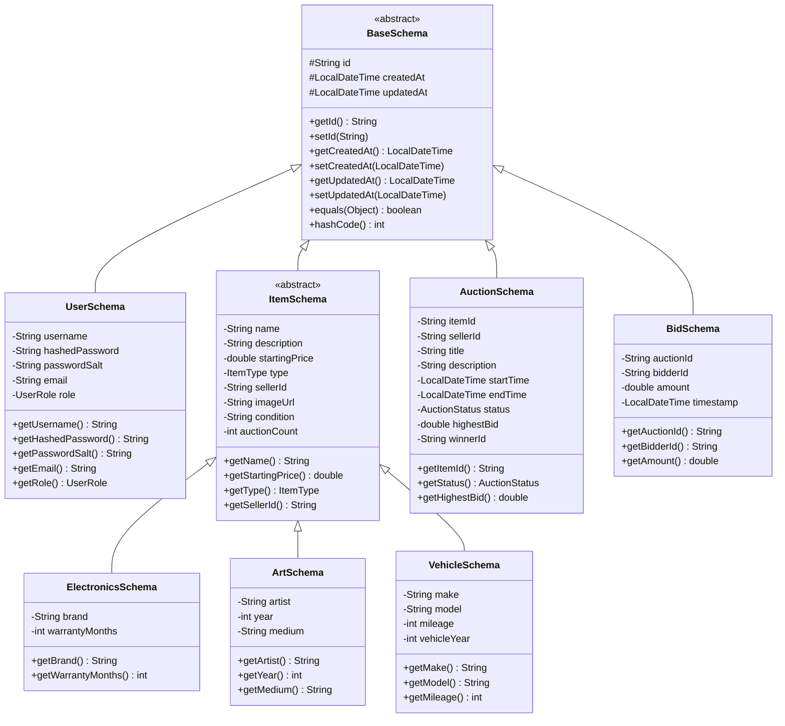

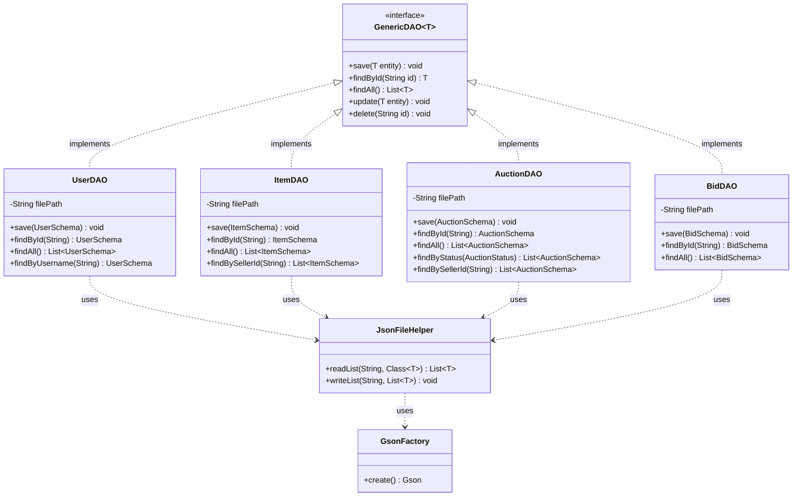

---

### 2️⃣ Sơ đồ lớp — Domain Layer (Model & Enums)

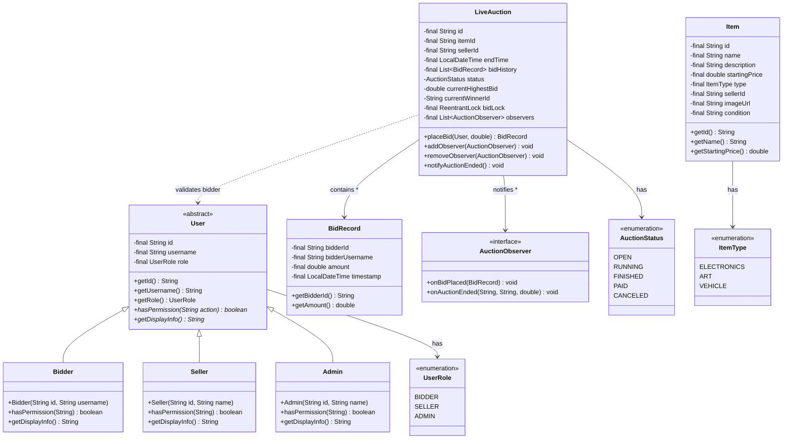

---

### Sơ đồ lớp — Network Layer (Protocol, Controller, Server)

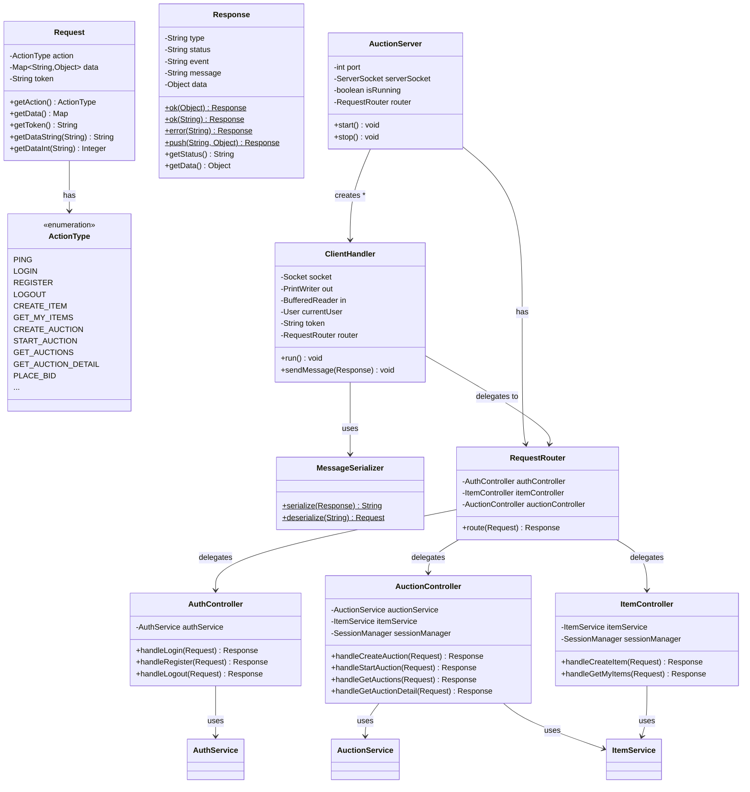

---

### Sơ đồ lớp — Service & Manager Layer

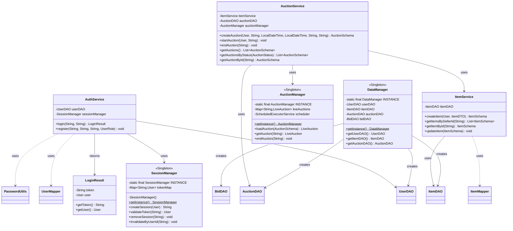

---

### Sơ đồ lớp — Client Side

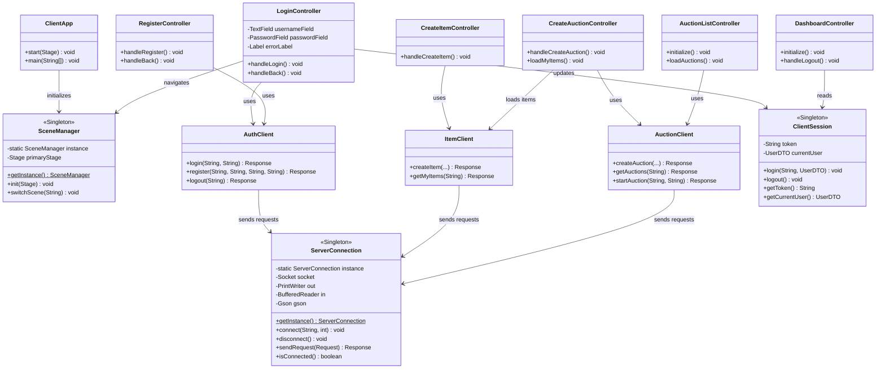

---

### Sơ đồ lớp — Mapper & DTO

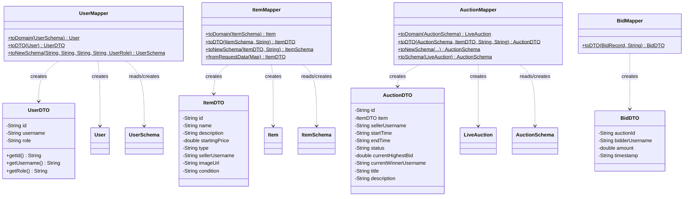

---

## Sơ đồ luồng dữ liệu (Data Flow Diagrams)

### Luồng 1: Đăng nhập (Login Flow)

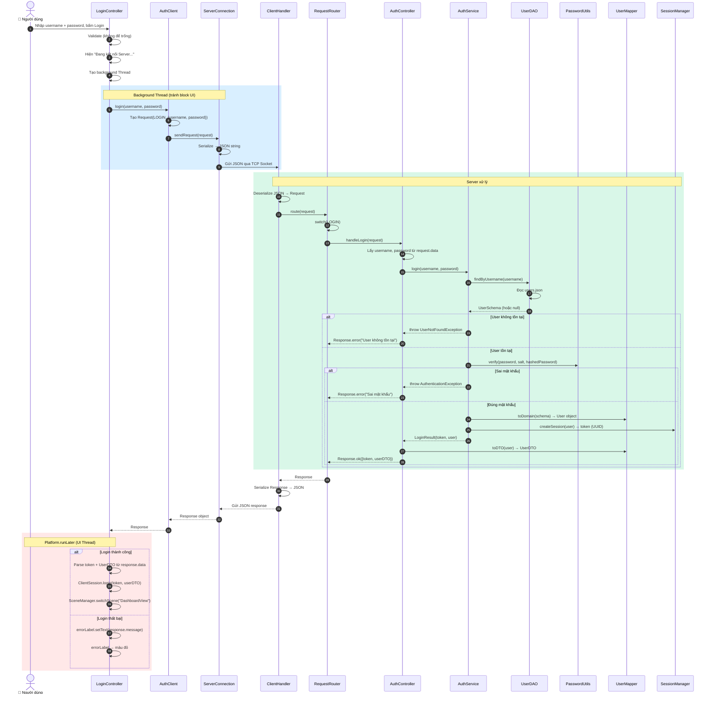

---

### Luồng 2: Tạo sản phẩm (Create Item Flow)

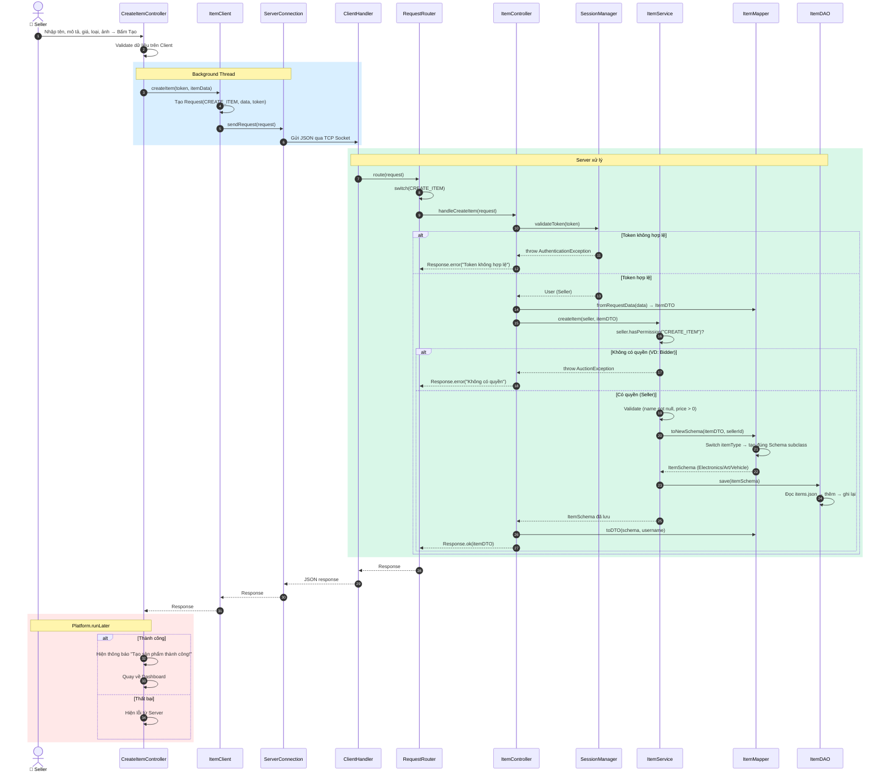

---

### Luồng 3: Tạo phiên đấu giá (Create Auction Flow)

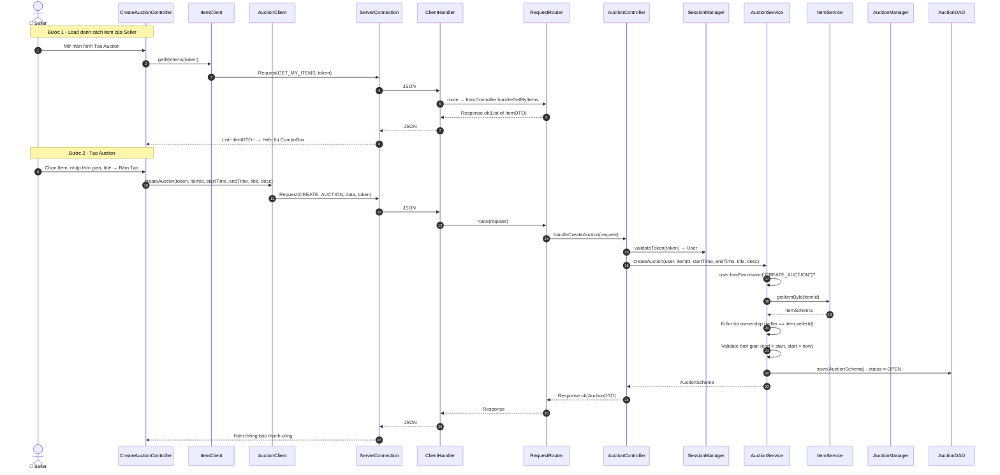

---

### Luồng 4: Bắt đầu phiên đấu giá (Start Auction Flow)

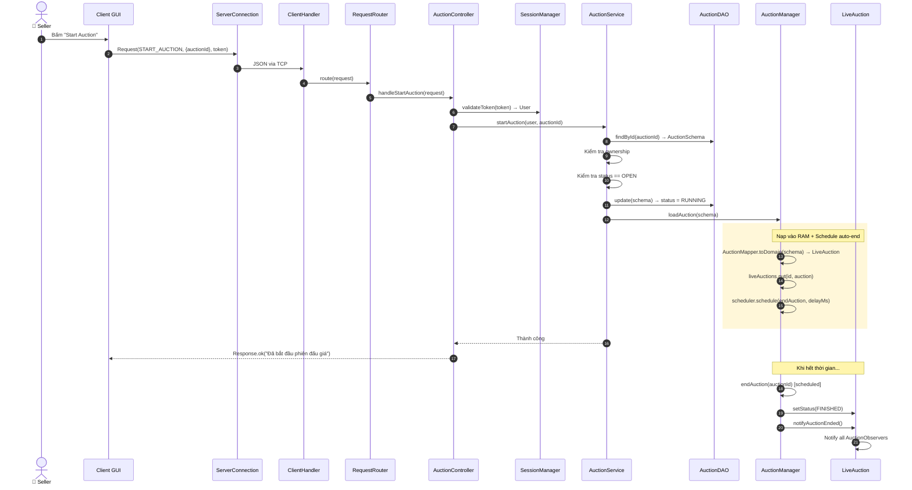

---

## Công nghệ & Design Patterns sử dụng

### Công nghệ

| Công nghệ | Mục đích |
|-----------|----------|
| **Java 21** | Ngôn ngữ lập trình chính |
| **JavaFX 21** | Framework GUI cho Client |
| **Maven** | Build tool, quản lý dependencies |
| **Gson** | JSON serialization/deserialization |
| **JUnit 5** | Unit testing & Integration testing |
| **TCP Socket** | Giao tiếp Client-Server |
| **GitHub Actions** | CI/CD tự động |

### Design Patterns

| Pattern | Áp dụng tại | Giải thích |
|---------|------------|------------|
| **Singleton** | `SessionManager`, `AuctionManager`, `DataManager`, `ServerConnection`, `SceneManager`, `ClientSession` | Đảm bảo chỉ có 1 instance duy nhất cho các manager/connection |
| **Observer** | `LiveAuction` + `AuctionObserver` | Thông báo realtime khi có bid mới hoặc phiên kết thúc |
| **Factory Method** | `UserMapper.toDomain()`, `ItemMapper.toNewSchema()` | Tạo đúng subclass (Bidder/Seller/Admin, Electronics/Art/Vehicle) dựa trên enum |
| **Template Method** | `BaseSchema` → các Schema con | Cung cấp cấu trúc base cho tất cả entity (id, timestamps) |
| **MVC** | Client GUI (FXML + Controller) | Tách biệt View (FXML), Controller (Java), Model (DTO) |
| **DAO** | `GenericDAO<T>`, `UserDAO`, `ItemDAO`, ... | Tách biệt logic truy xuất dữ liệu khỏi business logic |
| **DTO** | `UserDTO`, `ItemDTO`, `AuctionDTO`, `BidDTO` | Truyền dữ liệu an toàn qua mạng (không lộ password, internal state) |

---

## License

This project is licensed under the MIT License - see the [LICENSE](LICENSE) file for details.
