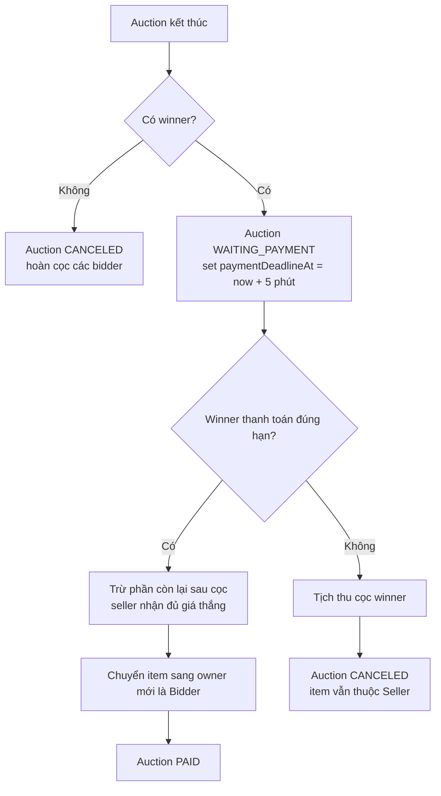
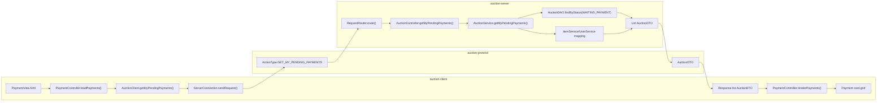
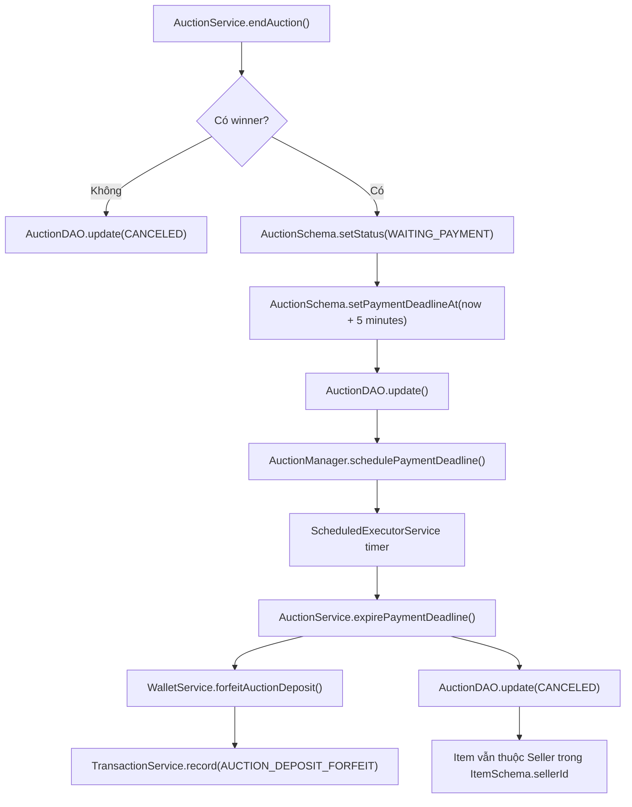
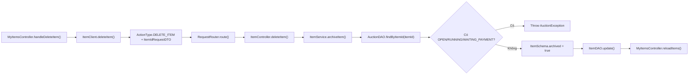
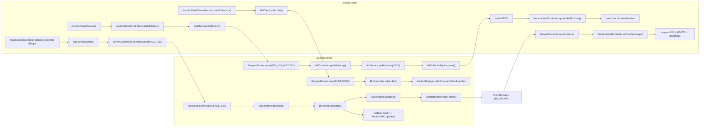

# Báo cáo refactor nhánh Công tuần 6

> Tài liệu này tổng hợp các thay đổi trên nhánh `week6-nguyen-cao-cong`
> so với `main` tại thời điểm rà soát ngày 23/05/2026.
>
> Mục tiêu: ghi lại các phần đã sửa, đã thêm mới, và chỉ ra khác biệt giữa
> phiên bản cũ với phiên bản hiện tại để cả nhóm dễ review, demo và tiếp tục
> phát triển.

## 1. Tóm tắt nhanh

Nhánh tuần 6 tập trung vào ba nhóm việc chính:

- Hoàn thiện luồng winner phải thanh toán sau khi thắng auction.
- Thêm màn quản lý vật phẩm của chính user, bao gồm cả Bidder sở hữu vật phẩm sau khi thanh toán thành công.
- Cải thiện nhiều màn JavaFX: danh sách đấu giá, trang chủ, chi tiết phiên, thanh toán, ví tiền, hồ sơ cá nhân và lịch sử vật phẩm.

Điểm khác biệt lớn nhất so với bản cũ là hệ thống không còn coi đấu giá chỉ kết thúc ở trạng thái thắng/thua. Sau khi có winner, auction đi tiếp vào trạng thái chờ thanh toán, giữ cọc winner, cho thanh toán trong 5 phút, rồi mới quyết định chuyển vật phẩm sang Bidder hoặc hủy phiên và tịch thu cọc.

Số liệu diff đã commit so với `main`:

| Chỉ số | Kết quả |
|---|---:|
| Base branch | `main` |
| Base commit | `38eac64` |
| Current branch | `week6-nguyen-cao-cong` |
| Current commit | `e6f11d0` |
| Số commit trên nhánh | 20 |
| Số file thay đổi | 55 |
| Số dòng thêm | 4.935 |
| Số dòng xóa | 309 |
| File thêm mới | 12 |

Số liệu trên tính cả file báo cáo này. Các file `data/*.json` có thay đổi chủ yếu do dữ liệu demo trong quá trình chạy app, không phải migration schema bắt buộc.

## 2. So sánh trước và sau

| Hạng mục | Phiên bản cũ | Phiên bản hiện tại |
|---|---|---|
| Winner sau khi hết phiên | Auction thường kết thúc mà chưa có luồng thanh toán rõ. | Winner vào trạng thái `WAITING_PAYMENT`, có hạn thanh toán 5 phút. |
| Tiền cọc | Có cọc/frozen balance nhưng chưa gắn đầy đủ với màn thanh toán tuần 6. | Cọc winner được giữ; khi thanh toán chỉ trừ thêm phần tiền tươi cần trả; quá hạn thì tịch thu cọc. |
| Quyền sở hữu vật phẩm | Vật phẩm gần như gắn với Seller. | Bidder có thể đứng tên vật phẩm sau khi thanh toán thành công. |
| Màn vật phẩm | Chưa có màn quản lý vật phẩm riêng đúng nghĩa cho cả Seller/Bidder. | Có `MyItemsView`: Seller thêm/gỡ/tạo phiên từ vật phẩm; Bidder xem vật phẩm đã sở hữu và lịch sử. |
| Màn thanh toán | Chưa có danh sách phiên thắng cần thanh toán/đã thanh toán. | Có `PaymentView` với chip `Tất cả`, `Chưa thanh toán`, `Đã thanh toán (30 ngày)`. |
| Checkout thanh toán | Thanh toán nằm trong detail hoặc chưa có UI riêng. | Có popup `PaymentCheckoutView` riêng, chọn QR hoặc tiền mặt, xác nhận thanh toán xong thì tự đóng và refresh danh sách. |
| Danh sách đấu giá | Filter/search/pagination còn lỗi, card layout dễ thừa khoảng trống. | Search/filter hoạt động, bỏ pagination thừa, card tự căn 4 thẻ mỗi hàng. |
| Trang chủ | Nút khám phá và nút chi tiết chưa đồng bộ routing. | Nút khám phá mở danh sách đấu giá; card home dùng cùng logic với danh sách đấu giá. |
| Chi tiết đấu giá | Thông tin item còn raw, trạng thái là text thường, nút start bị cắt chữ. | Item type thành badge, brand/warranty tách riêng, có `Chi tiết:`, trạng thái thành badge màu, Seller start auction ngay tại detail. |
| Lịch sử vật phẩm | Chưa có màn riêng rõ ràng. | Có `ItemHistoryView`, hiển thị item và lịch sử các auction gắn với item. |
| Ví tiền | Số dư dài có thể làm vỡ layout. | Có `CurrencyFormatter` compact số tiền dài như `1.23T VND`, hạn chế tràn UI. |
| Hồ sơ cá nhân | Thống kê hoạt động chưa cập nhật đúng theo role. | Seller xem sản phẩm đã bán; Bidder xem phiên đã tham gia; điểm uy tín hiển thị bằng sao. |

## 3. Luồng thanh toán sau khi thắng auction

### 3.1 Logic nghiệp vụ hiện tại

Luồng hiện tại:

Điểm quan trọng trong logic tiền:

- Tổng giá winner phải trả vẫn là giá thắng cuối cùng.
- Tiền cọc đã được giữ trước đó nên khi bấm thanh toán, ví chỉ bị trừ thêm phần còn lại.
- UI ghi rõ tổng tiền phải trả đã bao gồm cọc.
- Nếu tiền tươi không đủ để trả phần còn lại, hệ thống báo không đủ tiền và giữ auction ở trạng thái chờ thanh toán cho đến khi hết hạn.
- Nếu đã quá hạn nhưng client vẫn bấm thanh toán, server kiểm tra lại deadline, expire phiên và từ chối thanh toán.

### 3.2 Server thay đổi

Các thay đổi chính nằm ở:

- `auction-server/src/main/java/com/auctionuet/server/domain/service/AuctionService.java`
- `auction-server/src/main/java/com/auctionuet/server/domain/manager/AuctionManager.java`
- `auction-server/src/main/java/com/auctionuet/server/domain/service/ItemService.java`
- `auction-server/src/main/java/com/auctionuet/server/persistence/schema/AuctionSchema.java`
- `auction-server/src/main/java/com/auctionuet/server/persistence/schema/ItemSchema.java`

Các điểm đã thêm/sửa:

- `AuctionManager.PAYMENT_DEADLINE_MINUTES = 5` để dễ test, sau này có thể đổi thành 24 giờ.
- `AuctionSchema` có `paymentDeadlineAt` và `paidAt`.
- `AuctionDTO` trả thêm `paymentDeadlineAt` để client hiển thị hạn thanh toán.
- `AuctionService.endAuction(...)` chuyển phiên có winner sang `WAITING_PAYMENT`.
- `AuctionService.payAuction(...)` xử lý thanh toán, chuyển owner item sang winner và log giao dịch.
- `AuctionService.expirePaymentDeadline(...)` xử lý quá hạn: tịch thu cọc, hủy phiên, giữ item ở Seller.
- `ItemService.transferOwnership(...)` đổi owner item sang Bidder sau khi thanh toán thành công.
- `AuctionService.payAuction(...)` có check deadline ngay tại server để tránh client cũ hoặc UI stale thanh toán sau hạn.

### 3.3 Protocol và permission

Các action/permission liên quan:

- `PAY_AUCTION`
- `GET_MY_PENDING_PAYMENTS`
- `GET_MY_ITEMS`
- `DELETE_ITEM`
- `GET_ITEM_AUCTION_HISTORY`

Các DTO/protocol liên quan:

- `auction-protocol/src/main/java/com/auctionuet/protocol/ActionType.java`
- `auction-protocol/src/main/java/com/auctionuet/protocol/enums/Permission.java`
- `auction-protocol/src/main/java/com/auctionuet/protocol/dto/request/item/ItemIdRequestDTO.java`
- `auction-protocol/src/main/java/com/auctionuet/protocol/dto/response/auction/AuctionDTO.java`

Permission đã được mở cho đúng role:

- Bidder có thể xem vật phẩm của mình, xem lịch sử item, thanh toán auction.
- Seller có thể xem/gỡ item của mình, tạo phiên từ item.
- Controller vẫn chỉ làm auth/permission mỏng; rule chính nằm trong service.

## 4. Màn Thanh toán đấu giá

### 4.1 Danh sách thanh toán

Thêm màn:

- `auction-client/src/main/java/com/auctionuet/client/view/PaymentController.java`
- `auction-client/src/main/resources/fxml/PaymentView.fxml`

Màn này có ba chip lọc:

- `Tất cả`: hiển thị phiên chưa thanh toán, phiên đã thanh toán trong 30 ngày và các phiên thắng nhưng đã quá hạn trong 30 ngày.
- `Chưa thanh toán`: chỉ hiển thị phiên `WAITING_PAYMENT` mà user hiện tại là winner.
- `Đã thanh toán (30 ngày)`: hiển thị phiên đã thanh toán gần đây.

Card thanh toán đã được chỉnh để lấp layout giống danh sách đấu giá:

- mặc định 4 thẻ mỗi hàng;
- không để thừa khoảng trống lớn bên phải;
- có scroll dọc;
- nút card tùy trạng thái: thanh toán, xem chi tiết, hoặc trạng thái quá hạn/đã thanh toán.

### 4.2 Popup Trả tiền

Thêm màn popup riêng:

- `auction-client/src/main/java/com/auctionuet/client/view/PaymentCheckoutController.java`
- `auction-client/src/main/resources/fxml/PaymentCheckoutView.fxml`

Thiết kế hiện tại:

- Popup có tiêu đề `Trả tiền`.
- Bên trái là thẻ chọn phương thức thanh toán.
- Bên trái phía dưới là thẻ thông tin thanh toán: vật phẩm, người bán, mã phiên, tổng tiền phải trả, cọc đã giữ, cần thanh toán thêm.
- Bên phải là nội dung theo phương thức đang chọn.
- Với QR: hiển thị mã QR, số tiền cần trả thêm, mã phiên, nút `Xác nhận đã thanh toán`, nút `Quay về`.
- Với tiền mặt: hiển thị nội dung giao dịch trực tiếp và vẫn dùng nút xác nhận tạm thời.
- Sau khi xác nhận thanh toán thành công, popup tự đóng và `PaymentView` refresh lại danh sách.

Đây là UI tạm cho coursework/demo. Xác nhận thanh toán hiện vẫn là nút trong app, chưa tích hợp cổng thanh toán thật.

## 5. Màn Vật phẩm và lịch sử vật phẩm

### 5.1 MyItemsView

Thêm màn:

- `auction-client/src/main/java/com/auctionuet/client/view/MyItemsController.java`
- `auction-client/src/main/resources/fxml/MyItemsView.fxml`

Thay đổi chính:

- Sidebar đổi `Hoạt động` thành `Vật phẩm`.
- Seller có thể thêm vật phẩm mới ngay trong màn này.
- Sau khi đăng sản phẩm thành công, form đăng sản phẩm tự ẩn và danh sách item reload lại.
- Seller có thể gỡ mềm item nếu item không có auction đang `OPEN`, `RUNNING`, hoặc `WAITING_PAYMENT`.
- Bidder có thể xem các vật phẩm đã sở hữu sau khi thắng và thanh toán thành công.
- Thẻ item hiển thị tiêu chí theo chiều dọc để không bị cắt chữ.
- `brand` và `warrantyMonths` được tách thành tiêu chí riêng thay vì hiện raw map.
- Trạng thái auction của item hiện bằng badge màu giống card danh sách đấu giá.
- Nếu item chưa gắn auction thì hiển thị `NOT_LISTED`.
- Có ô menu, thanh tìm kiếm và nút tìm giống màn danh sách đấu giá.

### 5.2 Lịch sử vật phẩm

Thêm màn:

- `auction-client/src/main/java/com/auctionuet/client/view/ItemHistoryController.java`
- `auction-client/src/main/resources/fxml/ItemHistoryView.fxml`

Mục tiêu:

- Bấm `Lịch sử` từ card item sẽ mở màn lịch sử của đúng item.
- Màn lịch sử giống chi tiết phiên đấu giá nhưng đổi tiêu đề từ `Đấu giá` sang `Vật phẩm`.
- Bỏ ô thông tin giá hiện tại/người dẫn đầu/trạng thái phiên vì màn này tập trung vào item.
- Bảng lịch sử lấy auction theo `itemId`, không theo tên title, để tránh nhầm khi title cũ bị stale.

Lỗi đã phát hiện trong quá trình làm:

- Có dữ liệu demo cũ tạo auction title `Đấu giá: vin` nhưng `itemId` lại trỏ sang item `sexy lady`.
- Root cause là khi chọn item trong màn tạo phiên, title auto không luôn được cập nhật theo item mới.
- Đã sửa `CreateAuctionController` để title tự đổi khi item đổi, miễn là user chưa tự nhập title thủ công.
- Dữ liệu JSON cũ vẫn cần dọn riêng nếu muốn demo sạch tuyệt đối.

## 6. Danh sách đấu giá và trang chủ

### 6.1 Danh sách đấu giá

Các file chính:

- `auction-client/src/main/java/com/auctionuet/client/view/AuctionListController.java`
- `auction-client/src/main/java/com/auctionuet/client/view/AuctionViewFilter.java`
- `auction-client/src/main/resources/fxml/AuctionListView.fxml`

Thay đổi:

- Ô menu lọc auction hoạt động.
- Thanh tìm kiếm hoạt động theo tên sản phẩm/phiên.
- Bỏ các nút phân trang `1`, `2`, `3` vì màn đã có scroll.
- Sửa lỗi theme tối làm layout bị nhảy và thừa khoảng trống cạnh thanh cuộn.
- Bỏ thanh cuộn ngang thừa.
- Card được thu lại để mặc định 4 card mỗi hàng.
- Seller bấm `Xem chi tiết` sẽ vào `AuctionDetailView`.
- Bidder không dùng một nút `Xem chi tiết` duy nhất nữa:
  - nút chính là `Đăng ký đấu giá`, mở `BiddingView` khi phiên đang chạy;
  - dòng bên dưới là `Xem chi tiết thông tin`, mở `AuctionDetailView`.

### 6.2 Trang chủ

Các file chính:

- `auction-client/src/main/java/com/auctionuet/client/view/HomeController.java`
- `auction-client/src/main/resources/fxml/HomeView.fxml`

Thay đổi:

- Nút `Khám phá ngay` chuyển sang `Danh sách đấu giá`.
- Card đấu giá trên trang chủ dùng logic routing giống card ở danh sách đấu giá.
- Bidder thấy `Đăng ký đấu giá` và `Xem chi tiết thông tin`.
- Seller vẫn thấy nút `Xem chi tiết` như cũ.

## 7. Chi tiết phiên đấu giá

Các file chính:

- `auction-client/src/main/java/com/auctionuet/client/view/AuctionDetailController.java`
- `auction-client/src/main/resources/fxml/AuctionDetailView.fxml`
- `auction-client/src/main/resources/css/styles.css`
- `auction-client/src/main/resources/css/light-theme.css`
- `auction-client/src/main/resources/css/dark-theme.css`

Thay đổi:

- Nút `Bắt đầu phiên đấu giá` được tăng kích thước để không bị cắt chữ.
- Khung chứa nút bắt đầu chỉ hiện với Seller và chỉ khi auction đang `OPEN`.
- Seller bấm bắt đầu phiên sẽ gọi server start auction, reload detail và chuyển trạng thái sang `RUNNING`.
- Push `AUCTION_STARTED` không còn ép Seller nhảy sang màn bidding; Bidder vẫn có thể đi vào bidding.
- Trạng thái trong ô thông tin được bọc bằng badge màu như danh sách đấu giá.
- Giá hiện tại, người dẫn đầu, thời gian kết thúc được thêm class CSS riêng để dễ tạo màu theo theme.
- Type item chuyển thành badge đặt cạnh tên item.
- `brand` và `warrantyMonths` tách thành tiêu chí riêng.
- Các extra field khác cũng được render từng dòng thay vì hiển thị raw map.
- Phần mô tả có nhãn `Chi tiết:` và nội dung mô tả nằm bên dưới.
- Bid chart load lịch sử bid và cập nhật qua push `BID_UPDATE`.

Gợi ý màu đang áp dụng:

| Tiêu chí | Light theme | Dark theme |
|---|---|---|
| Giá hiện tại | Xanh dương | Xanh cyan |
| Người dẫn đầu | Vàng/cam | Vàng |
| Kết thúc | Cam | Cam sáng |
| Trạng thái | Badge theo status | Badge theo status |
| Loại item | Badge xanh nhạt | Badge xanh đậm |

## 8. Ví tiền, giao dịch và số tiền dài

Thêm helper:

- `auction-client/src/main/java/com/auctionuet/client/view/CurrencyFormatter.java`

Mục tiêu:

- Số tiền bình thường vẫn hiển thị đầy đủ.
- Số tiền quá dài được rút gọn để không phá layout, ví dụ dạng `1.23T VND`.
- Header `TK:` và màn ví dùng formatter này để tránh tràn màn hình.

Màn ví/giao dịch cũng được chỉnh:

- Tổng tiền đang cọc hiển thị rõ hơn.
- Lịch sử giao dịch hiển thị thông tin dễ đọc hơn.
- Phần auction trong lịch sử giao dịch nên ưu tiên tên phiên thay vì mã UUID để user hiểu được giao dịch gắn với phiên nào.

## 9. Hồ sơ cá nhân và thống kê hoạt động

File chính:

- `auction-client/src/main/java/com/auctionuet/client/view/ProfileController.java`
- `auction-client/src/main/resources/fxml/ProfileView.fxml`

Thay đổi:

- Thống kê không còn hard-code toàn 0.
- `Đấu giá đã thắng` tính theo auction user là winner.
- Với Seller, ô thứ hai là `Sản phẩm đã bán`.
- Với Bidder, ô thứ hai là `Phiên đã tham gia`.
- `Đang tham gia` tính theo các phiên user còn liên quan.
- Điểm uy tín hiển thị bằng sao `★`.

Lưu ý kỹ thuật:

- Cơ chế điểm uy tín hiện tại là tính ở client theo heuristic dựa trên số hoạt động thành công.
- Chưa có bảng/schema reputation riêng ở server.
- Nếu muốn chặt hơn, nên đưa reputation về server, lưu điểm theo user và cập nhật khi thanh toán đúng hạn/quá hạn.

## 10. Chống tạo nhiều auction active cho một item

Vấn đề đã phát hiện:

- Một vật phẩm có thể xuất hiện ở hai phiên đấu giá cùng lúc, ví dụ một phiên `RUNNING` và một phiên `CANCELED`.
- Điều này dễ làm user hiểu sai vì cùng một item không nên có nhiều phiên active.

Hướng đã làm trong nhánh:

- Khi tạo phiên mới, service kiểm tra item có auction active chưa.
- Active được hiểu là các trạng thái còn ảnh hưởng quyền sở hữu hoặc thanh toán: `OPEN`, `RUNNING`, `WAITING_PAYMENT`.
- Không chặn lịch sử cũ đã `CANCELED` hoặc `PAID`, vì cần giữ lịch sử item.
- Có xử lý reconcile/cancel duplicate active để dữ liệu demo không tiếp tục sinh lỗi.

Kết quả mong muốn:

- Tại một thời điểm chỉ có một auction active cho một item.
- Item vẫn có thể có nhiều auction trong lịch sử, nhưng không được có nhiều phiên đang mở/chạy/chờ thanh toán cùng lúc.

## 11. File thêm mới đáng chú ý

| File | Vai trò |
|---|---|
| `auction-client/src/main/java/com/auctionuet/client/view/AuctionViewFilter.java` | Lọc/tìm kiếm auction dùng lại cho list/home/payment. |
| `auction-client/src/main/java/com/auctionuet/client/view/CurrencyFormatter.java` | Format tiền compact để tránh vỡ layout. |
| `auction-client/src/main/java/com/auctionuet/client/view/MyItemsController.java` | Controller màn vật phẩm của tôi. |
| `auction-client/src/main/java/com/auctionuet/client/view/ItemHistoryController.java` | Controller màn lịch sử vật phẩm. |
| `auction-client/src/main/java/com/auctionuet/client/view/PaymentController.java` | Controller màn thanh toán đấu giá. |
| `auction-client/src/main/java/com/auctionuet/client/view/PaymentCheckoutController.java` | Controller popup trả tiền. |
| `auction-client/src/main/resources/fxml/MyItemsView.fxml` | FXML màn vật phẩm. |
| `auction-client/src/main/resources/fxml/ItemHistoryView.fxml` | FXML màn lịch sử vật phẩm. |
| `auction-client/src/main/resources/fxml/PaymentView.fxml` | FXML màn thanh toán đấu giá. |
| `auction-client/src/main/resources/fxml/PaymentCheckoutView.fxml` | FXML popup trả tiền. |
| `auction-protocol/src/main/java/com/auctionuet/protocol/dto/request/item/ItemIdRequestDTO.java` | Request DTO dùng cho item id actions. |
| `docs/Cong-refactor.md` | Báo cáo tổng hợp thay đổi tuần 6 theo mẫu báo cáo refactor. |

## 12. Chi tiết code theo tầng

Phần này đi sâu hơn vào code để thấy các thay đổi không chỉ nằm ở giao diện, mà đã đi qua đủ các tầng: protocol, server service, persistence, client network và JavaFX controller.

### 12.1 Tầng protocol

Các thay đổi protocol nằm ở module `auction-protocol`, giữ đúng hướng contract-first của repo.

| File | Thay đổi chính | Lý do |
|---|---|---|
| `auction-protocol/src/main/java/com/auctionuet/protocol/ActionType.java` | Thêm/hoàn thiện `DELETE_ITEM`, `GET_MY_ITEMS`, `GET_ITEM_AUCTION_HISTORY`, `PAY_AUCTION`, `GET_MY_PENDING_PAYMENTS`. | Client và server dùng chung enum action, tránh gửi string/action không được route. |
| `auction-protocol/src/main/java/com/auctionuet/protocol/enums/Permission.java` | Bổ sung permission cho item ownership, thanh toán và lịch sử item. | Controller có thể check quyền mỏng trước khi gọi service. |
| `auction-protocol/src/main/java/com/auctionuet/protocol/dto/request/item/ItemIdRequestDTO.java` | DTO mới chỉ chứa `itemId`, có validate không được rỗng. | Dùng lại cho `DELETE_ITEM` và `GET_ITEM_AUCTION_HISTORY`, tránh parse `Map<String, Object>` thủ công. |
| `auction-protocol/src/main/java/com/auctionuet/protocol/dto/response/auction/AuctionDTO.java` | Thêm `paymentDeadlineAt`, `paidAt`, `depositAmount`, `currentUserDeposited`. | UI cần biết hạn thanh toán, thời điểm thanh toán, cọc phải giữ và user hiện tại đã cọc chưa. |

Điểm đáng chú ý: các field mới được thêm vào DTO chung thay vì tạo DTO riêng ở client. Vì vậy nếu server trả thiếu field hoặc client gọi sai constructor, lỗi sẽ lộ ở compile/test sớm hơn.

### 12.2 Tầng server service

`AuctionService` là phần thay đổi nghiệp vụ lớn nhất.

| Method/nhóm code | Vai trò hiện tại |
|---|---|
| Constructor `AuctionService(...)` | Gắn callback cho `AuctionManager`: auto start auction, auto end auction và expire deadline thanh toán. |
| `createAuction(...)` | Tạo phiên mới, kiểm tra item thuộc Seller, validate thời gian, và chặn tạo thêm auction active cho cùng item. |
| `startAuction(...)` / `startAuctionNow(...)` | Chuyển `OPEN -> RUNNING`, load vào `AuctionManager`, schedule end time và notify observer. |
| `endAuction(...)` | Khi hết phiên: nếu không có winner thì cancel và hoàn cọc; nếu có winner thì chuyển `WAITING_PAYMENT`, set `paymentDeadlineAt`, hoàn cọc người thua, giữ cọc winner. |
| `expirePaymentDeadline(...)` | Khi quá hạn thanh toán: chỉ xử lý auction `WAITING_PAYMENT`, tịch thu cọc winner, chuyển `CANCELED`, giữ owner item là Seller. |
| `payAuction(...)` | Winner thanh toán: check đúng winner, đúng status, chưa quá deadline, trừ phần tiền còn lại sau cọc, payout Seller, chuyển owner item, set `PAID` và `paidAt`. |
| `getMyPendingPayments(...)` | Trả danh sách auction `WAITING_PAYMENT` mà user hiện tại là winner. |
| `getItemAuctionHistory(...)` | Trả lịch sử auction theo `itemId`, phục vụ màn lịch sử vật phẩm. |
| `toDTO(...)` | Map schema sang `AuctionDTO`, gắn thêm `paymentDeadlineAt`, `paidAt`, `depositAmount`, `currentUserDeposited`. |

Các rule tiền/cọc được giữ trong service, không đưa vào controller JavaFX. UI chỉ hiển thị và gọi action thanh toán.

`ItemService` cũng được mở rộng:

| Method/nhóm code | Vai trò hiện tại |
|---|---|
| `getItemsByOwner(...)` / nhóm lấy item của user | Dùng `sellerId` như owner hiện tại để trả item cho cả Seller và Bidder. |
| `transferOwnership(itemId, newOwnerId)` | Sau khi auction `PAID`, cập nhật owner item sang winner. |
| `deleteItem(...)` | Gỡ mềm item bằng `archived = true`, chỉ cho owner gỡ. |
| Check active auction trước khi delete | Không cho gỡ nếu item đang có auction `OPEN`, `RUNNING`, hoặc `WAITING_PAYMENT`. |
| `toDTO(...)` | Map `ItemSchema` sang `ItemDTO`, giữ `extraFields` để client render brand/warranty/artist/year... |

`WalletService` không bị đưa logic vào UI. Luồng thanh toán vẫn đi qua server:

- `freezeDeposit` giữ cọc khi tham gia bid.
- `payAuctionRemaining` trừ phần tiền tươi còn lại.
- `forfeitDeposit` tịch thu cọc khi quá hạn.
- `deposit`/`withdraw` vẫn phục vụ màn ví.

### 12.3 Tầng manager, schema và DAO

| File | Thay đổi chính | Ý nghĩa |
|---|---|---|
| `auction-server/src/main/java/com/auctionuet/server/domain/manager/AuctionManager.java` | Thêm scheduler/payment deadline task, callback expire, periodic reconcile. | Deadline thanh toán chạy ở server, không phụ thuộc client còn mở app hay không. |
| `auction-server/src/main/java/com/auctionuet/server/persistence/schema/AuctionSchema.java` | Thêm `paymentDeadlineAt`, `paidAt`. | Lưu được hạn thanh toán và thời điểm thanh toán vào JSON. |
| `auction-server/src/main/java/com/auctionuet/server/persistence/schema/ItemSchema.java` | Thêm `archived`. | Hỗ trợ gỡ mềm item, không phá lịch sử auction cũ. |
| `auction-server/src/main/java/com/auctionuet/server/persistence/dao/AuctionDAO.java` | Bổ sung helper tìm theo status/điều kiện phục vụ pending payment và active auction. | Service không phải tự lọc thủ công quá nhiều nơi. |
| `auction-server/src/main/java/com/auctionuet/server/persistence/dao/ItemDAO.java` | Không trả item archived trong các danh sách active. | Item đã gỡ mềm không còn xuất hiện để tạo phiên mới. |

Việc dùng `archived` thay vì hard-delete là đúng với lịch sử đấu giá: auction cũ vẫn cần đọc được item để xem chi tiết/lịch sử.

### 12.4 Tầng server controller và router

| File | Thay đổi chính |
|---|---|
| `auction-server/src/main/java/com/auctionuet/server/network/server/RequestRouter.java` | Route thêm `PAY_AUCTION`, `GET_MY_PENDING_PAYMENTS`, `GET_MY_ITEMS`, `DELETE_ITEM`, `GET_ITEM_AUCTION_HISTORY`. |
| `auction-server/src/main/java/com/auctionuet/server/network/controller/AuctionController.java` | Thêm endpoint thanh toán, pending payments và item auction history; check token/permission rồi gọi `AuctionService`. |
| `auction-server/src/main/java/com/auctionuet/server/network/controller/ItemController.java` | Thêm get my items và delete item; controller không tự xử lý ownership mà chuyển cho `ItemService`. |

Controller vẫn giữ vai trò mỏng:

- deserialize DTO bằng `request.getDataAs(...)`;
- validate token bằng `SessionManager`;
- check `user.hasPermission(...)`;
- gọi service;
- trả `Response.ok(...)`.

### 12.5 Tầng client network

| File | Method mới/sửa | Vai trò |
|---|---|---|
| `auction-client/src/main/java/com/auctionuet/client/network/AuctionClient.java` | `payAuction(...)` | Gửi `PAY_AUCTION` cho server. |
| `auction-client/src/main/java/com/auctionuet/client/network/AuctionClient.java` | `getMyPendingPayments(...)` | Lấy các phiên cần thanh toán của user hiện tại. |
| `auction-client/src/main/java/com/auctionuet/client/network/ItemClient.java` | `getMyItems(...)` | Lấy danh sách item user đang sở hữu. |
| `auction-client/src/main/java/com/auctionuet/client/network/ItemClient.java` | `deleteItem(...)` | Gỡ mềm item qua server. |
| `auction-client/src/main/java/com/auctionuet/client/network/ItemClient.java` | `getItemAuctionHistory(...)` | Lấy lịch sử auction theo item. |

Các client adapter vẫn dùng `Request.fromDto(...)` hoặc `Request(...)` theo protocol chung, không tạo request shape riêng trong client.

### 12.6 Tầng JavaFX UI

Nhóm controller mới/touched nhiều nhất:

| Controller | Luồng code chính |
|---|---|
| `PaymentController` | Load pending payments, merge với auction đã thanh toán/quá hạn gần đây, lọc theo chip, render grid 4 card mỗi hàng, mở popup checkout. |
| `PaymentCheckoutController` | Nhận `AuctionDTO`, render phương thức QR/tiền mặt, tính tiền cần thanh toán thêm, tạo QR giả lập, gọi `payAuction`, đóng popup và callback refresh. |
| `MyItemsController` | Load item của user, lấy trạng thái auction gần nhất theo item, filter/search, render card, xử lý thêm item/gỡ item/tạo auction/mở lịch sử. |
| `ItemHistoryController` | Nhận `ItemDTO`, gọi `getItemAuctionHistory`, render thông tin item và bảng lịch sử auction. |
| `AuctionListController` | Áp dụng `AuctionViewFilter`, bỏ pagination, render card responsive, tách hành động Seller/Bidder. |
| `HomeController` | Card trên trang chủ dùng cùng logic với danh sách: Seller xem chi tiết, Bidder đăng ký đấu giá hoặc xem thông tin. |
| `AuctionDetailController` | Render badge trạng thái, type badge, extra fields từng dòng, start auction cho Seller, payment area cho winner, bid chart realtime. |
| `ProfileController` | Tính thống kê theo role, Seller xem sản phẩm đã bán, Bidder xem phiên đã tham gia, điểm uy tín dạng sao. |
| `WalletController` | Format số dư compact và render transaction history dễ đọc hơn. |

Các controller gọi network trong background thread và update UI bằng `Platform.runLater`, phù hợp quy tắc JavaFX trong repo.

## 13. Luồng dữ liệu theo file

Các sơ đồ dưới đây mô tả hướng đi chính của dữ liệu/request giữa các file. Mũi tên thể hiện file nào gọi file nào hoặc dữ liệu đi qua lớp nào, không phải toàn bộ import trong code.

### 13.1 Luồng mở màn Thanh toán đấu giá

Khi user bấm sidebar `Thanh toán`, client load danh sách phiên cần thanh toán và các phiên đã thanh toán/quá hạn gần đây.

Điểm chính:

- `PaymentController` không tự lọc dữ liệu gốc từ JSON.
- Server chỉ trả các auction đúng user hiện tại là winner.
- UI nhận `AuctionDTO`, sau đó mới chia thành tab `Tất cả`, `Chưa thanh toán`, `Đã thanh toán (30 ngày)`.

### 13.2 Luồng xác nhận thanh toán trong popup Trả tiền

Khi user bấm `Thanh toán` trên card, popup `Trả tiền` mở ra. Khi bấm `Xác nhận đã thanh toán`, request đi đến server để xử lý tiền, giao dịch, owner item và trạng thái auction.

```mermaid
flowchart LR
    subgraph Client["auction-client"]
        A["PaymentController.openCheckoutPopup()"] --> B["PaymentCheckoutView.fxml"]
        B --> C["PaymentCheckoutController.renderCheckout()"]
        C --> D["PaymentCheckoutController.handleConfirmPayment()"]
        D --> E["AuctionClient.payAuction()"]
        E --> F["ServerConnection.sendRequest()"]
        R["Response OK"] --> S["PaymentCheckoutController.closeWindow()"]
        S --> T["PaymentController.loadPayments()"]
    end

    subgraph Protocol["auction-protocol"]
        G["ActionType.PAY_AUCTION"]
        H["AuctionIdRequestDTO"]
    end

    subgraph Server["auction-server"]
        I["RequestRouter.route()"] --> J["AuctionController.payAuction()"]
        J --> K["AuctionService.payAuction()"]
        K --> L["WalletService.payAuctionRemaining()"]
        K --> M["WalletService.payoutSeller()"]
        K --> N["ItemService.transferOwnership()"]
        K --> O["AuctionDAO.update(PAID, paidAt)"]
        L --> P["TransactionService.record(AUCTION_PAYMENT)"]
        M --> Q["TransactionService.record(SELLER_PAYOUT)"]
        N --> U["ItemDAO.update(owner = winnerId)"]
    end

    F --> G
    G --> H
    H --> I
    O --> R
    P --> R
    Q --> R
    U --> R
```

Logic tiền ở luồng này:

- UI hiển thị `Tổng tiền phải trả` là giá thắng và note `đã bao gồm cọc`.
- Server tính tiền tươi cần trừ là `highestBid - retainedDepositAmount`.
- Nếu tiền tươi không đủ, `WalletService.payAuctionRemaining(...)` ném lỗi, auction vẫn ở `WAITING_PAYMENT`.
- Nếu thanh toán thành công, seller nhận đủ giá thắng, item chuyển sang owner mới là Bidder, auction thành `PAID`.

### 13.3 Luồng tự động quá hạn thanh toán

Luồng này chạy ở server, không phụ thuộc việc client có đang mở màn thanh toán hay không.

Điểm bảo vệ quan trọng:

- `AuctionService.payAuction(...)` cũng check lại `paymentDeadlineAt`.
- Nếu client giữ màn cũ rồi bấm thanh toán sau hạn, server gọi expire và từ chối thanh toán.
- Việc tịch thu cọc nằm ở server service, không nằm trong JavaFX controller.

### 13.4 Luồng Vật phẩm của tôi và lịch sử vật phẩm

Màn `Vật phẩm` lấy item theo owner hiện tại. Với Seller, owner là Seller. Với Bidder đã thanh toán thành công, owner là Bidder vì `ItemService.transferOwnership(...)` đã đổi `sellerId`.

```mermaid
flowchart LR
    subgraph Client["auction-client"]
        A["DashboardView.fxml"] --> B["DashboardController.loadView(MyItemsView.fxml)"]
        B --> C["MyItemsController.loadItems()"]
        C --> D["ItemClient.getMyItems()"]
        Q["List ItemDTO"] --> R["MyItemsController.loadAuctionStatus()"]
        R --> S["ItemClient.getItemAuctionHistory()"]
        Z["List AuctionDTO"] --> AA["MyItemsController.renderItems()"]
        AA --> AB["Button Lịch sử"]
        AB --> AC["ItemHistoryView.fxml"]
        AC --> AD["ItemHistoryController.loadHistory()"]
    end

    subgraph Server["auction-server"]
        E["RequestRouter.route(GET_MY_ITEMS)"] --> F["ItemController.getMyItems()"]
        F --> G["ItemService.getItemsByOwnerId()"]
        G --> H["ItemDAO.findBySellerId(ownerId)"]
        H --> I["ItemDTO mapping"]

        T["RequestRouter.route(GET_ITEM_AUCTION_HISTORY)"] --> U["AuctionController.getItemAuctionHistory()"]
        U --> V["AuctionService.getItemAuctionHistory()"]
        V --> W["AuctionDAO.findByItemId(itemId)"]
        W --> X["AuctionDTO mapping"]
    end

    D --> E
    I --> Q
    S --> T
    X --> Z
    AD --> S
```

Luồng gỡ mềm item:

Điểm chính:

- Gỡ item là soft-delete qua `archived`, không xóa khỏi JSON.
- Lịch sử auction cũ vẫn đọc được vì item không bị hard-delete.
- Trạng thái auction trên card item được lấy từ `GET_ITEM_AUCTION_HISTORY`, không đoán bằng tên item.

### 13.5 Luồng tạo phiên và bắt đầu phiên đấu giá

Seller có thể tạo phiên từ màn `Vật phẩm`, sau đó start phiên ở màn chi tiết.

```mermaid
flowchart LR
    subgraph Client["auction-client"]
        A["MyItemsController.openCreateAuction()"] --> B["CreateAuctionView.fxml"]
        B --> C["CreateAuctionController.setPreselectedItem()"]
        C --> D["CreateAuctionController.handleCreateAuction()"]
        D --> E["AuctionClient.createAuction()"]
        P["AuctionDTO OPEN"] --> Q["AuctionDetailView.fxml"]
        Q --> R["AuctionDetailController.handleStartAuction()"]
        R --> S["AuctionClient.startAuction()"]
    end

    subgraph Server["auction-server"]
        F["RequestRouter.route(CREATE_AUCTION)"] --> G["AuctionController.createAuction()"]
        G --> H["AuctionService.createAuction()"]
        H --> I["ItemService.getItemSchemaById()"]
        H --> J["AuctionDAO.findByItemId() check active"]
        H --> K["AuctionDAO.save(OPEN)"]
        K --> L["AuctionManager.scheduleAuctionStart()"]

        T["RequestRouter.route(START_AUCTION)"] --> U["AuctionController.startAuction()"]
        U --> V["AuctionService.startAuction()"]
        V --> W["AuctionDAO.update(RUNNING)"]
        V --> X["AuctionManager.loadAuction()"]
        X --> Y["ClientHandler.onAuctionStarted()"]
    end

    E --> F
    K --> P
    S --> T
    Y --> Z["PushMessage AUCTION_STARTED"]
    Z --> AA["ServerConnection.pushListener"]
```

Điểm chính:

- `CreateAuctionController` chỉ gom dữ liệu từ form và gọi client adapter.
- `AuctionService.createAuction(...)` mới là nơi chặn duplicate active auction theo `itemId`.
- Seller start auction từ detail; sau khi start, UI reload status thành `RUNNING`.

### 13.6 Luồng đặt giá và biểu đồ bid realtime

Màn chi tiết có chart giá. Dữ liệu ban đầu lấy từ bid history, dữ liệu mới đến qua push `BID_UPDATE`.

Điểm chính:

- Chart không tự tạo dữ liệu giả; nó render từ `BidDTO`.
- `BidClient.getBidHistory(...)` lấy dữ liệu quá khứ từ server.
- `subscribeToAuction(...)` đăng ký push realtime.
- Khi có bid mới, `ClientHandler` gửi `PushMessage BID_UPDATE`, `ServerConnection` chuyển cho listener và `AuctionDetailController` append điểm mới vào chart.

## 14. Chi tiết file đã tạo và file đã sửa

### 14.1 File tạo mới

| File tạo mới | Nội dung |
|---|---|
| `auction-client/src/main/java/com/auctionuet/client/view/AuctionViewFilter.java` | Helper lọc auction theo trạng thái và từ khóa. Tách logic search/filter khỏi controller để `AuctionListController` gọn hơn. |
| `auction-client/src/main/java/com/auctionuet/client/view/CurrencyFormatter.java` | Helper format tiền VND. Có dạng full và compact để xử lý số dư quá dài trên header/ví. |
| `auction-client/src/main/java/com/auctionuet/client/view/MyItemsController.java` | Controller lớn cho màn `Vật phẩm`: load item, search/filter, render card, thêm/gỡ item, tạo auction, mở lịch sử. |
| `auction-client/src/main/java/com/auctionuet/client/view/ItemHistoryController.java` | Controller màn `Lịch sử vật phẩm`, render item detail và bảng các auction gắn với item. |
| `auction-client/src/main/java/com/auctionuet/client/view/PaymentController.java` | Controller màn `Thanh toán đấu giá`, gồm filter chip, danh sách pending/paid/expired và popup checkout. |
| `auction-client/src/main/java/com/auctionuet/client/view/PaymentCheckoutController.java` | Controller popup `Trả tiền`, chọn phương thức, QR/cash content, xác nhận thanh toán. |
| `auction-client/src/main/resources/fxml/MyItemsView.fxml` | Layout màn quản lý vật phẩm. |
| `auction-client/src/main/resources/fxml/ItemHistoryView.fxml` | Layout màn lịch sử vật phẩm. |
| `auction-client/src/main/resources/fxml/PaymentView.fxml` | Layout màn thanh toán đấu giá. |
| `auction-client/src/main/resources/fxml/PaymentCheckoutView.fxml` | Layout popup trả tiền có scroll dọc. |
| `auction-protocol/src/main/java/com/auctionuet/protocol/dto/request/item/ItemIdRequestDTO.java` | DTO request dùng chung cho các action theo item id. |
| `docs/Cong-refactor.md` | Báo cáo tổng hợp thay đổi tuần 6. |

### 14.2 File protocol/server đã sửa

| File sửa | Nội dung sửa |
|---|---|
| `auction-protocol/src/main/java/com/auctionuet/protocol/ActionType.java` | Thêm action item/payment/history để client-server thống nhất contract. |
| `auction-protocol/src/main/java/com/auctionuet/protocol/enums/Permission.java` | Thêm permission tương ứng cho các action mới. |
| `auction-protocol/src/main/java/com/auctionuet/protocol/dto/response/auction/AuctionDTO.java` | Bổ sung field phục vụ payment deadline, paid time, deposit amount và trạng thái cọc của current user. |
| `auction-server/src/main/java/com/auctionuet/server/domain/model/Bidder.java` | Mở permission cho Bidder xem item của mình, xem lịch sử item, thanh toán. |
| `auction-server/src/main/java/com/auctionuet/server/domain/model/Seller.java` | Mở permission phù hợp cho Seller quản lý item và xem lịch sử item. |
| `auction-server/src/main/java/com/auctionuet/server/domain/service/AuctionService.java` | Thêm/sửa phần lớn logic lifecycle auction: start, end, waiting payment, pay, expire, item history, chống duplicate active auction. |
| `auction-server/src/main/java/com/auctionuet/server/domain/service/ItemService.java` | Thêm ownership transfer, get my items, soft delete, check active auction trước khi gỡ. |
| `auction-server/src/main/java/com/auctionuet/server/network/controller/AuctionController.java` | Thêm handler cho pay auction, pending payment, item auction history. |
| `auction-server/src/main/java/com/auctionuet/server/network/controller/ItemController.java` | Thêm handler get my items và delete item. |
| `auction-server/src/main/java/com/auctionuet/server/network/server/RequestRouter.java` | Route các action mới vào đúng controller. |
| `auction-server/src/main/java/com/auctionuet/server/network/server/AuctionServer.java` | Khởi động thêm reconcile/schedule liên quan auction lifecycle. |
| `auction-server/src/main/java/com/auctionuet/server/persistence/dao/AuctionDAO.java` | Bổ sung query/helper phục vụ active/pending/payment history. |
| `auction-server/src/main/java/com/auctionuet/server/persistence/dao/ItemDAO.java` | Lọc/không hiển thị item archived trong danh sách active. |
| `auction-server/src/main/java/com/auctionuet/server/persistence/schema/AuctionSchema.java` | Thêm `paymentDeadlineAt`, `paidAt` để persist trạng thái thanh toán. |
| `auction-server/src/main/java/com/auctionuet/server/persistence/schema/ItemSchema.java` | Thêm `archived` để soft-delete item. |

### 14.3 File client Java đã sửa

| File sửa | Nội dung sửa |
|---|---|
| `auction-client/src/main/java/com/auctionuet/client/model/ClientSession.java` | Bổ sung helper/state nhỏ phục vụ nhận diện user hiện tại trong UI. |
| `auction-client/src/main/java/com/auctionuet/client/network/AuctionClient.java` | Thêm call start/pay/pending payment theo action protocol. |
| `auction-client/src/main/java/com/auctionuet/client/network/ItemClient.java` | Thêm call get my items, delete item, get item auction history. |
| `auction-client/src/main/java/com/auctionuet/client/view/AuctionDetailController.java` | Sửa mạnh màn detail: start button seller-only, status badge, item extra fields, payment area, bid chart, realtime update. |
| `auction-client/src/main/java/com/auctionuet/client/view/AuctionListController.java` | Sửa search/filter, layout 4 card/hàng, bỏ pagination, route Seller/Bidder khác nhau. |
| `auction-client/src/main/java/com/auctionuet/client/view/BiddingController.java` | Render tiền cọc/ví rõ hơn, refresh wallet khi current user bid, đồng bộ `currentUserDeposited`. |
| `auction-client/src/main/java/com/auctionuet/client/view/CreateAuctionController.java` | Auto-title theo item được chọn, không để title stale; check lịch sử item trước khi tạo phiên nếu cần. |
| `auction-client/src/main/java/com/auctionuet/client/view/CreateItemController.java` | Sau khi đăng item thành công, form có thể được reset/ẩn theo flow mới trong màn vật phẩm. |
| `auction-client/src/main/java/com/auctionuet/client/view/DashboardController.java` | Sidebar thêm/đổi route cho `Vật phẩm`, `Thanh toán`, đồng bộ label và active button. |
| `auction-client/src/main/java/com/auctionuet/client/view/HomeController.java` | Nút khám phá mở danh sách; card home dùng logic đăng ký/xem chi tiết giống list. |
| `auction-client/src/main/java/com/auctionuet/client/view/LoginController.java` | Cập nhật nhẹ để phù hợp session/navigation sau các màn mới. |
| `auction-client/src/main/java/com/auctionuet/client/view/ProfileController.java` | Tính thống kê hoạt động thật hơn theo role và render điểm uy tín dạng sao. |
| `auction-client/src/main/java/com/auctionuet/client/view/RegisterController.java` | Cập nhật nhẹ text/navigation để đồng bộ UI. |
| `auction-client/src/main/java/com/auctionuet/client/view/WalletController.java` | Format tiền compact, render transaction history rõ hơn và map auction id sang title nếu có. |

### 14.4 FXML và CSS đã sửa

| File | Nội dung |
|---|---|
| `auction-client/src/main/resources/fxml/AuctionDetailView.fxml` | Thêm vùng action seller-only, sửa bố cục item criteria, gắn `fx:id` mới cho controller. |
| `auction-client/src/main/resources/fxml/AuctionListView.fxml` | Bỏ pagination/thanh ngang thừa, giữ scroll dọc và vùng grid. |
| `auction-client/src/main/resources/fxml/DashboardView.fxml` | Sidebar đổi `Hoạt động` thành `Vật phẩm`, thêm/đồng bộ `Thanh toán`. |
| `auction-client/src/main/resources/fxml/HomeView.fxml` | Nút khám phá và vùng card dùng flow mới. |
| `auction-client/src/main/resources/fxml/ProfileView.fxml` | Bố cục thống kê role-specific và reputation star. |
| `auction-client/src/main/resources/css/styles.css` | Thêm style dùng chung: card, badge status, chip filter, payment checkout, item type badge, action buttons. |
| `auction-client/src/main/resources/css/light-theme.css` | Màu light theme cho badge, detail metrics, item/payment cards. |
| `auction-client/src/main/resources/css/dark-theme.css` | Màu dark theme tương ứng, sửa layout bị nhảy/thừa khoảng trống khi đổi theme. |

### 14.5 Test và dữ liệu

| File | Nội dung |
|---|---|
| `auction-server/src/test/java/com/auctionuet/server/domain/service/AuctionServiceTest.java` | Thêm test cho duplicate active auction, payment deadline, pay success, ownership transfer, timeout cancel. |
| `data/auctions.json` | Dữ liệu demo có thêm auction trạng thái mới như `WAITING_PAYMENT`, `PAID`, `CANCELED`. |
| `data/bids.json` | Dữ liệu demo bid phục vụ kiểm tra lịch sử/biểu đồ. |
| `data/items.json` | Dữ liệu demo item và owner/archived. |
| `data/transactions.json` | Dữ liệu demo giao dịch cọc, thanh toán, payout, nạp/rút. |
| `data/users.json` | Dữ liệu demo ví user thay đổi sau test app. |

Các file `data/*.json` nên được xem là seed/demo data. Khi review code, phần quan trọng là schema/service/DAO đã hỗ trợ field mới; không nên dùng dữ liệu demo cũ làm bằng chứng duy nhất cho business rule.

## 15. Test và kiểm chứng

Test server được mở rộng ở:

- `auction-server/src/test/java/com/auctionuet/server/domain/service/AuctionServiceTest.java`

Các nhóm test đã thêm/cập nhật:

- Không cho tạo nhiều auction active cho cùng một item.
- End auction có winner chuyển sang `WAITING_PAYMENT`.
- Payment deadline quá hạn thì winner không được thanh toán nữa và mất cọc.
- Thanh toán thành công chuyển auction sang `PAID`.
- Chuyển ownership item sang winner sau khi thanh toán thành công.
- Giữ item thuộc Seller nếu auction bị hủy do quá hạn.

Kết quả đã chạy trong quá trình làm:

| Lệnh | Kết quả |
|---|---|
| `mvn test` | Pass toàn bộ tại thời điểm kiểm tra sau phần deadline/payment service. |
| `mvn -pl auction-client -am test` | Pass sau các chỉnh sửa UI/controller gần đây. |

Vì lần sửa này chỉ thêm chi tiết vào tài liệu, không bắt buộc chạy lại test. Trước khi merge/nộp vẫn nên chạy lại `mvn test` một lần sau khi chốt toàn bộ working tree.

## 16. Rủi ro và việc nên dọn tiếp

Các điểm cần nói thật với nhóm:

- Một số file `data/*.json` đang là dữ liệu demo sinh ra khi chạy app, không nên coi là migration sạch.
- Có dữ liệu cũ bị stale title, ví dụ auction title không khớp item name; code đã sửa root cause cho dữ liệu mới nhưng dữ liệu cũ cần dọn riêng nếu demo.
- Popup `Trả tiền` hiện xác nhận thanh toán bằng nút tạm trong app, chưa tích hợp ngân hàng/cổng thanh toán thật.
- Điểm uy tín hiện tính ở client, chưa phải business rule server-side.
- Transaction history nên tiếp tục chuẩn hóa để mọi dòng liên quan auction đều ưu tiên tên phiên thay vì UUID.
- Cần review lại tiếng Việt có dấu ở toàn bộ UI để tránh còn string cũ không dấu.
- Trước khi chấm/demo nên chạy lại full `mvn test` và kiểm tra manual các flow: Seller tạo item, tạo auction, start auction; Bidder bid, thắng, thanh toán đủ/thiếu/quá hạn.

## 17. Kết luận

So với bản cũ, nhánh tuần 6 đã đưa AuctionUET tiến gần hơn tới một sản phẩm đấu giá hoàn chỉnh:

- Auction có hậu xử lý sau khi có winner.
- Tiền cọc, hạn thanh toán, thanh toán thành công và quá hạn được nối thành một flow rõ ràng.
- Bidder có thể sở hữu vật phẩm.
- Seller và Bidder đều có màn quản lý vật phẩm riêng.
- Người dùng có màn thanh toán, popup trả tiền, lịch sử vật phẩm, thống kê hoạt động và giao diện danh sách ổn định hơn.
- Client/server contract vẫn đi qua `auction-protocol`, không tạo DTO riêng bên client/server.

Phần đáng chú ý nhất là luồng thanh toán và ownership item: đây là thay đổi nghiệp vụ lớn, chạm cả protocol, service, persistence, client adapter và JavaFX UI. Phần cần dọn tiếp là dữ liệu demo cũ, reputation server-side và kiểm thử lại full flow sau khi chốt UI.
