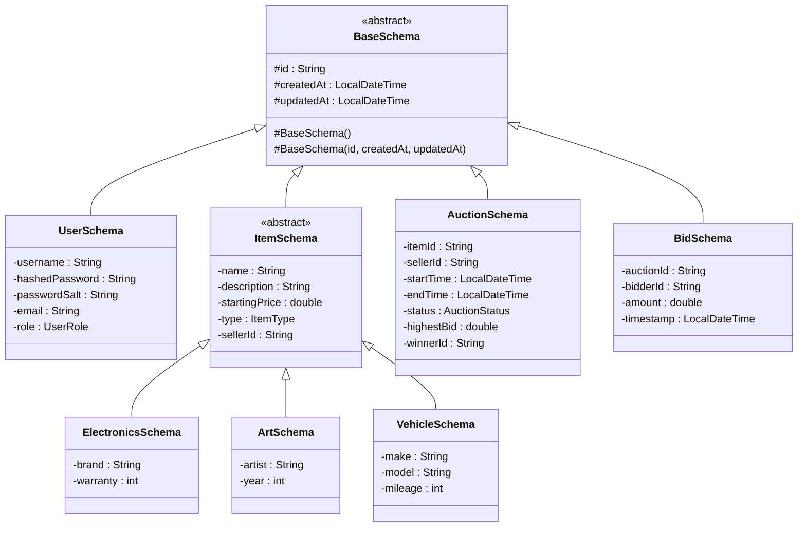
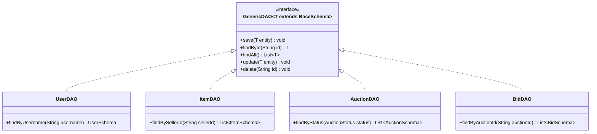
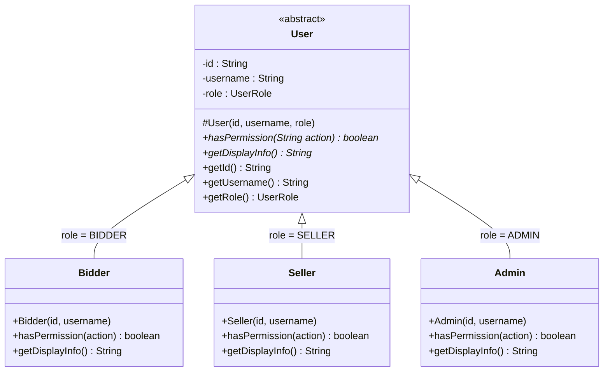
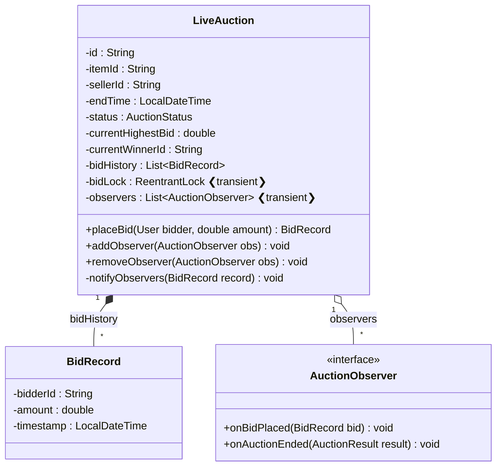
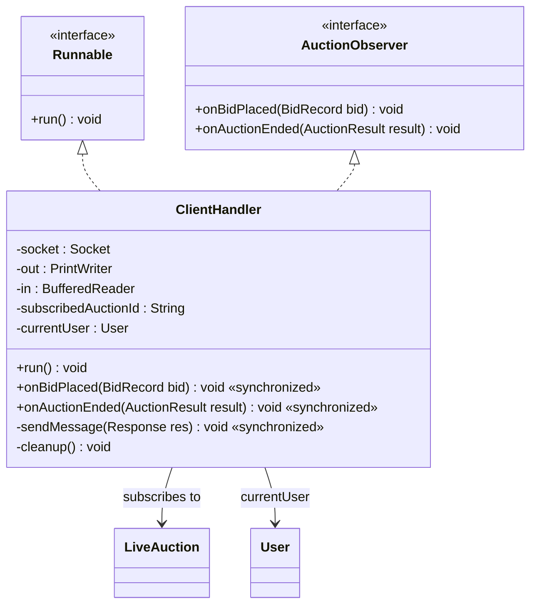
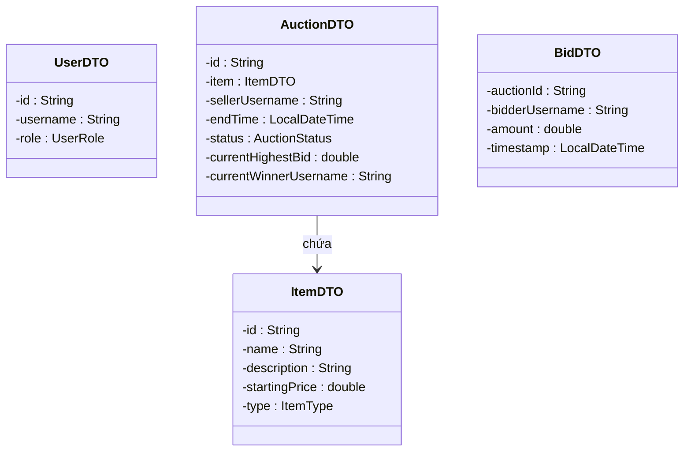
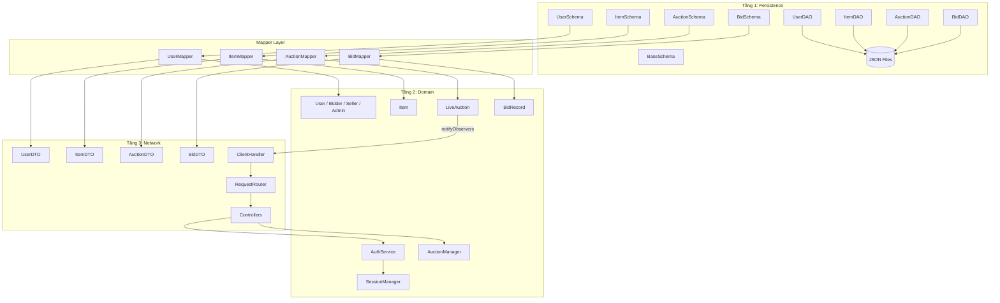
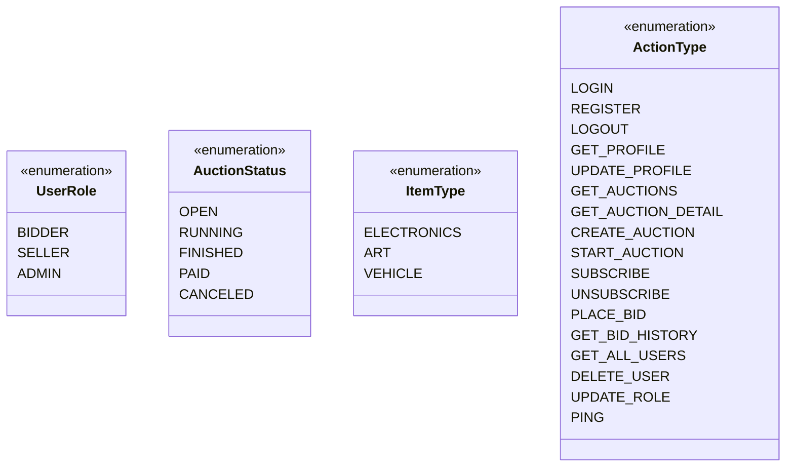
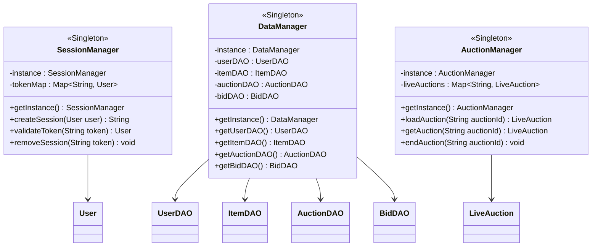

# 📊 Sơ đồ Cây kế thừa & Quan hệ giữa các lớp

> Tài liệu bổ trợ cho [server_architecture_overhaul.md](./server_architecture_overhaul.md)

---

## 1. Tầng Persistence — Cây kế thừa Schema

Tất cả các lớp Schema đều kế thừa từ `BaseSchema`. Cây kế thừa `Item` chỉ tồn tại ở tầng này.

---

## 2. Tầng Persistence — Cây DAO

Tất cả DAO implement `GenericDAO<T>`, chỉ làm việc với Schema.

---

## 3. Tầng Domain — Cây kế thừa User

Đây là cây kế thừa thể hiện **Polymorphism chính** của hệ thống qua `hasPermission()`.

---

## 4. Tầng Domain — LiveAuction & BidRecord

`LiveAuction` là class trung tâm cho logic đấu giá realtime.

---

## 5. Tầng Network — ClientHandler & Observer

`ClientHandler` vừa là Runnable (đọc request) vừa implement `AuctionObserver` (nhận push).

---

## 6. Tầng Transfer — DTO Classes

Các DTO đều immutable, chỉ có getter.

---

## 7. Toàn cảnh — Quan hệ giữa 3 tầng (qua Mapper)

Sơ đồ tổng hợp thể hiện cách 3 tầng liên kết với nhau thông qua Mapper.

---

## 8. Enums dùng chung

---

## 9. Singleton Managers

