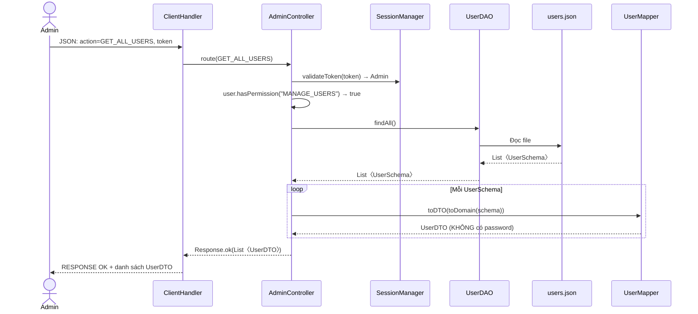
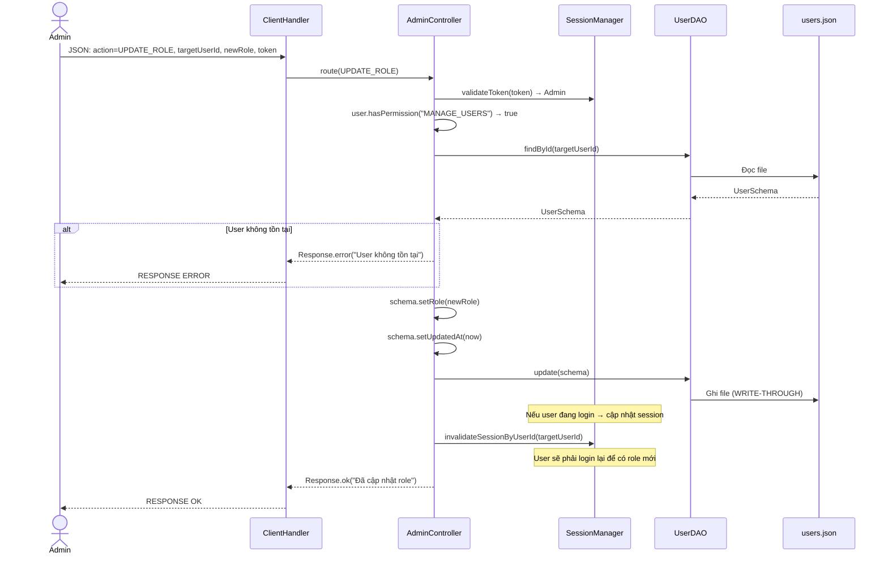
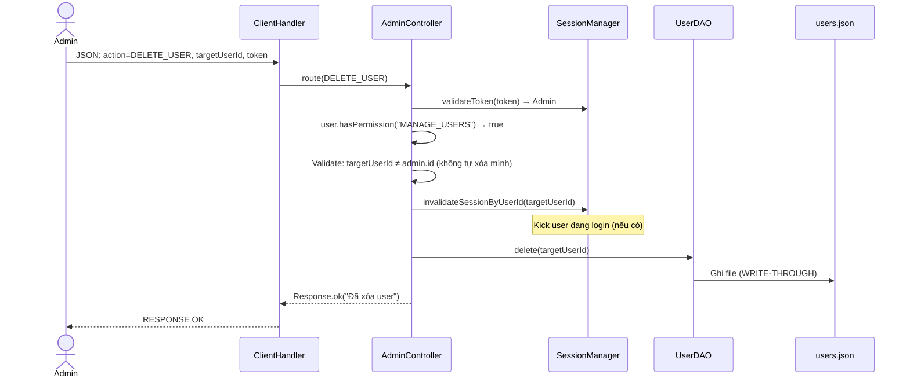
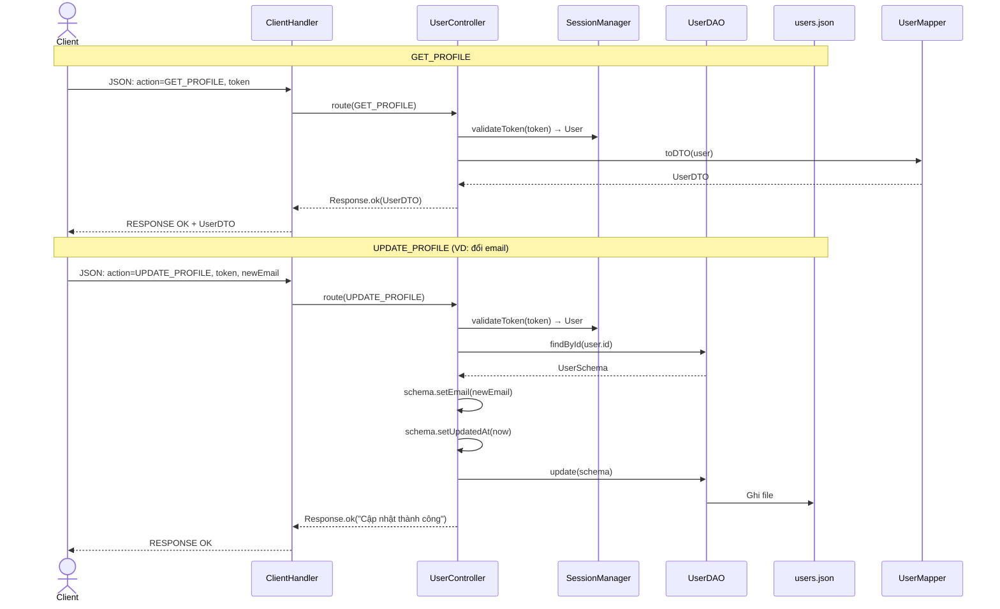
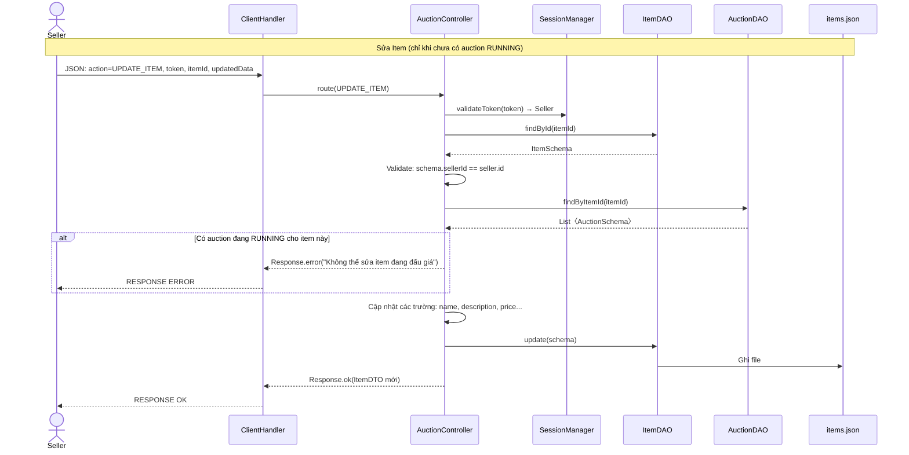
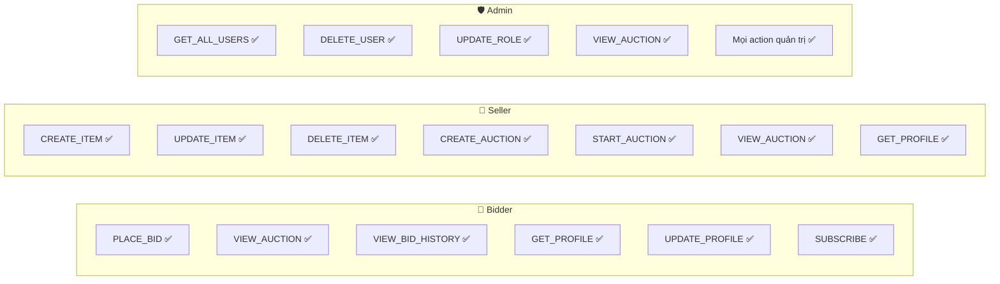
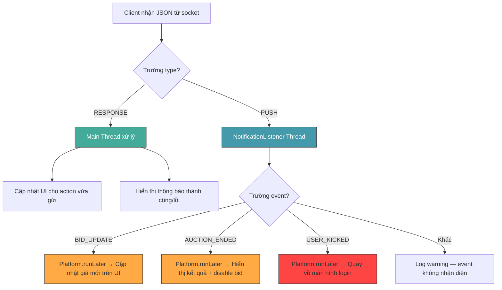

# 👤 Sơ đồ Luồng Quản trị & Các thao tác User

> Tài liệu bổ trợ cho [server_architecture_overhaul.md](./server_architecture_overhaul.md)

---

## 1. Luồng Admin xem danh sách Users

---

## 2. Luồng Admin thay đổi vai trò User

---

## 3. Luồng Admin xóa User

---

## 4. Luồng User xem / cập nhật Profile

---

## 5. Luồng Seller quản lý sản phẩm (Sửa / Xóa Item)

---

## 6. Sơ đồ phân quyền (Permission Matrix)

Tổng hợp quyền hạn của từng vai trò, được implement trong `hasPermission()`.

---

## 7. Phân biệt RESPONSE vs PUSH — Flowchart phía Client

