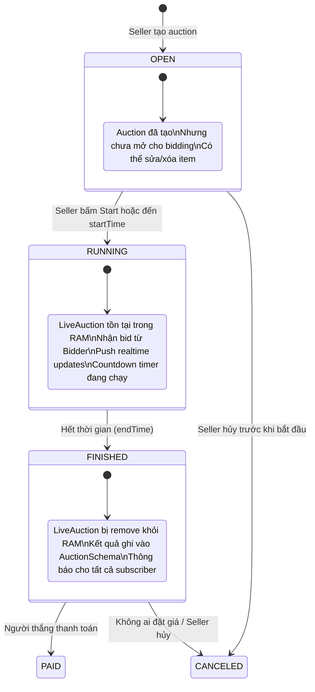
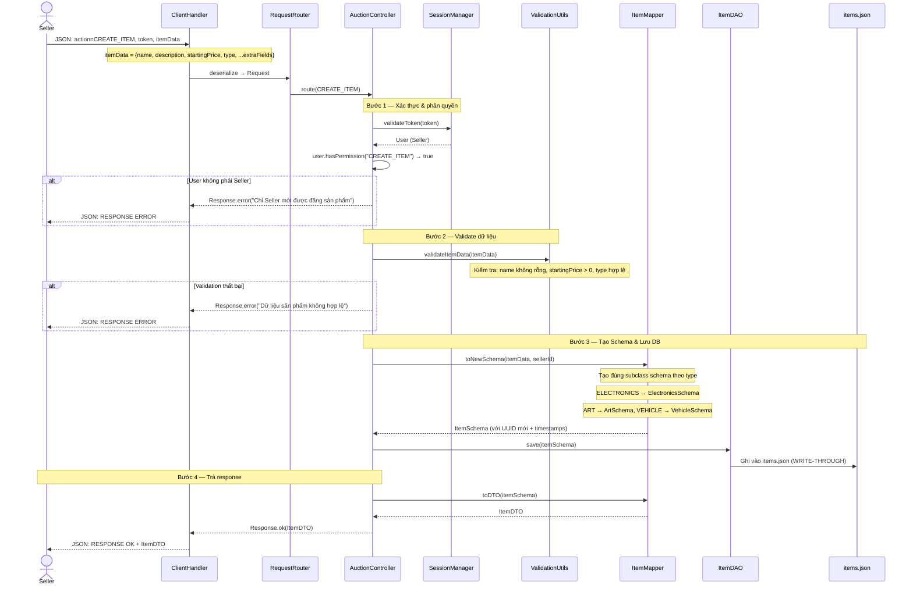
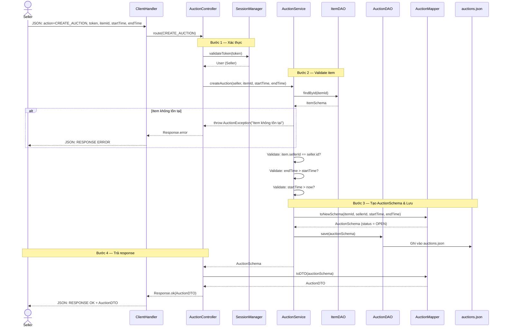
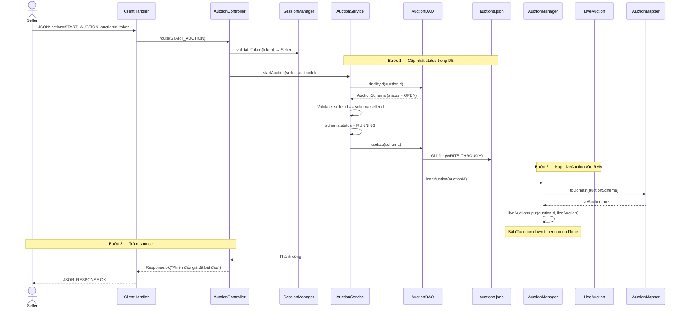
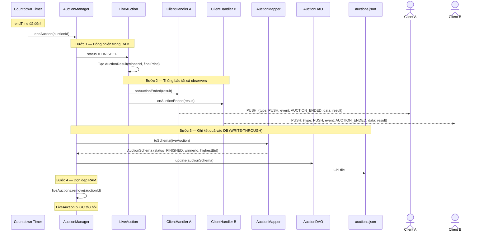
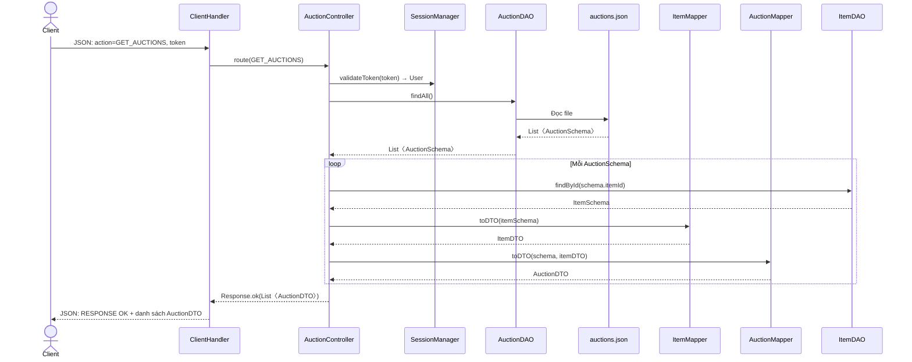
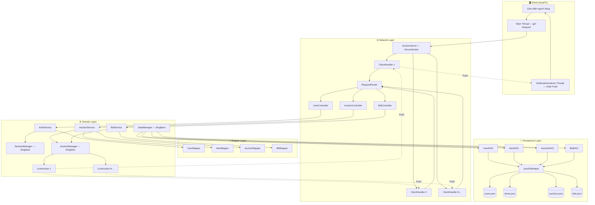

# 🏛️ Sơ đồ Luồng Quản lý Phiên đấu giá & Sản phẩm

> Tài liệu bổ trợ cho [server_architecture_overhaul.md](./server_architecture_overhaul.md)

---

## 1. Vòng đời phiên đấu giá (Auction Lifecycle)

Trạng thái của một phiên đấu giá từ khi tạo đến khi kết thúc.

---

## 2. Luồng Đăng bán sản phẩm mới (Create Item)

Seller đăng một sản phẩm lên hệ thống (chưa tạo phiên đấu giá).

---

## 3. Luồng Tạo phiên đấu giá (Create Auction)

Seller tạo phiên đấu giá cho một sản phẩm đã đăng.

---

## 4. Luồng Bắt đầu phiên đấu giá (Start Auction)

Chuyển trạng thái từ OPEN → RUNNING, nạp LiveAuction vào RAM.

---

## 5. Luồng Kết thúc phiên đấu giá (Auction End — Tự động)

Khi hết thời gian, hệ thống tự động kết thúc phiên.

---

## 6. Luồng Xem danh sách phiên đấu giá (Get Auctions)

---

## 7. Tổng quan luồng dữ liệu toàn hệ thống

