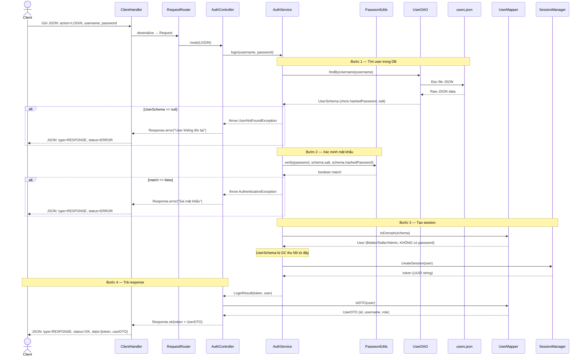
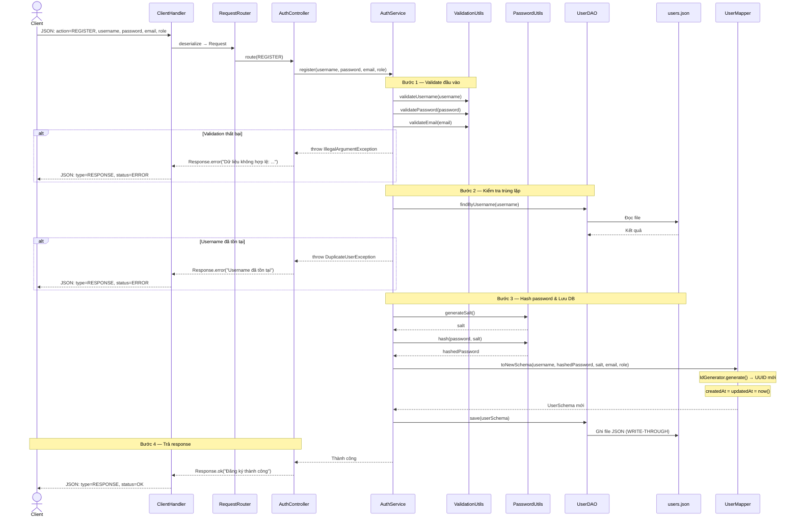
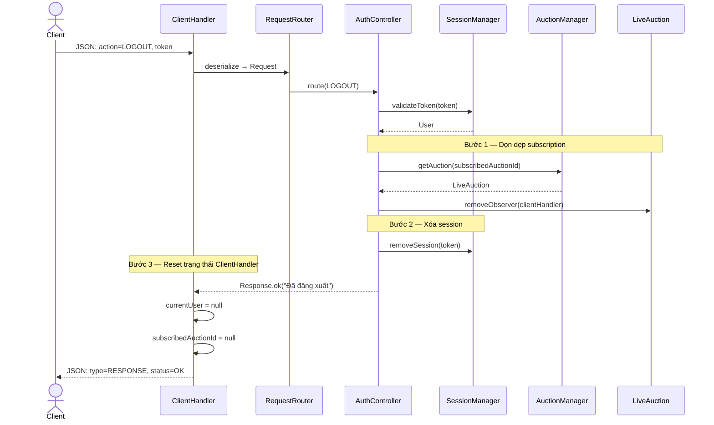
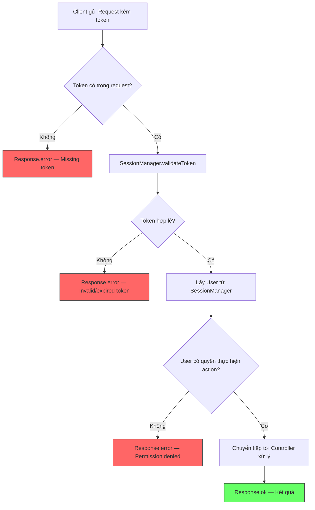

# 🔐 Sơ đồ Luồng Xác thực (Authentication Flows)

> Tài liệu bổ trợ cho [server_architecture_overhaul.md](./server_architecture_overhaul.md)

---

## 1. Luồng Đăng nhập (Login)

Từ lúc người dùng nhập tài khoản/mật khẩu đến khi nhận được token và thông tin user.

---

## 2. Luồng Đăng ký (Register)

Từ lúc người dùng điền form đăng ký đến khi tài khoản được lưu.

---

## 3. Luồng Đăng xuất (Logout)

---

## 4. Luồng Xác thực Token (dùng cho mọi request sau login)

Mọi request (trừ LOGIN, REGISTER, PING) đều phải qua bước xác thực token trước.

