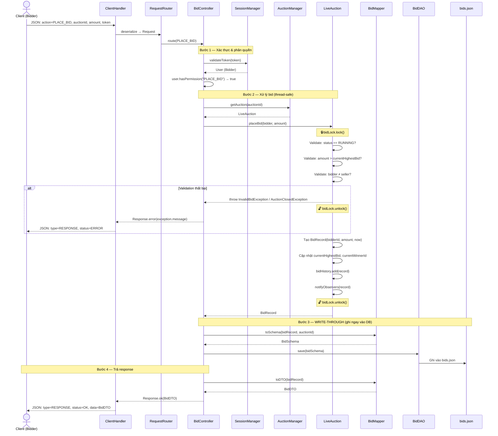
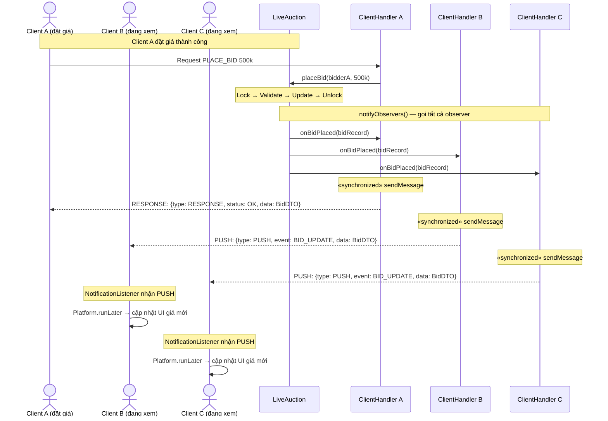
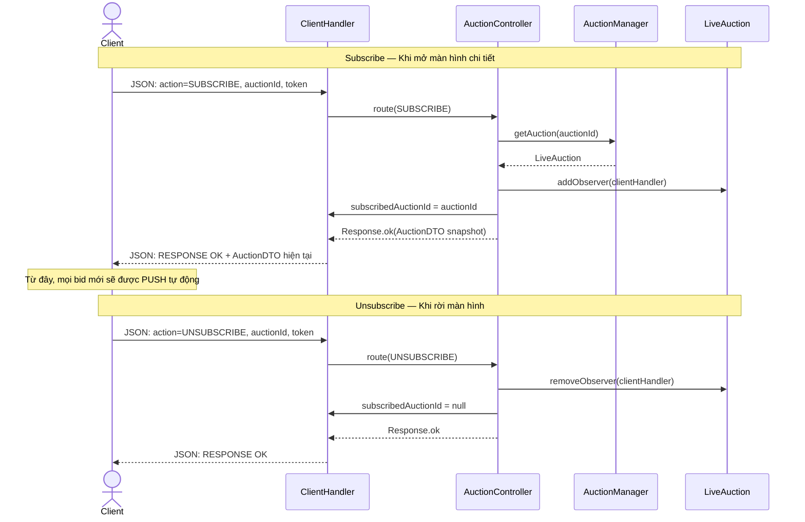
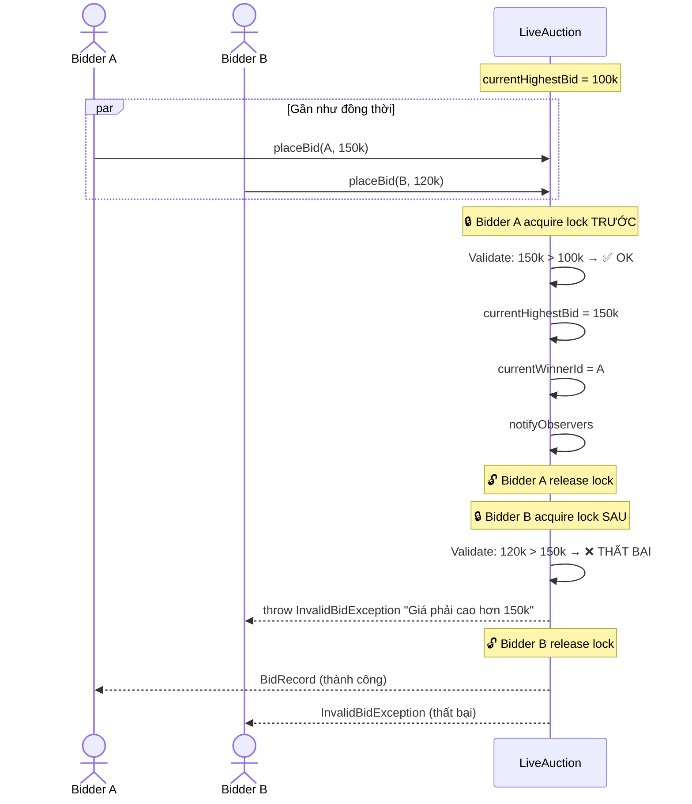
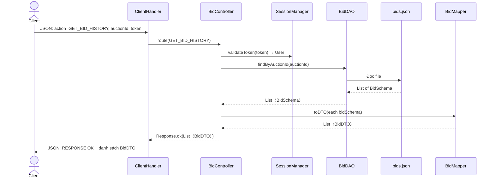

# 💰 Sơ đồ Luồng Đấu giá (Bidding Flows)

> Tài liệu bổ trợ cho [server_architecture_overhaul.md](./server_architecture_overhaul.md)

---

## 1. Luồng Đặt giá (Place Bid) — Critical Data Flow

Đây là luồng quan trọng nhất, cần write-through và thread-safe.

---

## 2. Luồng Realtime Push — Thông báo đến các Client đang xem

Khi Bidder A đặt giá, tất cả Client đang subscribe cùng phiên sẽ nhận được push.

---

## 3. Luồng Subscribe / Unsubscribe với LiveAuction

Client cần subscribe để nhận realtime push khi xem chi tiết phiên đấu giá.

---

## 4. Xử lý Concurrent Bidding — Race Condition

Khi 2 bidder đặt giá gần như cùng lúc, `ReentrantLock` đảm bảo tính nhất quán.

---

## 5. Luồng Xem lịch sử đấu giá (Get Bid History)

