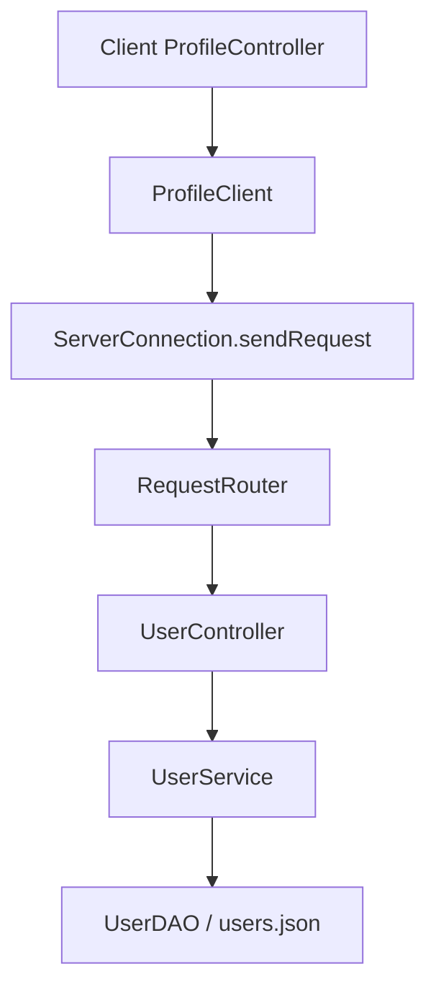
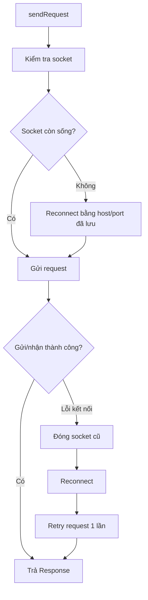

# Báo cáo chỉnh sửa Week 7 - DuyAnh

Tài liệu này ghi lại các chỉnh sửa chính đã thực hiện trên nhánh `DuyAnh-week7`.
Mục tiêu của các chỉnh sửa là giữ nguyên kiến trúc client-server hiện có, không phá vỡ contract trong `auction-protocol`, đồng thời làm rõ các luồng nghiệp vụ đã được thay đổi:

- Đổi logic Autobid giống nhánh `week7-DuyAnh`.
- Cải thiện phần chọn thời gian khi tạo phiên đấu giá.
- Thêm chức năng đổi username và đổi mật khẩu trong Profile.
- Thêm heartbeat và tự khôi phục kết nối socket.
- Dọn một số phần giao diện không cần dùng theo yêu cầu trước đó.

## 1. Logic Autobid

### 1.1. Mục tiêu

Logic Autobid được chỉnh lại theo hướng:

- Chỉ người đang dẫn đầu phiên đấu giá mới được bật Autobid.
- Autobid không tự tạo bid ngay khi bật.
- Autobid chỉ đóng vai trò bảo vệ người đang dẫn đầu khi có người khác đặt giá thủ công.
- Nếu người đặt giá thủ công vượt quá mức tối đa của Autobid cũ, người đó trở thành người dẫn đầu mới.
- Khi người dẫn đầu mới là B, B có quyền bật Autobid của chính B.

Nói ngắn gọn: Autobid không phải là hệ thống cho nhiều người cùng đặt proxy bid cạnh tranh liên tục. Autobid hiện tại là cơ chế bảo vệ người đang dẫn đầu.

### 1.2. Các file liên quan

- `auction-server/src/main/java/com/auctionuet/server/domain/model/LiveAuction.java`
- `auction-server/src/main/java/com/auctionuet/server/domain/service/BidService.java`
- `auction-server/src/test/java/com/auctionuet/server/JUnitTest/DomainModelTest.java`
- `auction-server/src/test/java/com/auctionuet/server/domain/service/AuctionServiceTest.java`

### 1.3. Điều kiện bật Autobid

Trong `BidService.setAutoBid(...)`, server kiểm tra người bật Autobid có phải là người đang dẫn đầu hay không.

Luồng kiểm tra chính:

```java
if (!bidder.getId().equals(liveAuction.getCurrentWinnerId())) {
    throw new IllegalArgumentException("chỉ người dẫn đầu mới được bật Autobid");
}
```

`LiveAuction.addAutoBid(...)` cũng kiểm tra lại điều kiện này ở tầng domain model. Việc kiểm tra ở cả service và model giúp tránh trường hợp logic bị gọi từ một đường khác trong tương lai mà bỏ qua điều kiện nghiệp vụ.

### 1.4. Autobid không tăng giá ngay khi bật

Khi người dẫn đầu bật Autobid, hệ thống chỉ lưu cấu hình:

- `bidderId`
- `maxBid`
- `increment`
- trạng thái đang hoạt động

Hệ thống không tạo thêm `BidRecord` tại thời điểm bật Autobid. Giá hiện tại của phiên đấu giá vẫn giữ nguyên.

Ví dụ:

1. A đang dẫn đầu với giá 100.
2. A bật Autobid tối đa 200, bước nhảy 10.
3. Giá hiện tại vẫn là 100.
4. Chỉ khi B đặt giá thủ công, Autobid của A mới được xét.

### 1.5. Cách xử lý khi có bid thủ công

Khi có người đặt bid thủ công, `LiveAuction.placeBid(...)` lấy lại cấu hình Autobid của người đang dẫn đầu trước đó.

Ý tưởng xử lý:

```java
AutoBidConfig previousLeaderAutoBid = getActiveAutoBidConfig(currentWinnerId);
```

Sau đó bid thủ công được ghi nhận trước. Người đặt bid thủ công tạm thời trở thành người dẫn đầu mới.

Tiếp theo hệ thống gọi logic xử lý Autobid:

```java
resolveAutoBidAfterManualBid(previousLeaderAutoBid, manualBidderId, onAutoBidPlaced);
```

Nếu người dẫn đầu cũ có Autobid đang bật, hệ thống xét các trường hợp sau.

### 1.6. Trường hợp Autobid còn đủ mức tối đa

Ví dụ:

- A đang dẫn đầu giá 100.
- A bật Autobid tối đa 200, bước nhảy 10.
- B đặt giá thủ công 150.

Vì 150 chưa vượt quá `maxBid = 200` của A, hệ thống tự đặt một bid cho A:

```text
autoBidAmount = min(maxBid, currentPrice + increment)
```

Trong ví dụ này:

```text
autoBidAmount = min(200, 150 + 10) = 160
```

Kết quả:

- Giá hiện tại là 160.
- Người dẫn đầu quay lại là A.
- Bid tự động được ghi với loại `BidType.AUTO`.
- UI realtime được thông báo như một bid mới.

### 1.7. Trường hợp bid thủ công vượt Autobid

Ví dụ:

- A đang dẫn đầu giá 100.
- A bật Autobid tối đa 200.
- B đặt giá thủ công 250.

Vì 250 lớn hơn `maxBid = 200`, Autobid của A không còn hiệu lực.

Kết quả:

- A bị tắt Autobid.
- B trở thành người dẫn đầu.
- Nếu B muốn bảo vệ vị trí dẫn đầu, B có thể bật Autobid của B.

Đây là câu trả lời cho trường hợp: nếu B vượt A thì B được bật Autobid. Điều kiện là B đã trở thành người dẫn đầu sau bid đó.

### 1.8. Lưu bid và thứ tự ghi dữ liệu

Trong `BidService.placeBid(...)`, bid thủ công được lưu trước, sau đó các bid tự động phát sinh mới được lưu.

Lý do:

- Bid thủ công là nguyên nhân gốc làm thay đổi giá.
- Bid tự động là kết quả phát sinh sau bid thủ công.
- Thứ tự lưu như vậy giúp lịch sử bid dễ đọc và đúng thứ tự nghiệp vụ.

Logic hiện tại thu các bid tự động vào danh sách, sau đó ghi xuống DAO.

### 1.9. Trạng thái Autobid

Khi client gọi kiểm tra Autobid, server trả về trạng thái dựa trên cấu hình hiện tại:

- `PROTECTING`: Autobid còn hoạt động và user đang là người dẫn đầu.
- `INEFFECTIVE`: Autobid đã không còn hiệu lực.
- `null` hoặc không có cấu hình: user chưa bật Autobid hoặc đã bị hủy.

Vì logic mới chỉ cho người dẫn đầu bật Autobid, trạng thái `WAITING` hầu như không xuất hiện trong luồng bình thường.

## 2. Cải thiện chọn thời gian tạo phiên đấu giá

### 2.1. Vấn đề ban đầu

Ở màn tạo phiên đấu giá, phần nhập thời gian bắt đầu và kết thúc khó thao tác. Đặc biệt là khi muốn đặt phút lẻ, người dùng bị phụ thuộc vào bước nhảy thời gian không linh hoạt.

Yêu cầu là cải thiện thao tác nhập thời gian nhưng không động vào logic gia hạn giờ đấu giá.

### 2.2. Các file liên quan

- `auction-client/src/main/java/com/auctionuet/client/view/CreateAuctionController.java`
- `auction-client/src/main/resources/fxml/CreateAuctionView.fxml`

### 2.3. Cách thiết kế giao diện mới

Phần thời gian bắt đầu có 3 lựa chọn:

- `Ngay bây giờ`
- `Sau 5 phút`
- `Tùy chỉnh`

Phần thời gian kết thúc có 4 lựa chọn:

- `Sau 1 giờ`
- `Sau 6 giờ`
- `Sau 1 ngày`
- `Tùy chỉnh`

Khi chọn `Tùy chỉnh`, giao diện mới hiện thêm:

- `DatePicker` để chọn ngày.
- `Spinner<Integer>` để chọn giờ.
- `Spinner<Integer>` để chọn phút.

Spinner phút chạy từ `0` đến `59` với bước nhảy `1`, nên người dùng có thể đặt phút lẻ như 07, 13, 26, 41.

### 2.4. Controller xử lý thời gian như thế nào

Trong `CreateAuctionController`, phần xử lý được tách thành các hàm rõ ràng:

- `setupTimeControls()`: khởi tạo radio button, spinner và giá trị mặc định.
- `syncTimeModeVisibility()`: ẩn hoặc hiện phần tùy chỉnh theo lựa chọn hiện tại.
- `resolveStartTime()`: đổi lựa chọn bắt đầu thành `LocalDateTime`.
- `resolveEndTime(LocalDateTime startTime)`: đổi lựa chọn kết thúc thành `LocalDateTime`.
- `getCustomDateTime(...)`: đọc ngày, giờ, phút từ các control tùy chỉnh.
- `commitSpinnerValue(...)`: nhận cả giá trị người dùng gõ tay trong spinner.
- `calculateDuration()`: tính và hiển thị thời lượng phiên.

Ví dụ luồng tạo phiên:

```text
Người dùng chọn "Sau 5 phút"
        |
        v
resolveStartTime()
        |
        v
startTime = LocalDateTime.now().plusMinutes(5)
```

Với thời gian kết thúc:

```text
Người dùng chọn "Sau 6 giờ"
        |
        v
resolveEndTime(startTime)
        |
        v
endTime = startTime.plusHours(6)
```

### 2.5. Kiểm tra lỗi thời gian

Khi bấm tạo phiên, controller vẫn kiểm tra:

- Đã chọn sản phẩm chưa.
- Tiêu đề không rỗng.
- Thời gian bắt đầu không nằm trong quá khứ.
- Thời gian kết thúc phải sau thời gian bắt đầu.
- Các giá trị chống sniping hợp lệ.

Phần thời gian bắt đầu có dung sai nhỏ để tránh trường hợp người dùng chọn "Ngay bây giờ" nhưng request đi qua socket tới server thì đồng hồ hệ thống đã chạy qua.
Server hiện cho phép thời gian bắt đầu chậm tối đa `10` giây so với thời điểm xử lý request. Nếu thời gian bắt đầu nằm trong khoảng này, server chuẩn hóa lại thành thời điểm hiện tại và cho tạo phiên. Nếu thời gian bắt đầu cũ hơn khoảng dung sai này, server vẫn từ chối vì đó là thời gian quá khứ thật sự.

### 2.6. Không thay đổi logic gia hạn giờ đấu giá

Chỉnh sửa này chỉ thay đổi cách người dùng nhập thời gian ở client.

Logic gia hạn giờ đấu giá vẫn giữ nguyên trong domain auction:

- `antiSnipingWindowSeconds`
- `antiSnipingExtensionSeconds`
- logic gia hạn trong `LiveAuction`

Nghĩa là phần tạo phiên vẫn gửi các trường chống sniping như trước, còn server vẫn xử lý gia hạn theo logic cũ.

## 3. Đổi username và đổi mật khẩu trong Profile

### 3.1. Mục tiêu

Màn Profile ban đầu có phần chỉnh sửa nhưng chưa có chức năng thật. Chức năng mới cần:

- Cho phép đổi username.
- Cho phép đổi mật khẩu.
- Khi bấm chỉnh sửa Profile, không hiện form lưu ngay, mà hiện 2 lựa chọn:
  - `Đổi tên`
  - `Đổi mật khẩu`
- Chỉ khi chọn một mục thì form tương ứng mới hiện ra.
- Dùng validation đã có trong codebase.
- Không lưu password ở client.
- Sau khi đổi username, các phần hiển thị tên ở UI phải cập nhật theo session hiện tại.

### 3.2. Các file protocol

File mới:

- `auction-protocol/src/main/java/com/auctionuet/protocol/dto/request/user/UpdateProfileRequestDTO.java`

DTO này chứa:

- `username`
- `currentPassword`
- `newPassword`

DTO validate các điều kiện cơ bản:

- Phải có ít nhất một thay đổi.
- Nếu đổi mật khẩu thì phải có cả mật khẩu hiện tại và mật khẩu mới.
- Không cho request rỗng.

Việc đặt DTO trong `auction-protocol` giúp client và server dùng chung contract, đúng theo kiến trúc contract-first của dự án.

### 3.3. Server xử lý Profile

Các file liên quan:

- `auction-server/src/main/java/com/auctionuet/server/domain/service/UserService.java`
- `auction-server/src/main/java/com/auctionuet/server/network/controller/UserController.java`
- `auction-server/src/main/java/com/auctionuet/server/network/server/RequestRouter.java`
- `auction-server/src/main/java/com/auctionuet/server/network/server/AuctionServer.java`
- `auction-server/src/main/java/com/auctionuet/server/domain/manager/SessionManager.java`
- `auction-server/src/test/java/com/auctionuet/server/domain/service/UserServiceTest.java`

### 3.4. Luồng request Profile

Luồng đổi Profile đi theo đúng kiến trúc server:



Controller không chứa nghiệp vụ đổi username hoặc đổi mật khẩu. `UserController` chỉ:

- đọc DTO bằng `request.getDataAs(...)`,
- validate token,
- kiểm tra quyền,
- gọi `UserService`,
- trả response.

### 3.5. Đổi username ở server

Trong `UserService.updateProfile(...)`, nếu request có username mới:

1. Trim username.
2. Gọi `ValidationUtils.validateUsername(...)`.
3. Kiểm tra username đã tồn tại chưa.
4. Nếu username thuộc user khác, ném `DuplicateUserException`.
5. Nếu hợp lệ, cập nhật `UserSchema`.

Điều quan trọng là kiểm tra trùng username phải bỏ qua chính user hiện tại. Nếu user gửi lại đúng username cũ của mình thì không bị coi là trùng.

### 3.6. Đổi mật khẩu ở server

Nếu request có mật khẩu mới:

1. Kiểm tra mật khẩu mới bằng `ValidationUtils.validatePassword(...)`.
2. Xác minh mật khẩu hiện tại bằng `PasswordUtils.verify(...)`.
3. Nếu mật khẩu hiện tại sai, trả lỗi `Mật khẩu hiện tại không đúng`.
4. Nếu mật khẩu mới trùng mật khẩu cũ, trả lỗi không cho đổi.
5. Sinh salt mới bằng `PasswordUtils.generateSalt()`.
6. Hash mật khẩu mới bằng `PasswordUtils.hash(...)`.
7. Lưu lại vào `UserSchema`.

Client không nhận và không lưu:

- password gốc,
- salt,
- hashed password.

Các thông tin này chỉ nằm trong schema phía server.

### 3.7. Cập nhật session server sau khi đổi username

Sau khi đổi username thành công, dữ liệu trong JSON đã thay đổi nhưng token hiện tại vẫn đang trỏ tới user runtime trong `SessionManager`.

Vì vậy `SessionManager` có thêm hàm cập nhật user trong session hiện tại. Server rebuild lại domain user từ schema mới rồi cập nhật session.

Mục đích:

- Request sau đó vẫn dùng token cũ.
- Server thấy username mới trong session.
- Không bắt người dùng đăng nhập lại chỉ vì đổi username.

### 3.8. Client xử lý Profile

Các file liên quan:

- `auction-client/src/main/java/com/auctionuet/client/network/ProfileClient.java`
- `auction-client/src/main/java/com/auctionuet/client/model/ClientSession.java`
- `auction-client/src/main/java/com/auctionuet/client/view/ProfileController.java`
- `auction-client/src/main/resources/fxml/ProfileView.fxml`

`ProfileClient` có các hàm:

- `getProfile(token)`
- `updateProfile(token, username, currentPassword, newPassword)`

Các hàm này tạo request DTO rồi gửi qua `ServerConnection.sendRequest(...)`.

### 3.9. Giao diện chọn đổi tên hoặc đổi mật khẩu

Khi người dùng bấm `Chỉnh sửa Profile`, giao diện không hiện ngay toàn bộ form. Thay vào đó, nó hiện 2 lựa chọn:

- `Đổi tên`
- `Đổi mật khẩu`

Nếu chọn `Đổi tên`, chỉ form username hiện ra.

Nếu chọn `Đổi mật khẩu`, chỉ form mật khẩu hiện ra.

Luồng giao diện:

```text
Bấm "Chỉnh sửa Profile"
        |
        v
Hiện 2 lựa chọn
        |
        +--> Đổi tên       -> hiện ô nhập username mới
        |
        +--> Đổi mật khẩu  -> hiện mật khẩu hiện tại, mật khẩu mới, xác nhận mật khẩu
```

### 3.10. Cập nhật tên trên giao diện sau khi đổi username

Sau khi đổi username thành công:

1. Server trả về `UserDTO` mới.
2. `ProfileController` gọi `ClientSession.updateCurrentUser(...)`.
3. `ClientSession` cập nhật user hiện tại.
4. Các listener đang đăng ký được gọi.
5. `DashboardController` cập nhật phần header `Tên (ROLE)`.

Vì vậy phần tên ở trên cùng giao diện, ví dụ:

```text
duyanh (BIDDER)
```

sẽ đổi ngay sau khi server trả kết quả thành công, không cần đăng nhập lại.

Nếu ở một màn nào đó vẫn đang giữ dữ liệu cũ đã render sẵn, chỉ cần reload lại màn đó để lấy dữ liệu mới từ server.

### 3.11. Vì sao cần listener trong ClientSession

Trước đó, Profile đổi tên thành công nhưng header ở Dashboard không đổi ngay vì header chỉ đọc user một lần khi màn hình khởi tạo.

`ClientSession` được bổ sung cơ chế listener:

```java
addUserChangeListener(...)
removeUserChangeListener(...)
notifyUserChanged(...)
```

Khi user thay đổi, Dashboard nhận event và render lại tên.

Việc này tránh phải truyền controller này sang controller khác, đồng thời giữ Profile không phụ thuộc trực tiếp vào Dashboard.

## 4. Heartbeat và tự khôi phục kết nối socket

### 4.1. Vấn đề ban đầu

Khi mở chương trình rồi ẩn cửa sổ, app vẫn chạy nền nhưng sau một thời gian socket có thể bị đóng do idle timeout hoặc mạng tạm ngắt.

Biểu hiện:

- Không hiện thông tin bid mới.
- Không cập nhật tiền tài khoản.
- Request mới bị lỗi kết nối.
- Người dùng tưởng phải đăng nhập lại.

### 4.2. Mục tiêu

Thay đổi cần đạt được:

- Client gửi heartbeat định kỳ để báo socket vẫn còn sống.
- Nếu socket bị ngắt, client tự reconnect bằng host/port đã lưu.
- Sau reconnect, request hiện tại được retry một lần.
- Không lưu password ở client.
- Không tự login lại bằng mật khẩu.
- Chỉ đưa về màn login nếu server xác nhận token không hợp lệ hoặc hết hạn.

### 4.3. File liên quan

- `auction-client/src/main/java/com/auctionuet/client/network/ServerConnection.java`
- `auction-client/src/main/java/com/auctionuet/client/model/ClientSession.java`

### 4.4. Lưu host và port

Sau lần kết nối thành công, `ServerConnection` lưu lại:

- `host`
- `port`

Khi socket cũ chết, client có thể mở socket mới mà không cần hỏi lại người dùng.

### 4.5. Kiểm tra trạng thái kết nối

`isConnected()` không chỉ kiểm tra socket khác `null`. Nó còn kiểm tra:

- socket đã connected,
- socket chưa closed,
- input chưa shutdown,
- output chưa shutdown,
- cờ `connectionAlive`.

Điều này giúp client phát hiện socket đã chết thay vì tưởng vẫn còn kết nối.

### 4.6. Listener thread và connection generation

`ServerConnection` có listener thread đọc dữ liệu từ server.

Server có thể gửi 2 loại message:

- Response thường cho request.
- Push realtime với `type = "PUSH"`.

Listener phân loại:

```text
Nếu message là PUSH  -> gửi tới pushListener
Nếu message là Response thường -> đưa vào responseQueue
```

Khi reconnect, socket mới sẽ có listener mới. Để tránh listener cũ làm hỏng trạng thái socket mới, code dùng `connectionGeneration`.

Ý tưởng:

```text
Mỗi lần mở socket mới -> tăng generation
Listener chỉ được đánh dấu disconnect nếu generation của nó vẫn là generation hiện tại
```

Nhờ vậy, listener cũ kết thúc muộn không thể đánh dấu nhầm kết nối mới là đã chết.

### 4.7. Heartbeat gửi PING định kỳ

Heartbeat chạy trong background thread riêng.

Chu kỳ mặc định:

```text
30 giây
```

Nếu `ClientSession` đang có token, heartbeat gửi request `PING` lên server.

Mục đích:

- Giữ socket không bị idle quá lâu.
- Phát hiện sớm socket đã bị đóng.
- Giúp request sau đó có cơ hội tự reconnect.

Heartbeat không chạy trên JavaFX Application Thread, nên không làm đơ giao diện.

### 4.8. Tự reconnect và retry request

`sendRequest(...)` được chỉnh để tự xử lý lỗi kết nối.

Luồng chính:



Nếu retry vẫn thất bại, client trả lỗi kết nối để UI hiển thị thông báo.

Quan trọng: request chỉ retry một lần để tránh vòng lặp vô hạn khi server thật sự đang tắt.

### 4.9. Không bắt đăng nhập lại khi token còn hợp lệ

Client không xóa token chỉ vì socket bị ngắt.

Các trường hợp:

- App bị ẩn lâu, socket idle bị đóng: reconnect lại và tiếp tục dùng token cũ.
- Mạng mất tạm thời: request có thể lỗi nếu reconnect fail, nhưng request sau vẫn có thể reconnect lại.
- Server vẫn còn session trong RAM: token cũ vẫn dùng được.

Người dùng không bị đưa về login trong các trường hợp này.

### 4.10. Khi nào mới về màn login

Client chỉ chuyển về login nếu server trả lỗi cho biết token không hợp lệ hoặc hết hạn.

Các message được nhận diện gồm những dạng như:

- `token không hợp lệ`
- `token khong hop le`
- `hết hạn`
- `het han`

Trường hợp thường gặp:

- Server restart.
- `SessionManager` phía server bị reset.
- Session/token bị xóa.

Khi đó client clear `ClientSession` và chuyển về màn login.

### 4.11. Vì sao không lưu password để tự login

Không lưu password ở client là quyết định an toàn hơn.

Nếu client lưu password để tự login lại:

- Password có thể bị lộ qua file local hoặc memory dump.
- Logic bảo mật phức tạp hơn.
- Không phù hợp với mục tiêu hiện tại.

Heartbeat và reconnect chỉ nhằm giữ hoặc khôi phục socket khi token server vẫn còn hợp lệ. Nó không biến session thành vĩnh viễn qua restart server.

### 4.12. Lưu ý về realtime push sau reconnect

Realtime push được gắn với `ClientHandler` ở server. Khi reconnect, server tạo handler mới.

Vì vậy, nếu một màn đấu giá cần nhận push realtime sau reconnect, màn đó nên subscribe lại khi được mở hoặc reload. Đây là hành vi phù hợp với kiến trúc hiện tại vì subscription thuộc kết nối socket hiện tại.

## 5. Dọn giao diện theo yêu cầu

### 5.1. Bỏ dropdown lọc trạng thái ở danh sách đấu giá

Các file liên quan:

- `auction-client/src/main/java/com/auctionuet/client/view/AuctionListController.java`
- `auction-client/src/main/resources/fxml/AuctionListView.fxml`

Dropdown lọc trạng thái được bỏ khỏi giao diện. Màn danh sách vẫn giữ:

- tìm kiếm,
- lọc phiên của tôi,
- danh sách phiên đấu giá.

Việc bỏ dropdown chỉ là thay đổi UI, không thay đổi logic server.

### 5.2. Bỏ biểu đồ giá ở chi tiết đấu giá

Các file liên quan:

- `auction-client/src/main/java/com/auctionuet/client/view/AuctionDetailController.java`
- `auction-client/src/main/resources/fxml/AuctionDetailView.fxml`

Biểu đồ giá được bỏ khỏi màn chi tiết đấu giá. Màn chi tiết vẫn giữ:

- thông tin phiên,
- giá hiện tại,
- người dẫn đầu,
- lịch sử bid,
- thao tác đặt giá,
- thao tác Autobid.

Lịch sử bid dạng bảng vẫn là nguồn chính để người dùng xem diễn biến giá.

## 6. Kiểm thử đã chạy

Trong quá trình chỉnh sửa, các nhóm test/compile liên quan đã được chạy:

```powershell
mvn -pl auction-server -am "-Dtest=AuctionServiceTest,DomainModelTest" "-Dsurefire.failIfNoSpecifiedTests=false" test
```

Kết quả: nhóm test domain và auction service chạy thành công.

```powershell
mvn -pl auction-server -am "-Dtest=UserServiceTest,AuthServiceTest" "-Dsurefire.failIfNoSpecifiedTests=false" test
```

Kết quả: nhóm test user service và auth service chạy thành công.

```powershell
mvn -pl auction-client -am "-Dsurefire.failIfNoSpecifiedTests=false" test
```

Kết quả: module client compile/test thành công.

## 7. Tổng kết luồng thay đổi

Các chỉnh sửa chính đều giữ đúng hướng kiến trúc của dự án:

- Contract request/response được đặt trong `auction-protocol`.
- Nghiệp vụ đổi profile nằm trong `UserService`, không nằm trong JavaFX controller.
- Logic Autobid nằm trong `LiveAuction` và `BidService`, không đưa vào UI.
- Heartbeat/reconnect nằm trong `ServerConnection`, nên các network adapter không cần đổi public API.
- Giao diện tạo phiên chỉ thay đổi cách nhập thời gian, không đổi contract và không đổi logic gia hạn giờ đấu giá.
- Client không lưu password và không tự đăng nhập lại bằng password.

Sau các thay đổi này, hệ thống có các hành vi chính:

- Người dẫn đầu mới có thể bật Autobid.
- Autobid bảo vệ người dẫn đầu cho tới khi bị vượt quá max bid.
- Người dùng có thể chọn phút lẻ khi tạo phiên đấu giá.
- Người dùng đổi được username và mật khẩu trong Profile.
- Header tên người dùng cập nhật sau khi đổi username.
- Socket có heartbeat và có thể tự reconnect nếu mất kết nối tạm thời.
- Chỉ yêu cầu đăng nhập lại khi server xác nhận token không còn hợp lệ.
