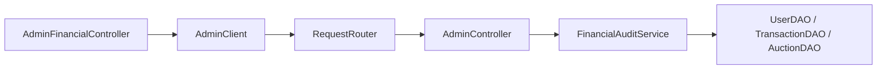
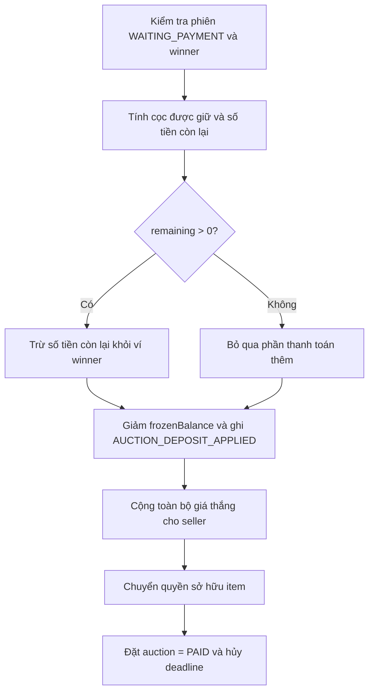
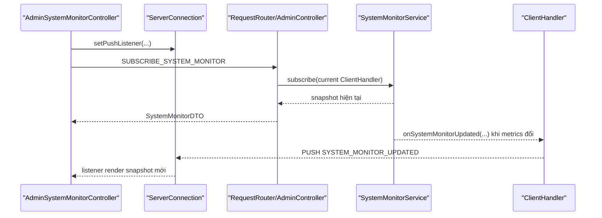

# Báo cáo chỉnh sửa Week 8 - Khanh

Tài liệu này ghi lại các thay đổi chính trên nhánh `Khanh-week8` so với `main`.
Nhánh gồm hai commit chức năng:

| Commit | Nội dung |
| --- | --- |
| `a049e32` | Thêm kiểm toán tài chính, thống kê ví và bộ lọc giao dịch cho Admin |
| `22f4443` | Thêm màn giám sát hệ thống realtime cho Admin |

Các thay đổi tuân theo kiến trúc contract-first hiện có:

- DTO, enum quyền và action mạng được đặt trong `auction-protocol`.
- Nghiệp vụ tổng hợp tài chính và theo dõi metrics nằm ở service phía server.
- Network controller chỉ xác thực token, kiểm tra quyền và điều phối request.
- Các thao tác mạng ở JavaFX chạy nền, sau đó cập nhật UI qua `Platform.runLater(...)`.

## 1. Kiểm toán tài chính và ví cho Admin

### 1.1. Mục tiêu

Admin có thêm màn `Kiểm toán tài chính` để:

- Xem tổng số dư khả dụng của toàn bộ người dùng.
- Xem tổng số tiền đang bị đóng băng trong ví.
- Xem doanh thu tiền phạt do tịch thu tiền cọc.
- Tra cứu tất cả giao dịch trong hệ thống.
- Lọc giao dịch theo loại, theo người dùng hoặc kết hợp cả hai điều kiện.

Phiên bản này không thu phí hoa hồng. Chỉ giao dịch tịch thu cọc do vi phạm
thanh toán được tính vào doanh thu tiền phạt.

### 1.2. Contract mới

Các file protocol liên quan:

- `auction-protocol/src/main/java/com/auctionuet/protocol/ActionType.java`
- `auction-protocol/src/main/java/com/auctionuet/protocol/enums/Permission.java`
- `auction-protocol/src/main/java/com/auctionuet/protocol/enums/TransactionType.java`
- `auction-protocol/src/main/java/com/auctionuet/protocol/dto/request/admin/GetGlobalTransactionsRequestDTO.java`
- `auction-protocol/src/main/java/com/auctionuet/protocol/dto/response/admin/FinancialSummaryDTO.java`

Các thành phần được bổ sung:

| Thành phần | Ý nghĩa |
| --- | --- |
| `GET_GLOBAL_TRANSACTIONS` | Lấy lịch sử giao dịch toàn hệ thống |
| `GET_FINANCIAL_SUMMARY` | Lấy ba chỉ số tổng hợp tài chính |
| `VIEW_FINANCIAL_AUDIT` | Quyền truy cập báo cáo tài chính, chỉ Admin có |
| `AUCTION_DEPOSIT_APPLIED` | Tiền cọc người thắng được áp dụng vào thanh toán thành công |

`GetGlobalTransactionsRequestDTO` có hai bộ lọc tùy chọn:

- `userId`: định danh người dùng cần tra cứu.
- `type`: loại giao dịch cần tra cứu.

Khi cả hai trường có giá trị, server áp dụng điều kiện `AND`.

`FinancialSummaryDTO` trả về:

- `availableBalanceTotal`
- `frozenBalanceTotal`
- `penaltyRevenueTotal`

### 1.3. Phân loại lại giao dịch cọc

Trước thay đổi này, cọc của người thắng được sử dụng khi thanh toán thành công
có thể bị ghi là `AUCTION_DEPOSIT_FORFEIT`. Cách ghi đó làm doanh thu tiền phạt
bị tính sai.

Luồng mới phân biệt rõ:

| Tình huống | Loại giao dịch |
| --- | --- |
| Người thắng thanh toán thành công, cọc được trừ vào tiền phải trả | `AUCTION_DEPOSIT_APPLIED` |
| Người thắng quá hạn hoặc vi phạm thanh toán, cọc bị tịch thu | `AUCTION_DEPOSIT_FORFEIT` |

Các file xử lý luồng này:

- `auction-server/src/main/java/com/auctionuet/server/domain/service/AuctionService.java`
- `auction-server/src/main/java/com/auctionuet/server/domain/service/WalletService.java`

`WalletService` có thêm `applyAuctionDeposit(...)` để ghi giao dịch cọc đã dùng
vào thanh toán mà không trộn lẫn với tiền phạt.

### 1.4. Migration dữ liệu giao dịch cũ

File mới:

- `auction-server/src/main/java/com/auctionuet/server/domain/service/FinancialAuditService.java`

Khi server khởi động, `AuctionServer` gọi:

```java
financialAuditService.migratePaidAuctionDepositTransactions();
```

Migration tìm các giao dịch thỏa cả hai điều kiện:

- Có loại cũ là `AUCTION_DEPOSIT_FORFEIT`.
- Thuộc phiên đấu giá đã có trạng thái `PAID`.

Các giao dịch này được chuyển sang `AUCTION_DEPOSIT_APPLIED`. Migration chỉ đổi
loại giao dịch, không tạo bản ghi mới, nên chạy lại không gây nhân đôi dữ liệu.

Dữ liệu mẫu được theo dõi trong `data/transactions.json` cũng được cập nhật theo
quy tắc này để báo cáo không hiển thị tiền cọc thanh toán thành tiền phạt.

### 1.5. Service tổng hợp và lọc giao dịch

`FinancialAuditService` chịu trách nhiệm nghiệp vụ báo cáo:

| Chỉ số | Cách tính |
| --- | --- |
| Số dư khả dụng | Tổng `UserSchema.balance` của mọi user |
| Tiền đang đóng băng | Tổng `UserSchema.frozenBalance` của mọi user |
| Doanh thu tiền phạt | Tổng amount của giao dịch `AUCTION_DEPOSIT_FORFEIT` |

Danh sách giao dịch được lọc phía server và sắp xếp theo `createdAt` giảm dần,
để giao dịch mới nhất xuất hiện trước.

### 1.6. API và phân quyền server

Các file server được nối thêm:

- `auction-server/src/main/java/com/auctionuet/server/network/controller/AdminController.java`
- `auction-server/src/main/java/com/auctionuet/server/network/server/RequestRouter.java`
- `auction-server/src/main/java/com/auctionuet/server/network/server/AuctionServer.java`
- `auction-server/src/main/java/com/auctionuet/server/domain/model/Admin.java`

Luồng request báo cáo tài chính:



Hai action tài chính đều yêu cầu:

- Token đăng nhập hợp lệ.
- Runtime user có quyền `VIEW_FINANCIAL_AUDIT`.

Chỉ role `ADMIN` được cấp quyền này.

### 1.7. Giao diện client

Các file client mới hoặc được cập nhật:

- `auction-client/src/main/java/com/auctionuet/client/network/AdminClient.java`
- `auction-client/src/main/java/com/auctionuet/client/view/AdminFinancialController.java`
- `auction-client/src/main/java/com/auctionuet/client/view/DashboardController.java`
- `auction-client/src/main/resources/fxml/AdminFinancialView.fxml`
- `auction-client/src/main/resources/fxml/DashboardView.fxml`

Màn hình tài chính hiển thị ba thẻ độc lập:

- `Số dư khả dụng`
- `Tiền đang đóng băng`
- `Doanh thu tiền phạt`

Bảng giao dịch hiển thị:

- Thời gian
- Người dùng
- Loại giao dịch
- Số tiền
- Phiên đấu giá
- Mô tả

Bộ lọc người dùng gửi `AdminUserDTO.id` tới server, còn UI hiển thị username.
Tất cả lời gọi lấy dữ liệu chạy ở thread nền; việc render số liệu và bảng chạy
trên JavaFX Application Thread qua `Platform.runLater(...)`.

### 1.8. Phân tích logic xử lý tài chính

#### 1.8.1. Vì sao cần tách `APPLIED` khỏi `FORFEIT`

Tiền cọc có cùng thao tác vật lý ở ví là giảm `frozenBalance`, nhưng có hai ý
nghĩa nghiệp vụ khác nhau:

```text
Cọc được giữ
     |
     +--> Thanh toán thành công --> áp vào tổng giá mua --> APPLIED
     |
     +--> Quá hạn thanh toán ----> sàn giữ làm phạt -----> FORFEIT
```

Nếu cả hai nhánh đều ghi `FORFEIT`, phép tổng hợp doanh thu không thể biết khoản
nào thực sự thuộc về sàn. Việc thêm `AUCTION_DEPOSIT_APPLIED` giải quyết ở tầng
dữ liệu giao dịch, thay vì vá bằng điều kiện suy luận tại màn báo cáo.

#### 1.8.2. Luồng thanh toán thành công

Trong `AuctionService.payAuction(...)`, server chỉ xử lý khi phiên đang ở
`WAITING_PAYMENT` và người gọi đúng là winner. Service lấy số cọc đã giữ từ
`AuctionDepositRefSchema`, sau đó tính:

```text
remaining = highestBid - retainedDepositAmount
```

Thứ tự xử lý chính:



Điểm quan trọng là seller vẫn nhận `highestBid`, còn winner thanh toán bằng hai
nguồn: phần tiền khả dụng còn lại và phần cọc đã đóng băng. Không có khoản
`penaltyRevenueTotal` nào phát sinh trong nhánh thanh toán hợp lệ.

#### 1.8.3. Luồng quá hạn thanh toán

Trong `AuctionService.expirePaymentDeadline(...)`, server chỉ xử lý phiên
`WAITING_PAYMENT`. Khi winner không thanh toán đúng hạn:

1. Tìm khoản cọc giữ của winner và transaction liên quan.
2. Gọi `walletService.forfeitAuctionDeposit(...)`.
3. Giảm `frozenBalance` của winner và ghi `AUCTION_DEPOSIT_FORFEIT`.
4. Chuyển phiên sang `CANCELED`, xóa deadline và đưa phiên khỏi RAM.

Đây là luồng duy nhất trong phần bổ sung làm tăng chỉ số doanh thu tiền phạt.

#### 1.8.4. Logic migration và tính idempotent

`migratePaidAuctionDepositTransactions()` lập tập id của các phiên `PAID`, rồi
duyệt mọi giao dịch. Điều kiện sửa bản ghi là:

```java
transaction.getType() == TransactionType.AUCTION_DEPOSIT_FORFEIT
        && paidAuctionIds.contains(transaction.getAuctionId())
```

Sau lần chạy đầu tiên, giao dịch đã sửa có type là `AUCTION_DEPOSIT_APPLIED` nên
không còn khớp điều kiện ở các lần chạy sau. Vì vậy:

- Không tạo giao dịch bổ sung.
- Không làm thay đổi amount, auction link hoặc thời điểm giao dịch.
- Có thể chạy lại mỗi khi server khởi động mà không cộng trùng doanh thu.

Migration được chạy trước khi server bắt đầu nhận request, do đó màn báo cáo
không quan sát trạng thái trung gian trong lúc dữ liệu cũ đang được sửa.

#### 1.8.5. Logic tính summary và truy vấn giao dịch

`FinancialAuditService.getSummary()` không tự dựng số liệu từ các dòng thay đổi
ví. Service đọc trạng thái hiện tại của user để tính balance/frozen balance, và
đọc transaction để tính doanh thu:

```text
availableBalanceTotal = sum(users.balance)
frozenBalanceTotal    = sum(users.frozenBalance)
penaltyRevenueTotal   = sum(transaction.amount where type = FORFEIT)
```

Cách tính này có chủ đích:

- Số dư là snapshot hiện tại, nên lấy trực tiếp từ ví.
- Doanh thu là lịch sử khoản tiền bị giữ lại, nên lấy từ ledger giao dịch.
- `APPLIED` không bị cộng nhầm vào doanh thu sau khi dữ liệu đã phân loại.

`getTransactions(userId, type)` dùng hai phép lọc độc lập nối tiếp. Khi tham số
là `null`, điều kiện tương ứng được bỏ qua; khi cả hai có giá trị, kết quả buộc
phải khớp cả user và type. Cuối cùng service sort giảm dần theo `createdAt`.

#### 1.8.6. Vai trò từng tầng trong request tài chính

| Tầng | Logic được đặt tại đây |
| --- | --- |
| `AdminFinancialController` | Đọc filter UI, gọi mạng nền, render số liệu/bảng |
| `AdminClient` | Tạo request theo DTO dùng chung, bóc response |
| `AdminController` | Validate token và `VIEW_FINANCIAL_AUDIT` |
| `FinancialAuditService` | Tính tổng, lọc giao dịch, migration |
| DAO/schema | Đọc và ghi dữ liệu JSON thực tế |

Việc tách này giữ JavaFX controller không biết cách tính doanh thu, đồng thời
không để network controller tự duyệt DAO hoặc tự tổng hợp số tiền.

#### 1.8.7. Giới hạn nhất quán hiện tại

Luồng thanh toán cập nhật nhiều bản ghi JSON liên tiếp: ví winner, giao dịch,
ví seller, item và auction. Nhánh này giữ nguyên mô hình DAO hiện có và chưa bổ
sung transaction/rollback nguyên tử. Do đó thay đổi đã sửa đúng cách phân loại
giao dịch, nhưng không mở rộng phạm vi sang cơ chế phục hồi nếu tiến trình dừng
giữa một chuỗi ghi dữ liệu.

## 2. Giám sát hệ thống realtime cho Admin

### 2.1. Mục tiêu

Admin có thêm màn `Giám sát hệ thống` hiển thị realtime:

- Tổng socket client server đang giữ.
- Tổng số `LiveAuction` đang tồn tại trong RAM.

Số kết nối bao gồm cả:

- Kết nối của admin đang mở màn monitor.
- Client đã đăng nhập.
- Client đã kết nối socket nhưng chưa đăng nhập.

Chức năng này chỉ giám sát metrics runtime, không thêm tính năng gửi thông báo
broadcast và không lưu lịch sử metrics xuống JSON.

### 2.2. Contract push và quyền mới

Các file protocol liên quan:

- `auction-protocol/src/main/java/com/auctionuet/protocol/ActionType.java`
- `auction-protocol/src/main/java/com/auctionuet/protocol/PushActionType.java`
- `auction-protocol/src/main/java/com/auctionuet/protocol/dto/push/PushEvents.java`
- `auction-protocol/src/main/java/com/auctionuet/protocol/dto/response/admin/SystemMonitorDTO.java`
- `auction-protocol/src/main/java/com/auctionuet/protocol/enums/Permission.java`

Các thành phần mới:

| Thành phần | Ý nghĩa |
| --- | --- |
| `SUBSCRIBE_SYSTEM_MONITOR` | Admin mở kênh theo dõi và nhận snapshot ban đầu |
| `UNSUBSCRIBE_SYSTEM_MONITOR` | Admin dừng nhận cập nhật monitor |
| `VIEW_SYSTEM_MONITOR` | Quyền xem monitor, chỉ Admin có |
| `SYSTEM_MONITOR_UPDATED` | Push event phát khi metrics thay đổi |

`SystemMonitorDTO` và payload push chứa cùng dữ liệu:

- `activeConnectionCount`
- `liveAuctionCount`
- `sequence`
- `capturedAt`

`sequence` là số thứ tự tăng dần mỗi khi metrics thay đổi. Client dùng sequence
để không cho response subscribe ban đầu ghi đè một push mới hơn đã tới trước.

### 2.3. Service monitor phía server

Các file server mới:

- `auction-server/src/main/java/com/auctionuet/server/domain/model/SystemMonitorObserver.java`
- `auction-server/src/main/java/com/auctionuet/server/domain/service/SystemMonitorService.java`

`SystemMonitorService` nhận hai nguồn đếm runtime qua `IntSupplier`:

- Số kết nối từ `activeConnections` của `AuctionServer`.
- Số phiên live từ `AuctionManager.getLiveAuctionCount()`.

Service chịu trách nhiệm:

- Trả snapshot ban đầu khi subscribe.
- Quản lý tập observer đang theo dõi.
- Tăng `sequence` khi metrics thay đổi.
- Phát snapshot mới tới các observer.

`ClientHandler` triển khai `SystemMonitorObserver`; khi có snapshot mới, handler
chuyển dữ liệu thành `PushMessage` loại `SYSTEM_MONITOR_UPDATED` để gửi qua socket.

### 2.4. Theo dõi số kết nối socket

Trong `AuctionServer`, ngay sau khi `accept()` thành công:

1. `activeConnections` được tăng.
2. `SystemMonitorService` được báo metrics đã thay đổi.
3. Handler mới được tạo cho socket.

Khi `ClientHandler` cleanup:

1. Handler tự unsubscribe khỏi monitor.
2. `activeConnections` được giảm.
3. Service phát snapshot mới cho các observer còn sống.

Thứ tự cleanup bảo đảm socket vừa đóng không còn nằm trong tập nhận push.

### 2.5. Theo dõi số phiên live trong RAM

File được cập nhật:

- `auction-server/src/main/java/com/auctionuet/server/domain/manager/AuctionManager.java`

`AuctionManager` bổ sung:

- `getLiveAuctionCount()`
- Callback `setLiveAuctionCountChangeCallback(...)`

Callback chỉ chạy khi kích thước map `liveAuctions` thực sự thay đổi:

- Phiên được load/start vào RAM lần đầu.
- Phiên kết thúc và bị lấy khỏi map.
- Phiên bị hủy hoặc bị remove khỏi map.

Việc load lại một phiên có cùng id không phát cập nhật thừa vì số lượng phiên
live không đổi.

### 2.6. API subscribe/unsubscribe

`AdminController` có thêm hai handler:

- `handleSubscribeSystemMonitor(...)`
- `handleUnsubscribeSystemMonitor(...)`

`RequestRouter` truyền kèm `ClientHandler` hiện tại làm observer. Hai API đều
kiểm tra token và quyền `VIEW_SYSTEM_MONITOR`; Bidder và Seller không được truy cập.

### 2.7. Giao diện monitor và lifecycle

Các file client mới hoặc được cập nhật:

- `auction-client/src/main/java/com/auctionuet/client/network/AdminClient.java`
- `auction-client/src/main/java/com/auctionuet/client/view/AdminSystemMonitorController.java`
- `auction-client/src/main/java/com/auctionuet/client/view/DashboardContentLifecycle.java`
- `auction-client/src/main/java/com/auctionuet/client/view/DashboardController.java`
- `auction-client/src/main/resources/fxml/AdminSystemMonitorView.fxml`
- `auction-client/src/main/resources/fxml/DashboardView.fxml`

Màn monitor có:

- Thẻ số kết nối đang hoạt động.
- Thẻ số phiên đấu giá realtime.
- Thời điểm snapshot gần nhất.
- Trạng thái kênh giám sát.
- Nút thử đăng ký lại nếu request subscribe lỗi.

Khi mở màn:

1. Controller đăng ký push listener trước.
2. Gửi `SUBSCRIBE_SYSTEM_MONITOR` trên thread nền.
3. Render response ban đầu và các push tiếp theo bằng `Platform.runLater(...)`.

Khi rời màn hoặc đăng xuất:

1. `DashboardController` gọi `cleanup()` thông qua `DashboardContentLifecycle`.
2. Monitor controller gỡ push listener.
3. Gửi `UNSUBSCRIBE_SYSTEM_MONITOR` ở thread nền.

Cơ chế lifecycle này tránh giữ subscription và listener sau khi Admin không còn
đang xem màn giám sát.

### 2.8. Phân tích logic realtime monitor

#### 2.8.1. Snapshot không phải dữ liệu lưu trữ

`SystemMonitorService` không phụ thuộc DAO. Hai số liệu của nó được đọc trực tiếp
từ runtime:

```text
activeConnectionCount <- AtomicInteger trong AuctionServer
liveAuctionCount       <- liveAuctions.size() trong AuctionManager
```

Điều này phù hợp với ý nghĩa monitor: một phiên đã lưu JSON nhưng không chạy
trong map RAM không được tính là live; một socket chưa đăng nhập nhưng server vẫn
đang giữ vẫn được tính là kết nối đang hoạt động.

#### 2.8.2. Vòng đời subscription

Khi Admin mở màn monitor, luồng xử lý là:



Observer chính là `ClientHandler` gắn với socket đang mở. Điều này có nghĩa
subscription tự nhiên thuộc về kết nối vật lý hiện tại, không phải chỉ thuộc về
token. Nếu socket mất, handler cũ được cleanup và không còn nhận push.

#### 2.8.3. Vì sao listener được gắn trước request subscribe

Controller client gọi `setPushListener(...)` trước khi gửi request subscribe.
Sau khi observer đã được đăng ký ở server, một client khác có thể kết nối hoặc
một phiên đấu giá có thể bắt đầu ngay lập tức. Nếu listener được gắn muộn, push
đầu tiên có thể bị bỏ lỡ trước khi response ban đầu được render.

#### 2.8.4. Chống ghi đè dữ liệu mới bằng `sequence`

Sau khi subscribe, response snapshot và push có thể đến gần nhau. Ví dụ:

```text
Snapshot response: sequence = 10
Metrics thay đổi:  push sequence = 11
UI nhận/render push trước rồi mới xử lý response cũ
```

`AdminSystemMonitorController.renderSnapshot(...)` chỉ nhận dữ liệu nếu:

```java
sequence >= latestSequence
```

Vì vậy response `10` không thể ghi đè giá trị mới đã render từ push `11`.
Cho phép sequence bằng nhau là hợp lệ vì hai dữ liệu cùng phiên bản không làm
chỉ số lùi lại.

#### 2.8.5. Logic tăng/giảm kết nối

Khi socket mới được `accept()`, `AuctionServer` tăng `activeConnections` trước
khi báo `notifyMetricsChanged()`. Do đó mọi Admin đang subscribe sẽ nhận snapshot
đã chứa socket mới.

Riêng socket của Admin đang xem màn hình đã được accept trước khi Admin gửi lệnh
subscribe, nên snapshot đầu tiên của chính màn hình cũng đã bao gồm kết nối Admin.

Khi socket đóng, `ClientHandler.cleanup()` thực hiện:

```text
unsubscribe(this) -> decrement activeConnections -> notifyMetricsChanged()
```

Handler bị đóng được loại khỏi tập observer trước khi service phát update giảm
kết nối. Nhờ đó server không cố gửi snapshot mới qua socket vừa chết.

#### 2.8.6. Logic chỉ phát khi số live auction đổi

`AuctionManager.loadAuction(...)` dùng giá trị trả về của `liveAuctions.put(...)`:

- `previous == null`: id chưa có trong map, số phiên tăng, cần phát metrics.
- `previous != null`: cùng id chỉ được hydrate/thay object, số phiên không đổi,
  không phát metrics thừa.

Tương tự, `endAuction(...)` và `removeLiveAuction(...)` chỉ gọi callback nếu
`remove(...)` thực sự lấy ra được một object. Quy tắc này giữ monitor phản ánh
thay đổi cardinality của map, không phản ánh các lần cập nhật nội bộ của phiên.

#### 2.8.7. Concurrency của service

`SystemMonitorService` sử dụng:

- `ConcurrentHashMap.newKeySet()` cho danh sách observer.
- `AtomicLong` cho `sequence`.
- `IntSupplier` để đọc giá trị hiện tại tại thời điểm lấy snapshot.

Vì vậy việc socket connect/disconnect và scheduler của auction phát event từ các
thread khác nhau không làm hỏng tập subscriber hoặc cấp trùng sequence. Mỗi push
được đóng gói với cùng một snapshot trước khi phát tới toàn bộ observer của lần
thay đổi đó.

#### 2.8.8. Cleanup UI và giới hạn listener hiện có

`DashboardContentLifecycle` là giao kèo nhỏ để dashboard gọi dọn dẹp nội dung
đang hiển thị trước khi chuyển view hoặc logout. Monitor dùng hook này để:

- Đặt màn hình về trạng thái không còn active.
- Gỡ push listener khỏi `ServerConnection`.
- Gửi unsubscribe ở background thread.

`ServerConnection` hiện duy trì một push listener đang hoạt động tại một thời
điểm. Thiết kế monitor phù hợp với giả định chỉ nhận update khi màn monitor đang
mở; nhánh này không mở rộng thành cơ chế phát đồng thời cho nhiều màn nền.

## 3. Điều hướng và hiển thị theo quyền Admin

Sidebar Admin có thêm hai mục riêng:

- `Kiểm toán tài chính`
- `Giám sát hệ thống`

Hai mục chỉ hiển thị khi tài khoản hiện tại là Admin và không còn bị yêu cầu đổi
mật khẩu mặc định. Bidder, Seller và Admin chưa hoàn thành đổi mật khẩu không thấy
các màn này trong dashboard.

## 4. Khởi tạo tài khoản Admin khi chạy server

Nhánh `Khanh-week8` không thêm mới hành vi khởi tạo Admin. Hành vi đã tồn tại từ
trước và vẫn được giữ nguyên:

- `AuctionServer.start()` tạo `AdminService`.
- Server gọi `adminService.ensureDefaultAdminExists()` trước khi mở socket lắng nghe.
- Nếu hệ thống chưa có Admin, service tạo tài khoản Admin hoạt động và yêu cầu đổi
  mật khẩu mặc định khi đăng nhập.

Việc bổ sung báo cáo tài chính và monitor chỉ sử dụng quyền của Admin đã có, không
thay đổi quy tắc tạo tài khoản quản trị.

## 5. Kiểm thử được bổ sung

### 5.1. Kiểm toán tài chính

Các test liên quan:

- `auction-server/src/test/java/com/auctionuet/server/domain/service/FinancialAuditServiceTest.java`
- `auction-server/src/test/java/com/auctionuet/server/domain/service/AuctionServiceTest.java`
- `auction-server/src/test/java/com/auctionuet/server/network/controller/AdminControllerFinancialAuditTest.java`
- `auction-server/src/test/java/com/auctionuet/server/UnitTest/UserModelTest.java`

Các trường hợp được kiểm tra:

- Tổng balance và frozen balance của nhiều user.
- Doanh thu chỉ cộng giao dịch tiền phạt.
- Lọc giao dịch theo loại, theo user và kết hợp hai điều kiện.
- Migration đổi cọc của phiên `PAID` sang `AUCTION_DEPOSIT_APPLIED` và có tính idempotent.
- Thanh toán thành công ghi `AUCTION_DEPOSIT_APPLIED`.
- Phân quyền API báo cáo chỉ dành cho Admin.

### 5.2. System monitor

Các test mới hoặc được cập nhật:

- `auction-server/src/test/java/com/auctionuet/server/domain/service/SystemMonitorServiceTest.java`
- `auction-server/src/test/java/com/auctionuet/server/domain/manager/AuctionManagerSystemMonitorTest.java`
- `auction-server/src/test/java/com/auctionuet/server/IntegrationTest/SystemMonitorIntegrationTest.java`
- `auction-server/src/test/java/com/auctionuet/server/network/controller/AdminControllerFinancialAuditTest.java`
- `auction-server/src/test/java/com/auctionuet/server/UnitTest/UserModelTest.java`

Các trường hợp được kiểm tra:

- Snapshot ban đầu và sequence tăng khi metrics đổi.
- Observer đã unsubscribe không còn nhận update.
- Callback số live auction chỉ phát khi kích thước map thực sự đổi.
- Admin được phép subscribe/unsubscribe; Bidder và Seller bị từ chối.
- Qua socket thật, Admin nhận push khi một client khác kết nối/ngắt kết nối.
- Qua socket thật, Admin nhận push khi phiên live được thêm/xóa khỏi RAM.
- Sau unsubscribe, Admin không còn nhận push monitor.

### 5.3. Kết quả chạy test

Đã chạy toàn bộ project:

```powershell
mvn test
```

Kết quả:

- `auction-server`: 145 test thành công.
- `auction-client`: 1 test thành công.
- Reactor Maven: `BUILD SUCCESS`.

Build vẫn hiển thị các cảnh báo cấu hình Maven đã có về version của
`maven-compiler-plugin` và khuyến nghị dùng `--release 21`; các cảnh báo này
không làm test thất bại.

## 6. Các nội dung ngoài phạm vi nhánh

Nhánh này không triển khai:

- Phí hoa hồng trên phiên đấu giá thành công.
- Chức năng Admin gửi broadcast/thông báo hệ thống.
- Lưu lịch sử metrics monitor xuống JSON.
- Phân trang cho danh sách giao dịch toàn hệ thống.
- Thay đổi mô hình tiền tệ `double` hiện có.

## 7. Tổng kết

Sau thay đổi trên nhánh `Khanh-week8`, Admin có hai năng lực mới tách biệt:

- Kiểm tra dòng tiền toàn hệ thống và xem đúng doanh thu từ tiền cọc bị phạt.
- Theo dõi realtime tải kết nối socket và số phiên đấu giá đang hoạt động trong RAM.

Hai chức năng đều đi xuyên suốt đúng các tầng protocol, service, controller và
JavaFX client; quyền truy cập chỉ được cấp cho Admin và các luồng realtime được
dọn đăng ký khi màn hình không còn sử dụng.
