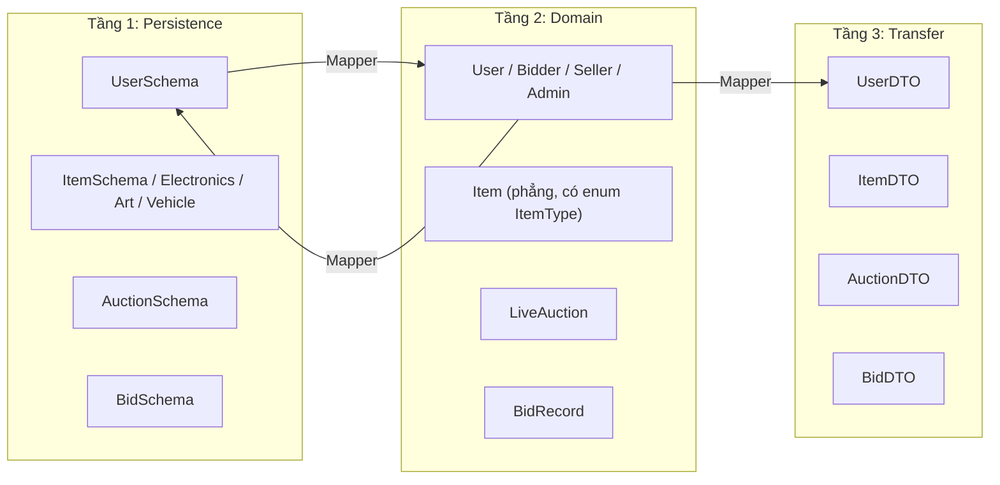
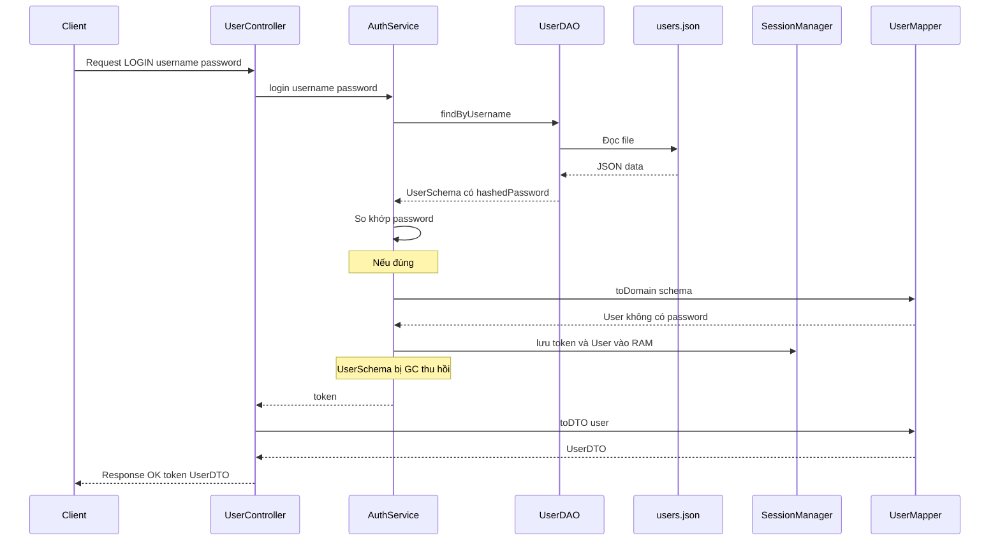
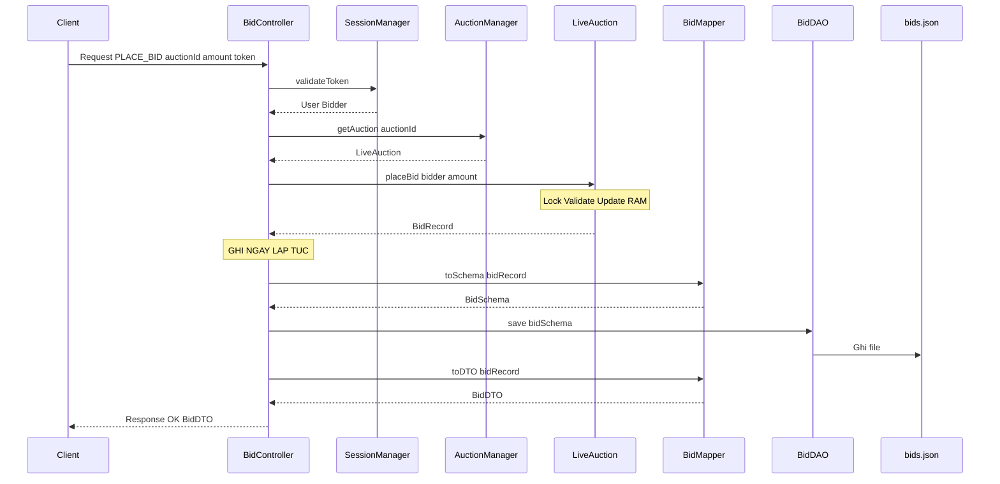
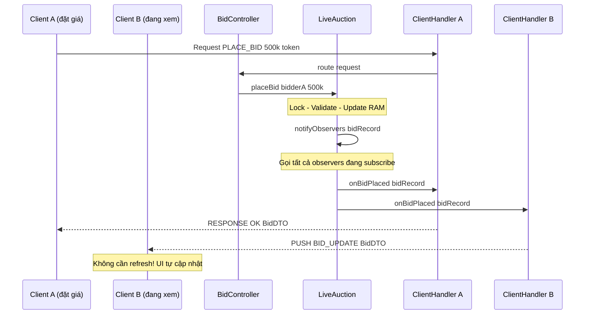

# 🏗️ KIẾN TRÚC SERVER — AuctionUET

> **Phiên bản:** 1.0 · **Ngày duyệt:** 04/04/2026 · **Trạng thái:** Đã phê duyệt
>
> Tài liệu này là **nguồn chân lí duy nhất** cho kiến trúc `auction-server`. Mọi thành viên trong nhóm cần đọc và tuân thủ các quy ước trong tài liệu khi triển khai.

---

## 1. Tổng kết các vấn đề của kiến trúc cũ

### 1.1 Lớp `Entity` có Side Effects trong Constructor

Constructor mặc định của lớp `Entity` cũ tự động sinh UUID mới và gán thời gian hiện tại (`LocalDateTime.now()`) cho cả `createdAt` lẫn `updatedAt` mỗi khi được khởi tạo. Điều này gây ra vấn đề nghiêm trọng: khi Gson nạp dữ liệu từ file JSON, nó phải gọi constructor trước (qua Reflection) — tức là mỗi đối tượng bị gán sẵn một bộ giá trị rác (UUID mới, thời gian hiện tại) — rồi sau đó Gson mới ghi đè bằng giá trị đúng từ JSON.

**Hậu quả:** Lãng phí CPU, gây nhầm lẫn logic, và nếu Gson không ghi đè được trường nào (do typo trong JSON hoặc thiếu field) thì dữ liệu sai hoàn toàn mà không có cảnh báo.

### 1.2 Không phân tách giữa Data Entity và Runtime Entity

Cùng một class `User` được dùng cho **cả 3 mục đích**: lưu xuống file JSON (chứa password hash, createdAt, updatedAt), giữ trong `SessionManager` trên RAM trong suốt phiên đăng nhập, và gửi qua mạng cho Client dưới dạng response.

**Hậu quả:** Password hash nằm trong RAM suốt session dù không cần dùng tới. Dữ liệu thừa thãi như `createdAt`, `updatedAt` chiếm bộ nhớ vô ích. Nghiêm trọng nhất: nếu vô tình serialize đối tượng `User` ra response gửi cho Client, password hash sẽ bị lộ.

### 1.3 Thiếu chiến lược đồng bộ RAM ↔ Database
Không có quy tắc rõ ràng về:
- Dữ liệu nào cần ghi ngay lập tức vào file JSON (Critical Data).
- Dữ liệu nào chỉ cần giữ trong RAM (Volatile Data).
- Cơ chế chuyển đổi giữa Data Entity ↔ Runtime Entity.

---

## 2. Nguyên tắc thiết kế mới

### 2.1 Bốn nguyên tắc cốt lõi

| # | Nguyên tắc | Giải thích |
|---|-----------|------------|
| 1 | **Explicit over Implicit** | Constructor không được có side effects. Mọi giá trị phải được truyền vào một cách rõ ràng |
| 2 | **Separation of Concerns** | Phân tách rõ: Dữ liệu lưu trữ (Schema) ≠ Đối tượng chạy thực (Domain) ≠ Dữ liệu truyền tải (DTO) |
| 3 | **Minimum Privilege in RAM** | Chỉ nạp vào RAM những gì cần thiết cho logic nghiệp vụ. Password, metadata không dùng tới thì không giữ |
| 4 | **Write-through for Critical Data** | Dữ liệu quan trọng (bid, trạng thái auction, tài khoản) phải ghi xuống file ngay lập tức |

### 2.2 Phân loại đối tượng theo 3 tầng



> [!NOTE]
> Cây kế thừa `Item → Electronics / Art / Vehicle` chỉ tồn tại ở **tầng Persistence** (Schema) nhằm lưu trữ các trường đặc thù theo loại và đáp ứng yêu cầu OOP Inheritance của đề bài. Ở tầng Domain, `Item` là 1 class phẳng duy nhất với trường `ItemType type` (enum), vì logic đấu giá không phân biệt loại sản phẩm.

---

## 3. Cấu trúc Package mới

```
com.auctionuet.server/
│
├── ServerApp.java                          # Entry point
│
├── persistence/                            # ═══ TẦNG 1: Lưu trữ ═══
│   ├── schema/                             # Các lớp ánh xạ 1:1 với file JSON
│   │   ├── BaseSchema.java                 #   id, createdAt, updatedAt
│   │   ├── UserSchema.java                 #   username, hashedPassword, email, role
│   │   ├── ItemSchema.java                 #   name, description, startingPrice, type, ...
│   │   ├── AuctionSchema.java              #   itemId, sellerId, startTime, endTime, status
│   │   └── BidSchema.java                  #   auctionId, bidderId, amount, timestamp
│   │
│   ├── dao/                                # Data Access Objects
│   │   ├── GenericDAO.java                 #   Interface: save, findById, findAll, update, delete
│   │   ├── UserDAO.java                    #   Implements GenericDAO<UserSchema>
│   │   ├── ItemDAO.java                    #   Implements GenericDAO<ItemSchema>
│   │   ├── AuctionDAO.java                 #   Implements GenericDAO<AuctionSchema>
│   │   └── BidDAO.java                     #   Implements GenericDAO<BidSchema>
│   │
│   └── json/                               # Hạ tầng JSON
│       ├── JsonFileHelper.java             #   Đọc/ghi file JSON generic
│       └── GsonFactory.java                #   Tạo Gson instance với TypeAdapter
│
├── domain/                                 # ═══ TẦNG 2: Logic nghiệp vụ (RAM) ═══
│   ├── model/                              # Các đối tượng chạy thực trong RAM
│   │   ├── User.java                       #   abstract: id, username, role (KHÔNG có password)
│   │   ├── Bidder.java                     #   extends User: hasPermission(), placeBid()
│   │   ├── Seller.java                     #   extends User: createAuction()
│   │   ├── Admin.java                      #   extends User: manageUsers()
│   │   ├── Item.java                       #   abstract: id, name, description, startingPrice
│   │   ├── Electronics.java                #   extends Item: brand, warranty
│   │   ├── Art.java                        #   extends Item: artist, year
│   │   ├── Vehicle.java                    #   extends Item: make, model, mileage
│   │   ├── LiveAuction.java                #   Phiên đấu giá đang chạy trong RAM
│   │   └── BidRecord.java                  #   Một lệnh đặt giá trong RAM
│   │
│   ├── enums/                              # Enums dùng chung
│   │   ├── UserRole.java
│   │   ├── AuctionStatus.java
│   │   └── ItemType.java
│   │
│   ├── service/                            # Business Logic
│   │   ├── AuthService.java                #   login, register, validateToken
│   │   ├── UserService.java                #   CRUD user profile
│   │   ├── AuctionService.java             #   createAuction, lifecycle management
│   │   ├── BidService.java                 #   placeBid, getBidHistory
│   │   └── SessionManager.java             #   Singleton: quản lý token → User (RAM)
│   │
│   └── manager/                            # Singleton managers
│       ├── DataManager.java                #   Singleton: quản lý tất cả DAO instances
│       └── AuctionManager.java             #   Singleton: quản lý các LiveAuction đang chạy
│
├── mapper/                                 # ═══ CẦU NỐI giữa các tầng ═══
│   ├── UserMapper.java                     #   UserSchema ↔ User (Domain) ↔ UserDTO
│   ├── ItemMapper.java                     #   ItemSchema ↔ Item (Domain) ↔ ItemDTO
│   ├── AuctionMapper.java                  #   AuctionSchema ↔ LiveAuction ↔ AuctionDTO
│   └── BidMapper.java                      #   BidSchema ↔ BidRecord ↔ BidDTO
│
├── network/                                # ═══ TẦNG 3: Giao tiếp mạng ═══
│   ├── dto/                                # Data Transfer Objects (gửi qua mạng)
│   │   ├── UserDTO.java                    #   id, username, role (không có password)
│   │   ├── ItemDTO.java
│   │   ├── AuctionDTO.java
│   │   └── BidDTO.java
│   │
│   ├── protocol/                           # Giao thức truyền thông
│   │   ├── Request.java                    #   action, data, token
│   │   ├── Response.java                   #   status, message, data
│   │   ├── ActionType.java                 #   Enum: LOGIN, REGISTER, PLACE_BID, ...
│   │   └── MessageSerializer.java          #   Serialize/Deserialize Request/Response
│   │
│   ├── server/                             # Socket server
│   │   ├── AuctionServer.java              #   ServerSocket, accept connections
│   │   ├── ClientHandler.java              #   Runnable: xử lý 1 client
│   │   └── RequestRouter.java              #   Map ActionType → Controller method
│   │
│   └── controller/                         # Xử lý request từ client
│       ├── UserController.java
│       ├── AuctionController.java
│       └── BidController.java
│
├── exception/                              # ═══ Exceptions ═══
│   ├── AuctionException.java               #   Base exception
│   ├── InvalidBidException.java
│   ├── AuctionClosedException.java
│   ├── AuthenticationException.java
│   ├── UserNotFoundException.java
│   └── DuplicateUserException.java
│
└── util/                                   # ═══ Tiện ích ═══
    ├── ValidationUtils.java                #   Validate email, password, username
    ├── PasswordUtils.java                  #   Hash + salt
    └── IdGenerator.java                    #   Sinh UUID tập trung, có thể mock khi test
```

---

## 4. Chi tiết thiết kế từng tầng

### 4.1 Tầng Persistence — Schema và DAO

#### `BaseSchema.java` — Lớp cơ sở cho dữ liệu lưu trữ

**Khai báo:** `public abstract class BaseSchema`

**Trường dữ liệu (protected):**
- `id` (String) — định danh duy nhất của đối tượng
- `createdAt` (LocalDateTime) — thời điểm tạo
- `updatedAt` (LocalDateTime) — thời điểm cập nhật gần nhất

**Constructor:**
1. **Constructor rỗng** `protected BaseSchema()` — không làm gì, không tự sinh giá trị. Được đánh dấu `protected` để Gson dùng qua Reflection khi đọc file JSON, nhưng ngăn code bên ngoài package vô tình gọi.
2. **Constructor tường minh** nhận đầy đủ 3 tham số `(String id, LocalDateTime createdAt, LocalDateTime updatedAt)` — dùng khi tạo đối tượng mới từ code hoặc khi cần truyền giá trị cụ thể.

**Method:** Cung cấp getter/setter cho cả 3 trường. Override `equals()` so sánh theo `id`, `hashCode()` tính từ `id`.

#### `UserSchema.java` — Ánh xạ 1:1 với `users.json`

**Khai báo:** `public class UserSchema extends BaseSchema`

**Trường dữ liệu (private):**
- `username` (String) — tên đăng nhập
- `hashedPassword` (String) — mật khẩu đã hash (tên trường nhấn mạnh đây là hash, không phải plain text)
- `passwordSalt` (String) — salt dùng để hash mật khẩu
- `email` (String) — địa chỉ email
- `role` (UserRole) — vai trò trong hệ thống (BIDDER / SELLER / ADMIN)

**Constructor:**
1. **Constructor rỗng** `protected UserSchema()` — cho Gson.
2. **Constructor tường minh** nhận đầy đủ 7 tham số: 3 trường kế thừa từ `BaseSchema` (id, createdAt, updatedAt) và 5 trường riêng (username, hashedPassword, passwordSalt, email, role). Gọi `super(id, createdAt, updatedAt)` trước, rồi gán các trường còn lại.

**Method:** Getter/setter cho tất cả các trường.

#### `GenericDAO<T>` — Interface DAO tổng quát

**Khai báo:** `public interface GenericDAO<T extends BaseSchema>`

Ràng buộc generic `T extends BaseSchema` đảm bảo DAO **chỉ làm việc với Schema** (dữ liệu lưu trữ), không bao giờ làm việc trực tiếp với Domain Model.

**Các method signature:**

| Method | Mô tả |
|--------|--------|
| `void save(T entity)` | Lưu đối tượng mới vào file JSON |
| `T findById(String id)` | Tìm đối tượng theo ID, trả về `null` nếu không tìm thấy |
| `List<T> findAll()` | Trả về toàn bộ đối tượng từ file JSON |
| `void update(T entity)` | Cập nhật đối tượng đã tồn tại (so khớp theo ID) |
| `void delete(String id)` | Xóa đối tượng theo ID |

---

### 4.2 Tầng Domain — Runtime Model và Services

#### `User.java` — Đối tượng người dùng chạy trong RAM

**Khai báo:** `public abstract class User`

Đại diện cho một người dùng **đang hoạt động** trong hệ thống. Đặc biệt, class này **không chứa password** và **không chứa metadata lưu trữ** (createdAt, updatedAt). Chỉ giữ lại những gì cần thiết cho phân quyền và logic nghiệp vụ.

**Trường dữ liệu (private final — immutable):**
- `id` (String) — liên kết 1:1 với `UserSchema.id`
- `username` (String) — tên hiển thị
- `role` (UserRole) — vai trò

**Constructor:** `protected User(String id, String username, UserRole role)` — gán trực tiếp cả 3 trường, được gọi từ các lớp con.

**Abstract methods (lớp con bắt buộc override):**
- `boolean hasPermission(String action)` — kiểm tra quyền hạn theo action (VD: `"PLACE_BID"`, `"CREATE_AUCTION"`). Mỗi vai trò trả về kết quả khác nhau → **đây là Polymorphism chính của hệ thống**.
- `String getDisplayInfo()` — trả về chuỗi mô tả ngắn gọn để hiển thị.

**Getter:** Chỉ cung cấp getter cho cả 3 trường. **Không có setter** — đối tượng `User` runtime là immutable. Nếu cần thay đổi thông tin (VD: đổi role), cần tạo đối tượng mới. Thiết kế này đảm bảo an toàn trong môi trường multi-thread.

#### `Bidder.java` — Lớp con cụ thể (ví dụ)

**Khai báo:** `public class Bidder extends User`

**Constructor:** `public Bidder(String id, String username)` — gọi `super(id, username, UserRole.BIDDER)`. Lưu ý role luôn là `BIDDER`, không cần truyền từ bên ngoài.

**Override `hasPermission(String action)`:** Dùng switch expression (Java 14+) để phân quyền:
- Trả `true` cho: `"PLACE_BID"`, `"VIEW_AUCTION"`, `"VIEW_BID_HISTORY"`
- Trả `false` cho: `"CREATE_AUCTION"`, `"MANAGE_USERS"`, và mọi action khác

**Override `getDisplayInfo()`:** Trả về chuỗi `"Bidder: " + getUsername()`.

> [!NOTE]
> Các lớp `Seller` và `Admin` được thiết kế tương tự, chỉ khác nhau ở bảng quyền hạn trong `hasPermission()` và chuỗi trả về trong `getDisplayInfo()`.

#### `LiveAuction.java` — Phiên đấu giá đang chạy (RAM-only state)

**Khai báo:** `public class LiveAuction`

Đại diện cho một phiên đấu giá **đang diễn ra** trong bộ nhớ. Chứa cả dữ liệu nghiệp vụ lẫn trạng thái runtime (observer list, lock) mà không cần lưu vào file.

**Trường dữ liệu nghiệp vụ:**
- `id` (String, final) — ID phiên đấu giá
- `itemId` (String, final) — ID sản phẩm đang đấu
- `sellerId` (String, final) — ID người bán
- `endTime` (LocalDateTime, final) — thời gian kết thúc dự kiến
- `status` (AuctionStatus) — trạng thái hiện tại (OPEN / RUNNING / FINISHED / ...)
- `currentHighestBid` (double) — giá cao nhất hiện tại
- `currentWinnerId` (String) — ID người đang dẫn đầu
- `bidHistory` (List\<BidRecord\>, final) — lịch sử đặt giá

**Trường runtime-only (đánh dấu `transient` — không serialize):**
- `bidLock` (ReentrantLock, final) — đảm bảo chỉ 1 thread được xử lý bid tại một thời điểm
- `observers` (List\<AuctionObserver\>, final) — danh sách ClientHandler đang subscribe phiên này

**Constructor:** Nhận đầy đủ 7 tham số nghiệp vụ (id, itemId, sellerId, endTime, status, currentHighestBid, currentWinnerId). Khởi tạo `bidHistory` là danh sách rỗng. Các trường `transient` tự khởi tạo tại chỗ khai báo.

**Method chính `BidRecord placeBid(User bidder, double amount)`:**

Đây là method quan trọng nhất, được bảo vệ bởi `ReentrantLock` (thread-safe). Luồng xử lý:
1. **Acquire lock** (`bidLock.lock()`)
2. **Validate:** Kiểm tra 3 điều kiện, ném exception tương ứng nếu vi phạm:
   - `status` phải là `RUNNING` → nếu không, ném `AuctionClosedException`
   - `amount` phải lớn hơn `currentHighestBid` → nếu không, ném `InvalidBidException`
   - `bidder.getId()` không được trùng `sellerId` (người bán không tự đấu giá) → nếu không, ném `InvalidBidException`
3. **Update state:** Tạo `BidRecord` mới, cập nhật `currentHighestBid` và `currentWinnerId`, thêm vào `bidHistory`
4. **Notify observers:** Gọi `notifyObservers(record)` để push realtime update cho tất cả client đang xem
5. **Release lock** trong `finally` block (`bidLock.unlock()`)
6. **Return** `BidRecord` vừa tạo

---

### 4.3 Tầng Mapper — Cầu nối giữa 2 thế giới

#### `UserMapper.java`

**Khai báo:** `public class UserMapper` — tất cả method đều là `static` (pure function, không giữ state).

Đây là **nơi duy nhất** biết cách chuyển đổi giữa UserSchema (DB) ↔ User (RAM) ↔ UserDTO (Network).

**3 static methods:**

| Method | Chiều chuyển | Mô tả |
|--------|------------|--------|
| `User toDomain(UserSchema schema)` | DB → RAM | Dùng switch theo `schema.getRole()` để tạo đúng lớp con: `BIDDER` → `new Bidder(...)`, `SELLER` → `new Seller(...)`, `ADMIN` → `new Admin(...)`. Đây chính là **Factory Method**. |
| `UserDTO toDTO(User user)` | RAM → Network | Tạo `UserDTO` chỉ với 3 trường: id, username, role. **Tuyệt đối không gửi password.** |
| `UserSchema toNewSchema(String username, String hashedPassword, String salt, String email, UserRole role)` | Tạo mới | Sinh `UserSchema` mới với ID từ `IdGenerator.generate()` và thời gian hiện tại cho `createdAt`/`updatedAt`. Dùng khi đăng ký tài khoản. |

---

### 4.4 Tầng Network — Kiến trúc Giao tiếp Mạng

> [!IMPORTANT]
> Đề bài **cấm polling** cho realtime update. Toàn bộ giao tiếp phải theo mô hình **Persistent TCP Socket + Server Push (Event-based)**.

#### Mô hình kết nối tổng quan

```
CLIENT                                   SERVER
  │                                         │
  │ ═══════ Kết nối TCP bền vững ══════════ │  (1 connection = 1 ClientHandler thread)
  │                                         │
  │ ──── REQUEST {PLACE_BID, token} ──────► │  Client chủ động gửi
  │ ◄─── RESPONSE {OK, bidData} ─────────── │  Server trả về
  │                                         │
  │ ◄─── PUSH {BID_UPDATE, bidData} ──────  │  Server CHỦ ĐỘNG đẩy (Observer)
  │ ◄─── PUSH {AUCTION_ENDED, result} ────  │  Server CHỦ ĐỘNG đẩy (Observer)
  │                                         │
```

Một TCP connection dùng cho **cả 2 chiều**:
- **Client → Server**: Gửi Request, nhận Response tương ứng
- **Server → Client**: Chủ động PUSH notification bất kỳ lúc nào **không cần Client hỏi**

#### Protocol — Phân biệt Response vs Push

Mọi message qua mạng đều là JSON. Trường `type` để Client phân biệt:

**`Response.java`**

**Khai báo:** `public class Response`

**Trường dữ liệu (private):**
- `type` (String) — giá trị `"RESPONSE"` hoặc `"PUSH"`, để Client biết đây là phản hồi cho request của mình, hay là thông báo Server chủ động đẩy xuống
- `status` (String) — `"OK"` hoặc `"ERROR"`, chỉ dùng khi `type = "RESPONSE"`
- `event` (String) — tên sự kiện push (VD: `"BID_UPDATE"`, `"AUCTION_ENDED"`), chỉ dùng khi `type = "PUSH"`
- `message` (String) — thông báo lỗi hoặc mô tả
- `data` (Object) — payload dữ liệu (BidDTO, AuctionDTO, ...)

**3 factory method (static):**
- `Response.ok(Object data)` — tạo response thành công với type=RESPONSE, status=OK
- `Response.error(String message)` — tạo response lỗi với type=RESPONSE, status=ERROR, kèm thông báo
- `Response.push(String event, Object data)` — tạo push notification với type=PUSH, kèm tên event và payload

#### `ClientHandler.java` — Trung tâm của kiến trúc mạng

`ClientHandler` đảm nhiệm **cả 2 vai trò** song song:
1. **Runnable**: Vòng lặp đọc Request từ Client (blocking)
2. **AuctionObserver**: Nhận thông báo từ `LiveAuction` và PUSH xuống Client

**Khai báo:** `public class ClientHandler implements Runnable, AuctionObserver`

**Trường dữ liệu (private):**
- `socket` (Socket, final) — kết nối TCP với client
- `out` (PrintWriter, final) — luồng gửi (cả Response lẫn Push)
- `in` (BufferedReader, final) — luồng nhận Request
- `subscribedAuctionId` (String) — ID auction mà client đang subscribe (để nhận push)
- `currentUser` (User) — người dùng đang login trên kết nối này

**Method `run()` (override từ Runnable):**
Vòng lặp blocking: đọc từng dòng JSON từ socket, deserialize thành `Request`, chuyển cho `RequestRouter.route()` để xử lý, rồi gửi `Response` về client. Nếu có exception, gửi `Response.error()`. Khi socket đóng (client ngắt kết nối), gọi `cleanup()` để dọn dẹp.

**Các method Observer (được `AuctionManager` gọi từ thread khác → đánh dấu `synchronized`):**
- `onBidPlaced(BidRecord bid)` — gửi push `"BID_UPDATE"` kèm `BidDTO` xuống client
- `onAuctionEnded(AuctionResult result)` — gửi push `"AUCTION_ENDED"` kèm kết quả

**Method `sendMessage(Response res)` (đánh dấu `synchronized`):**
Serialize response thành JSON, ghi vào socket và flush. Việc đánh dấu `synchronized` đảm bảo rằng dù `run()` và các method Observer chạy trên thread khác nhau, chúng không bao giờ ghi đồng thời vào cùng một socket (tránh corrupt dữ liệu).

**Method `cleanup()`:**
Khi client ngắt kết nối, tự động unsubscribe khỏi `LiveAuction` (đang xem) thông qua `AuctionManager.getInstance().getAuction(subscribedAuctionId).removeObserver(this)`.

#### Phía Client — 2 thread song song

```
JavaFX Application Thread (Main)
  └── Người dùng bấm nút → gửi Request → chờ Response
  └── Cập nhật UI dựa theo Response nhận được

NotificationListener Thread (Background)
  └── Vòng lặp blocking đọc từ socket
  └── Nhận message có type="PUSH"
  └── Gọi Platform.runLater(() -> updateUI()) — đẩy lên JavaFX thread
```

**`NotificationListener.java`** (Client-side)

**Khai báo:** `public class NotificationListener implements Runnable`

**Trường dữ liệu:**
- `in` (BufferedReader, final) — luồng đọc từ socket (dùng chung socket với Main Thread)
- `controller` (AuctionViewController, final) — callback để cập nhật UI

**Method `run()`:** Vòng lặp blocking đọc từng dòng JSON từ socket. Với mỗi message nhận được, deserialize thành `Response`, kiểm tra `type`: nếu là `"PUSH"` thì gọi `Platform.runLater(() -> controller.handlePush(msg))` để đẩy việc cập nhật UI lên JavaFX Application Thread. Các message `type = "RESPONSE"` được bỏ qua — chúng được xử lý bởi Main Thread.

#### Subscribe / Unsubscribe với LiveAuction

Client cần thông báo cho Server biết mình đang xem auction nào:

| Hành động | Request | Kết quả |
|-----------|---------|----------|
| Mở màn hình Auction Detail | `{action: "SUBSCRIBE", auctionId: "..."}` | Server gọi `LiveAuction.addObserver(clientHandler)` |
| Đóng màn hình / Logout | `{action: "UNSUBSCRIBE", auctionId: "..."}` | Server gọi `LiveAuction.removeObserver(clientHandler)` |
| Mất kết nối đột ngột | Socket đóng | `ClientHandler.cleanup()` tự unsubscribe |

#### `ActionType.java` — Toàn bộ hành động trong hệ thống

**Khai báo:** `public enum ActionType`

Enum này liệt kê tất cả các hành động mà Client có thể gửi lên Server, được nhóm theo chức năng:

| Nhóm | Các giá trị |
|------|----------|
| **Auth** | `LOGIN`, `REGISTER`, `LOGOUT` |
| **User** | `GET_PROFILE`, `UPDATE_PROFILE` |
| **Auction** | `GET_AUCTIONS`, `GET_AUCTION_DETAIL`, `CREATE_AUCTION`, `START_AUCTION`, `SUBSCRIBE`, `UNSUBSCRIBE` |
| **Bidding** | `PLACE_BID`, `GET_BID_HISTORY` |
| **Admin** | `GET_ALL_USERS`, `DELETE_USER`, `UPDATE_ROLE` |
| **Ping** | `PING` |

#### DTO classes — Dữ liệu gửi qua mạng

Tất cả DTO đều là class **immutable** (mọi trường đều `private final`, chỉ có getter, không setter). Constructor nhận đầy đủ tham số.

**`UserDTO`** — thông tin người dùng gửi cho Client, **tuyệt đối không chứa password**:
- `id` (String), `username` (String), `role` (UserRole)

**`AuctionDTO`** — snapshot của một phiên đấu giá:
- `id` (String), `item` (ItemDTO), `sellerUsername` (String), `endTime` (LocalDateTime), `status` (AuctionStatus), `currentHighestBid` (double), `currentWinnerUsername` (String)

> Lưu ý: DTO dùng `sellerUsername` và `currentWinnerUsername` (tên hiển thị) thay vì ID, để Client không cần gọi thêm API lấy tên.

**`BidDTO`** — một lệnh đặt giá:
- `auctionId` (String), `bidderUsername` (String), `amount` (double), `timestamp` (LocalDateTime)

---

## 5. Luồng dữ liệu (Data Flow)

### 5.1 Luồng Đăng nhập (Login)


### 5.2 Luồng Đặt giá (Place Bid) — Critical Data


### 5.3 Luồng Realtime Push (Observer → Client)


> [!NOTE]
> Client A (người đặt giá) nhận **RESPONSE**, Client B (người đang xem) nhận **PUSH**. Cả hai message đều đi qua cùng một TCP connection, chỉ khác nhau ở trường `type` trong JSON.

---

## 6. Chiến lược đồng bộ RAM ↔ Database

### 6.1 Ghi ngay lập tức (Write-through) — Critical Data

| Dữ liệu | Lý do |
|----------|-------|
| **BidTransaction** (mỗi lần đặt giá) | Mất bid = tranh chấp pháp lý |
| **AuctionStatus** (thay đổi trạng thái) | Mất trạng thái = không biết ai thắng |
| **User Registration** (tạo tài khoản mới) | Mất = người dùng không đăng nhập lại được |
| **Password Change** (đổi mật khẩu) | Mất = lỗ hổng bảo mật |

### 6.2 Ghi khi cần (Write-back / Lazy) — Non-critical Data

| Dữ liệu | Thời điểm ghi | Lý do |
|----------|---------------|-------|
| **Last login time** | Khi logout hoặc session timeout | Mất vài phút không ảnh hưởng |
| **Số người đang xem auction** | Không ghi (RAM-only) | Chỉ có ý nghĩa khi đang chạy |
| **Danh sách observers** | Không ghi (RAM-only) | Rebuild khi client reconnect |

---

## 7. So sánh Kiến trúc Cũ vs Mới

| Tiêu chí | Kiến trúc Cũ | Kiến trúc Mới |
|----------|-------------|--------------|
| **Tạo ID** | Tự sinh trong Constructor (side effect) | `IdGenerator.generate()` gọi tường minh |
| **Password trong RAM** | Luôn có trong `User` object | Chỉ tồn tại trong `UserSchema`, bị GC ngay sau login |
| **Số lớp Entity** | 1 loại dùng cho mọi mục đích | 3 loại: Schema (DB), Domain (RAM), DTO (Network) |
| **DAO làm việc với** | `Entity` (chứa cả logic lẫn dữ liệu) | `BaseSchema` (chỉ chứa dữ liệu thuần) |
| **Gửi Client** | Toàn bộ `User` object (kể cả password) | `UserDTO` (chỉ id, username, role) |
| **Thread safety** | Không có | `ReentrantLock` per `LiveAuction` |
| **Đồng bộ DB** | Không có chiến lược | Write-through cho Critical, Lazy cho Non-critical |

---

## 8. Ánh xạ với yêu cầu đề bài (TASK.md)

| Yêu cầu đề bài | Kiến trúc mới đáp ứng như thế nào |
|----------------|----------------------------------|
| OOP: Encapsulation | Schema: getter/setter. Domain: immutable fields, `private final` |
| OOP: Inheritance | `User -> Bidder/Seller/Admin`, `Item -> Electronics/Art/Vehicle` (cả Schema lẫn Domain) |
| OOP: Polymorphism | `User.hasPermission()`, `User.getDisplayInfo()` — mỗi lớp con khác nhau |
| OOP: Abstraction | `User` abstract (Domain), `BaseSchema` abstract (Persistence) |
| Singleton | `SessionManager`, `DataManager`, `AuctionManager` |
| Factory Method | `UserMapper.toDomain()` đóng vai trò Factory: tạo đúng lớp con theo role |
| Observer | `LiveAuction` quản lý `List<AuctionObserver>` — realtime notification |
| Strategy | `BidValidator` interface — cho phép thay đổi luật đấu giá |
| MVC Server-side | Controller (network/) -> Service (domain/service/) -> DAO (persistence/) |
| Concurrent bidding | `ReentrantLock` per `LiveAuction`, thread-safe `placeBid()` |

---

## 9. Kế hoạch triển khai (Migration Plan)

### Phase 1: Nền tảng (Ưu tiên cao nhất)
1. Tạo package structure mới
2. Viết `BaseSchema`, `UserSchema`, `ItemSchema`, `AuctionSchema`, `BidSchema`
3. Viết `IdGenerator`, `PasswordUtils`
4. Refactor `GenericDAO` để làm việc với `BaseSchema`
5. Di chuyển `UserRole`, `AuctionStatus`, `ItemType` vào `domain/enums/`

### Phase 2: Domain Model
6. Viết `User` (abstract, immutable), `Bidder`, `Seller`, `Admin` mới
7. Viết `Item` (abstract), `Electronics`, `Art`, `Vehicle` mới
8. Viết `LiveAuction`, `BidRecord`
9. Viết tất cả Mapper classes

### Phase 3: Service Layer
10. Viết `AuthService` với luồng login/register mới
11. Viết `SessionManager` (Singleton)
12. Viết `AuctionService`, `BidService`
13. Viết `DataManager`, `AuctionManager`

### Phase 4: Network Layer (Tuần 4 theo kế hoạch)
14. Viết DTO classes
15. Viết Protocol classes
16. Viết Controller classes

### Phase 5: Dọn dẹp
17. Xóa toàn bộ code cũ trong `model/` package cũ
18. Cập nhật tất cả Unit Tests
19. Cập nhật `WEEKLY_PLAN.md`

> [!WARNING]
> **Lưu ý quan trọng:** Phase 1 và Phase 2 cần hoàn thành trước khi các thành viên khác bắt đầu build các tuần tiếp theo. Đây là "nền móng" mới — nếu nền móng sai, mọi thứ xây trên nó đều sai.

---

## 10. Quyết định thiết kế đã xác nhận

Các quyết định dưới đây đã được thảo luận và phê duyệt, ảnh hưởng tới toàn bộ kiến trúc. Mọi thành viên cần tuân thủ.

### 10.1 Item: Tách Schema/Domain, nhưng Domain chỉ 1 class phẳng

**Quyết định:** Cây kế thừa `ItemSchema → ElectronicsSchema / ArtSchema / VehicleSchema` được giữ **ở tầng Persistence** nhằm lưu trữ các trường đặc thù theo loại và thể hiện OOP Inheritance cho đề bài. Ở tầng Domain, `Item` là **1 class duy nhất** chứa các trường chung (id, name, description, startingPrice) và một trường `ItemType type` (enum).

**Lý do:** Logic đấu giá không phân biệt loại sản phẩm. Khi server xử lý bid, nó không cần biết item là Electronics hay Art — chỉ cần giá khởi điểm và ID. Việc phân biệt loại chỉ cần thiết khi serialize/deserialize JSON và khi hiển thị ở Client.

### 10.2 Auction: Tách thành 2 class riêng biệt

**Quyết định:** Giữ `AuctionSchema` (lưu trữ) và `LiveAuction` (RAM) là **2 class riêng biệt**.

**Lý do:** `AuctionSchema` tồn tại vĩnh viễn trên ổ cứng, không cần thread safety. `LiveAuction` chỉ tồn tại khi auction đang RUNNING, chứa `ReentrantLock` và `List<AuctionObserver>` — những trường runtime không thuộc về persistence. Nếu gộp lại, các trường `transient` dễ bị quên đánh dấu và Gson serialize sẽ phức tạp hơn.

### 10.3 Cây kế thừa Item ở Domain: Không cần

**Quyết định:** Tầng Domain **không** dùng cây kế thừa cho Item. Chỉ có 1 class `Item` với enum `ItemType`.

**Lý do:** Polymorphism của Item được thể hiện ở tầng Schema (Gson + TypeAdapter tạo đúng subclass dựa trên `type`). Polymorphism chính của hệ thống nằm ở `User → Bidder/Seller/Admin` với `hasPermission()` — đây mới là nơi thực sự cần đa hình trong logic nghiệp vụ.

### 10.4 Mapper: Dùng static methods

**Quyết định:** Tất cả Mapper class dùng **static methods**.

**Lý do:** Mapper là pure function (nhận input, trả output, không giữ state). Không cần mock mapper khi test — vì chúng chỉ chuyển field từ object này sang object kia, luôn cho kết quả đúng. Việc dùng instance methods + DI là over-engineering cho scope dự án này. Nếu sau này cần DI, việc chuyển static → instance rất dễ (chỉ bỏ `static` và inject qua constructor).
