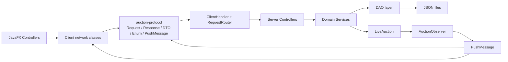

# Báo cáo refactor nhánh Cuong tuần 5

> Tài liệu này tổng hợp toàn bộ thay đổi trên nhánh
> `Cuong-fix-bug-refactor-va-cai-thien-san-pham-tuan-5` so với `main`
> tại thời điểm rà soát ngày 16/05/2026.
>
> Mục tiêu: giúp Cường nhìn lại mình đã làm gì, giúp các thành viên khác nắm được bức tranh thay đổi, và giúp cả nhóm thấy rõ vì sao code sau refactor sạch hơn, chuyên nghiệp hơn và gần yêu cầu đề bài hơn.

## 1. Tóm tắt nhanh

Nhánh hiện tại không chỉ sửa vài lỗi nhỏ. Đây là một đợt refactor khá sâu, chạm vào cả ba phần lớn của hệ thống:

- `auction-protocol`: tách contract chung giữa client và server thành một module Maven độc lập.
- `auction-server`: dọn tầng DTO/mapper/protocol cũ, đưa mapping về service, chuẩn hóa schema và business flow cho item, auction, bid, wallet, payment.
- `auction-client`: bỏ DTO/protocol tự định nghĩa ở client, chuyển sang dùng trực tiếp contract chung, làm lại network client và nhiều controller để nhận dữ liệu typed hơn.

Kết quả diff so với `main`:

| Chỉ số | Kết quả |
|---|---:|
| Base branch | `main` |
| Base commit | `3523d56ec108f03c4f4949185e1cfb5d17903488` |
| Current branch | `Cuong-fix-bug-refactor-va-cai-thien-san-pham-tuan-5` |
| Current commit | `a7c5b7b92117f5c7f2d735a9219c29c1161e1865` |
| Số file thay đổi | 156 |
| Số dòng thêm | 4.110 |
| Số dòng xóa | 4.299 |
| Net line count | -189 dòng |
| File thêm mới | 30 |
| File xóa | 33 |
| File sửa | 87 |
| File rename | 6 |

Điểm đáng chú ý nhất là số dòng xóa còn nhiều hơn số dòng thêm. Điều này tốt: refactor đã giảm trùng lặp, bỏ nhiều lớp trung gian cũ, bỏ các bản sao DTO/protocol ở nhiều nơi và gom contract về một nguồn duy nhất.

## 2. Timeline commit trên nhánh

Các commit từ `main..HEAD` cho thấy nhánh được làm theo nhiều nhịp, không phải một lần sửa cuối:

| Commit | Ngày | Author | Nội dung chính |
|---|---|---|---|
| `591aed1` | 2026-05-10 | Tạ Hữu Cường | Sửa các lỗi nhỏ ở frontend client. |
| `c74eb29` | 2026-05-10 | Tạ Hữu Cường | Sửa realtime bidding chưa hoạt động. |
| `0e0de93` | 2026-05-10 | Tạ Hữu Cường | Di chuyển `SessionManager` về tầng manager. |
| `5b6c10a` | 2026-05-11 | Nguyễn Cao Công | Cập nhật client view và login models. |
| `c6f059b` | 2026-05-11 | Đào Khánh | Ổn định protocol và network controller. |
| `4bd4fba` | 2026-05-11 | Tạ Hữu Cường | Căn lại domain/service với protocol mới và xử lý encoding. |
| `44993b5` | 2026-05-12 | Đào Khánh | Dọn DTO và thêm cấu trúc validation DTO. |
| `1319a19` | 2026-05-12 | Tạ Hữu Cường | Chuyển item schema sang dạng phẳng với `extraFields`. |
| `0411938` | 2026-05-12 | Tạ Hữu Cường | Refactor `ItemService`. |
| `75741d2` | 2026-05-13 | Tạ Hữu Cường | Refactor `AuctionService`, `AuctionController`, `BidService`, `BidController`. |
| `6c7dce2` | 2026-05-13 | Nguyễn Cao Công | Hoàn tất migration client theo contract-first protocol và dọn legacy models. |
| `a7c5b7b` | 2026-05-16 | Ngô Duy Anh | Hoàn thiện DTO resource objects và service-based mapping. |

Theo `git shortlog`, phần commit author như sau:

| Author | Số commit |
|---|---:|
| Tạ Hữu Cường | 7 |
| Nguyễn Cao Công | 2 |
| Đào Khánh | 2 |
| Ngô Duy Anh | 1 |

Vì vậy tài liệu này ghi nhận toàn bộ thay đổi của nhánh hiện tại, đồng thời nhấn mạnh phần Cường dẫn dắt chính: service layer, persistence/schema, bidding/wallet/payment, và các chỉnh sửa refactor quanh domain/server.

## 3. Bức tranh kiến trúc sau refactor

Trước refactor, client và server có nhiều lớp protocol/DTO riêng. Server có thêm mapper riêng. Một số dữ liệu phải đi qua nhiều lớp chuyển đổi, dẫn tới nguy cơ lệch field, lệch enum, lệch format JSON.

Sau refactor, kiến trúc chuyển rõ sang hướng contract-first:



Ý nghĩa:

- Client không còn tự đoán shape JSON bằng model riêng.
- Server không còn phải giữ một bộ DTO network riêng.
- Contract truyền qua socket nằm ở `auction-protocol`, client và server cùng compile theo cùng một nguồn.
- Khi sửa action, enum, DTO request/response, cả hai phía cùng thấy lỗi compile nếu dùng sai.
- Push realtime cũng dùng contract chung thay vì string/message tự chế.

## 4. Thay đổi lớn nhất: tách module `auction-protocol`

### 4.1 Trước refactor

Trên `main`, các lớp protocol nằm rải rác:

- Client có `auction-client/src/main/java/com/auctionuet/client/network/protocol/*`.
- Server có `auction-server/src/main/java/com/auctionuet/server/network/protocol/*`.
- Client có DTO riêng ở `auction-client/src/main/java/com/auctionuet/client/model/*`.
- Server có DTO riêng ở `auction-server/src/main/java/com/auctionuet/server/network/dto/*`.

Điểm yếu:

- Cùng một khái niệm như `Request`, `Response`, `AuctionDTO`, `ItemDTO`, `UserDTO` có nhiều bản khác nhau.
- Nếu server thêm field nhưng client quên cập nhật, lỗi chỉ xuất hiện lúc chạy.
- Việc serialize/deserialize phụ thuộc vào convention ngầm.
- Các controller/service dễ phải làm nhiều đoạn convert thủ công.

### 4.2 Sau refactor

Thêm module mới:

- `auction-protocol/pom.xml`
- `auction-protocol/src/main/java/com/auctionuet/protocol/ActionType.java`
- `auction-protocol/src/main/java/com/auctionuet/protocol/Request.java`
- `auction-protocol/src/main/java/com/auctionuet/protocol/Response.java`
- `auction-protocol/src/main/java/com/auctionuet/protocol/PushMessage.java`
- `auction-protocol/src/main/java/com/auctionuet/protocol/PushActionType.java`
- `auction-protocol/src/main/java/com/auctionuet/protocol/dto/**`
- `auction-protocol/src/main/java/com/auctionuet/protocol/enums/**`
- `auction-protocol/src/main/java/com/auctionuet/protocol/util/NetworkGson.java`

Root `pom.xml` giờ có ba module:

```xml
<modules>
    <module>auction-protocol</module>
    <module>auction-server</module>
    <module>auction-client</module>
</modules>
```

`auction-server` và `auction-client` đều phụ thuộc vào `auction-protocol`.

### 4.3 Lợi ích

Refactor này là phần làm code chuyên nghiệp hơn rõ nhất:

- Một nguồn sự thật duy nhất cho network contract.
- Giảm duplicate class.
- Giảm lỗi mismatch giữa client và server.
- Dễ review hơn vì DTO nằm tập trung.
- Dễ mở rộng action mới hơn.
- Dễ test serialization hơn.
- Kiến trúc module Maven rõ ràng hơn.

## 5. Dọn protocol và DTO trùng lặp

### 5.1 File legacy đã xóa ở client

Các file DTO/protocol cũ ở client bị xóa:

- `auction-client/src/main/java/com/auctionuet/client/model/AuctionDTO.java`
- `auction-client/src/main/java/com/auctionuet/client/model/BidDTO.java`
- `auction-client/src/main/java/com/auctionuet/client/model/ItemDTO.java`
- `auction-client/src/main/java/com/auctionuet/client/model/UserDTO.java`
- `auction-client/src/main/java/com/auctionuet/client/network/protocol/ActionType.java`
- `auction-client/src/main/java/com/auctionuet/client/network/protocol/AuctionStatus.java`
- `auction-client/src/main/java/com/auctionuet/client/network/protocol/ItemType.java`
- `auction-client/src/main/java/com/auctionuet/client/network/protocol/PushMessage.java`
- `auction-client/src/main/java/com/auctionuet/client/network/protocol/Request.java`
- `auction-client/src/main/java/com/auctionuet/client/network/protocol/Response.java`
- `auction-client/src/main/java/com/auctionuet/client/network/protocol/UserRole.java`
- `auction-client/src/main/java/com/auctionuet/client/FakeServer.java`

Việc xóa `FakeServer` cũng làm client nghiêm túc hơn: không còn lớp giả lập nằm cạnh code production dễ gây nhầm lẫn khi demo hoặc chạy thật.

### 5.2 File legacy đã xóa ở server

Các file DTO/protocol/mapper cũ ở server bị xóa:

- `auction-server/src/main/java/com/auctionuet/server/network/dto/AuctionDTO.java`
- `auction-server/src/main/java/com/auctionuet/server/network/dto/BidDTO.java`
- `auction-server/src/main/java/com/auctionuet/server/network/dto/ItemDTO.java`
- `auction-server/src/main/java/com/auctionuet/server/network/dto/UserDTO.java`
- `auction-server/src/main/java/com/auctionuet/server/network/protocol/Request.java`
- `auction-server/src/main/java/com/auctionuet/server/network/protocol/Response.java`
- `auction-server/src/main/java/com/auctionuet/server/mapper/AuctionMapper.java`
- `auction-server/src/main/java/com/auctionuet/server/mapper/BidMapper.java`
- `auction-server/src/main/java/com/auctionuet/server/mapper/ItemMapper.java`
- `auction-server/src/main/java/com/auctionuet/server/mapper/UserMapper.java`

Một số enum được rename/chuyển từ server sang protocol:

- `AuctionStatus`
- `Permission`
- `UserRole`
- `ActionType`
- `MessageSerializer`

### 5.3 Kết quả

Trước đây, nếu đọc flow `create item`, ta phải đi qua:

`Request data map -> server DTO -> mapper -> schema -> mapper -> server DTO -> client DTO`

Sau refactor, flow gọn hơn:

`Request DTO chung -> service -> schema -> response DTO chung`

Không phải mọi mapping đều biến mất, nhưng mapping đã ít "lớp trung gian vì lịch sử" hơn và dễ nhìn luồng nghiệp vụ hơn.

## 6. DTO validation rõ hơn

Module `auction-protocol` thêm interface:

- `ValidatableDTO`

Các request DTO quan trọng implement `validate()`:

- `LoginRequestDTO`
- `RegisterRequestDTO`
- `CreateItemRequestDTO`
- `UpdateItemRequestDTO`
- `CreateAuctionRequestDTO`
- `PlaceBidRequestDTO`
- `SetAutoBidRequestDTO`
- `AuctionIdRequestDTO`
- `AmountRequestDTO`

`Request.fromDto(...)` gọi `validate()` trước khi đóng gói data. `Request.getDataAs(...)` cũng convert data về DTO và validate lại nếu DTO implement `ValidatableDTO`.

Điều này tốt hơn cách cũ ở `ItemMapper.fromRequestData(...)` vì:

- validation nằm gần contract của request;
- lỗi dữ liệu bị chặn sớm;
- controller bớt phải parse map thủ công;
- client cũng có thể validate trước khi gửi;
- server vẫn validate lại sau deserialize.

Ví dụ hiện tại:

- `CreateItemRequestDTO.validate()` kiểm tra name, startingPrice, type, condition, extraFields.
- `CreateAuctionRequestDTO.validate()` kiểm tra itemId, title, startTime/endTime, anti-sniping defaults.
- `AmountRequestDTO.validate()` chặn số tiền <= 0.
- `SetAutoBidRequestDTO.validate()` chặn maxBid/increment không hợp lệ.

## 7. Refactor item: từ cây schema đa hình sang schema phẳng có `extraFields`

### 7.1 Trước refactor

Trên `main`, `ItemSchema` là abstract class. Các loại item có schema con:

- `ElectronicsSchema`
- `ArtSchema`
- `VehicleSchema`

Để Gson đọc/ghi được abstract class, server phải có:

- `RuntimeTypeAdapterFactory`
- đăng ký subtype trong `GsonFactory`
- mapper kiểm tra `instanceof ElectronicsSchema`, `ArtSchema`, `VehicleSchema`

Điểm mạnh của cách cũ:

- Thể hiện inheritance đúng kiểu bài OOP.
- Mỗi loại item có class riêng.

Điểm yếu:

- Nhiều class nhỏ nhưng business logic đấu giá không thật sự cần phân biệt class item.
- Gson config phức tạp.
- `RuntimeTypeAdapterFactory` dài và là code hạ tầng khó giải thích.
- `ItemMapper` phải biết toàn bộ subtype.
- Dễ lệch field khi thêm loại item mới.

### 7.2 Sau refactor

Các class sau bị xóa:

- `Art.java`
- `Electronics.java`
- `Vehicle.java`
- `Item.java` ở domain
- `ArtSchema.java`
- `ElectronicsSchema.java`
- `VehicleSchema.java`
- `RuntimeTypeAdapterFactory.java`

`ItemSchema` hiện là class phẳng:

- `name`
- `description`
- `startingPrice`
- `type`
- `sellerId`
- `imageUrl`
- `condition`
- `auctionCount`
- `extraFields`

`ItemType` trong `auction-protocol` đảm nhiệm validate/normalize field đặc thù:

- `ELECTRONICS`: `brand`, `warrantyMonths`
- `ART`: `artist`, `year`, `medium`
- `VEHICLE`: `make`, `model`, `mileage`, `vehicleYear`

### 7.3 Vì sao sạch hơn

Cách mới chuyển sự phức tạp từ "đa hình class + Gson adapter" sang "enum type + map field có validate".

Lợi ích:

- JSON dễ đọc hơn.
- DAO đơn giản hơn.
- Không cần adapter đa hình custom.
- Client/server dùng cùng `ItemType`.
- Thêm loại item mới chủ yếu sửa `ItemType` và UI, ít đụng persistence hạ tầng.
- `ItemDAOTest.testGsonItemSchemaRoundTrip()` xác nhận item schema mới round-trip được qua Gson.

### 7.4 Điểm cần lưu ý khi bảo vệ OOP

Đề bài gợi ý cây `Item -> Electronics/Art/Vehicle`. Refactor hiện tại không còn cây kế thừa Item ở domain/persistence. Khi trình bày, nhóm nên nói rõ đây là quyết định thiết kế:

- Đa hình chính của hệ thống nằm ở `User -> Bidder/Seller/Admin` thông qua `hasPermission()`.
- Với item, logic đấu giá không phụ thuộc subtype nên dùng `ItemType` + `extraFields` để tránh over-engineering.
- `ItemType` vẫn có hành vi riêng qua `normalizeAndValidateExtraFields(...)`, gần với Strategy/enum polymorphism.

Nếu giảng viên chấm rất cứng theo cây kế thừa Item, phần này có thể bị trừ nhẹ. Nếu nhóm giải thích tốt trade-off, refactor này lại là điểm cộng về clean architecture.

## 8. Refactor service layer

### 8.1 `UserService`

Thêm `UserService` để gom logic chuyển user sang DTO:

- `toDTO(User user)`
- `toDTO(UserSchema schema)`
- `getUserDTOById(String id)`
- `getUserSchemaById(String id)`

Lợi ích:

- Không còn `UserMapper` riêng.
- DTO response không lộ password/hash.
- Các service khác không phải lặp logic tạo `UserDTO`.

### 8.2 `ItemService`

`ItemService` sau refactor:

- nhận `User seller` và các field typed thay vì nhận DTO server cũ;
- kiểm tra quyền `CREATE_ITEM`;
- tạo `ItemSchema` mới;
- normalize extra fields qua `ItemType`;
- trả về `ItemDTO` chung của protocol;
- hỗ trợ `getItemsBySellerId` trả DTO thay vì schema thô.

Điểm sạch hơn:

- Controller không cần biết schema.
- Client không nhận object persistence.
- `extraFields` được normalize trước khi lưu.
- Default response fallback giúp dữ liệu cũ/hỏng nhẹ không làm sập UI ngay.

### 8.3 `AuctionService`

`AuctionService` được refactor mạnh:

- `createAuction(...)` nhận anti-sniping window/extension.
- Kiểm tra quyền tạo auction.
- Kiểm tra item tồn tại.
- Kiểm tra seller là chủ item.
- Kiểm tra thời gian bắt đầu/kết thúc.
- Tăng `auctionCount` cho item.
- Tạo `AuctionDTO` response bằng `ItemDTO`, `UserDTO`, `BidDTO`.
- `startAuction(...)` chuyển `OPEN -> RUNNING`, update DAO và load vào `AuctionManager`.
- `endAuction(...)` chuyển phiên có winner sang `WAITING_PAYMENT`, không winner sang `CANCELED`.
- Lên lịch timeout 24h để tịch thu cọc nếu winner không thanh toán.
- `payAuction(...)` xử lý thanh toán winner, chuyển cọc thành tiền thanh toán, cộng tiền cho seller, đổi status sang `PAID`.

Điểm sạch hơn:

- Rule nghiệp vụ nằm trong service thay vì controller.
- Các hàm require/validate nhỏ hơn: `requireItem`, `requireAuction`, `requireWinner`, `requireAuctionStatus`, `requireFutureStartTime`.
- DTO trả ra đã giàu thông tin hơn: item, seller, winner, currentHighestBid, currentPrice, anti-sniping config.

### 8.4 `BidService`

`BidService` sau refactor:

- quản lý `placeBid`;
- tính cọc 10% từ `startingPrice`;
- freeze deposit qua `WalletService`;
- gọi `LiveAuction.placeBid`;
- sync trạng thái auction về `AuctionSchema`;
- lưu `BidSchema` vào `bids.json`;
- trả `BidDTO`;
- lấy lịch sử bid dạng schema hoặc DTO;
- hỗ trợ `setAutoBid`, `cancelAutoBid`, `getAutoBidConfigDTO`;
- convert `BidRecord`/`BidSchema` sang `BidDTO`.

Điểm sạch hơn:

- Bidding không còn nằm rải ở controller.
- Có write-through bid history xuống DAO.
- Wallet/deposit được nối vào flow đặt giá.
- Auto-bid dùng DTO riêng và enum `BidType`.

### 8.5 `WalletService`

`WalletService` hiện có:

- `deposit`
- `withdraw`
- `freezeDeposit`
- `unfreezeDeposit`
- `forfeitDeposit`
- `getWallet`

Các method thay đổi tiền đều `synchronized`. Đây là điểm cộng với yêu cầu concurrency, vì ví tiền là state nhạy cảm.

Điểm sạch hơn:

- Logic tiền không nằm trong bid/auction controller.
- Response dùng `WalletResponseDTO`.
- `balance`, `frozenBalance`, `totalBalance` rõ ràng.
- Có check số tiền > 0 và số dư đủ.

## 9. Refactor realtime bidding và observer

### 9.1 `LiveAuction`

`LiveAuction` hiện có các phần quan trọng:

- `ReentrantLock bidLock` để bảo vệ critical section khi đặt giá.
- `CopyOnWriteArrayList<AuctionObserver>` để notify observer thread-safe.
- `ConcurrentHashMap` cho auto-bid configs.
- `PriorityQueue<AutoBidConfig>` cho auto-bid.
- `ConcurrentHashMap.newKeySet()` để track bidder đã cọc.
- `extendIfSniping()` cho anti-sniping.
- `notifyObservers(...)`, `notifyAuctionEnded()`, `onAuctionExtended`.

Các rule chính:

- Chỉ bid khi status là `RUNNING`.
- Bid phải lớn hơn current highest bid.
- Seller không được bid auction của chính mình.
- Bid thành công cập nhật highest bid, winner, history.
- Bid gần cuối phiên kích hoạt anti-sniping.
- Sau manual bid có thể trigger auto-bid resolution.
- Bid mới được push cho observer.

### 9.2 `AuctionManager`

`AuctionManager` hiện:

- là Singleton;
- giữ `liveAuctions` trong `ConcurrentHashMap`;
- dùng scheduler để auto-end auction;
- hủy schedule cũ khi auction được extend;
- implement `AuctionObserver` để nghe `onAuctionExtended` và reschedule end time;
- gọi callback `AuctionService.endAuction` khi hết giờ.

Đây là điểm rất hợp với yêu cầu:

- tự động kết thúc phiên;
- hỗ trợ anti-sniping;
- có lifecycle manager riêng;
- không để controller tự quản timer.

### 9.3 Push protocol

`auction-protocol` có:

- `PushMessage`
- `PushActionType`
- `PushEvents.BidUpdatePush`
- `PushEvents.AuctionEndedPush`
- `PushEvents.AuctionExtendedPush`

`ClientHandler` implement `AuctionObserver` và push message về client.

`ServerConnection` ở client có listener thread để phân loại:

- `type == "PUSH"`: dispatch vào `pushListener`;
- còn lại: đưa vào `responseQueue` để `sendRequest` lấy.

Đây là đúng tinh thần đề bài: realtime update bằng Observer/Socket, không polling liên tục.

## 10. Refactor controller/server network

### 10.1 `RequestRouter`

`RequestRouter` route các action:

- Auth: `LOGIN`, `REGISTER`, `LOGOUT`
- Item: `CREATE_ITEM`, `GET_MY_ITEMS`
- Auction: `CREATE_AUCTION`, `START_AUCTION`, `GET_AUCTIONS`, `GET_AUCTION_DETAIL`
- Bidding: `PLACE_BID`, `GET_BID_HISTORY`, `SET_AUTO_BID`, `CANCEL_AUTO_BID`, `CHECK_AUTO_BID`
- Realtime: `SUBSCRIBE`, `UNSUBSCRIBE`
- Wallet: `DEPOSIT`, `WITHDRAW`, `GET_WALLET`
- Payment: `PAY_AUCTION`
- Utility: `PING`

Điểm sạch hơn:

- Route tập trung một chỗ.
- Controller xử lý đúng domain của mình.
- Unknown action được trả lỗi.
- Exception được gom qua `GlobalExceptionHandler`.

### 10.2 Controller đã mỏng hơn

Các controller hiện dùng DTO chung:

- `AuthController` dùng `LoginRequestDTO`, `RegisterRequestDTO`, `LoginResponseDTO`.
- `ItemController` dùng `CreateItemRequestDTO`, `ItemDTO`.
- `AuctionController` dùng `CreateAuctionRequestDTO`, `AuctionIdRequestDTO`, `AuctionDTO`.
- `BidController` dùng `PlaceBidRequestDTO`, `SetAutoBidRequestDTO`, `BidDTO`, `AutoBidConfigDTO`.
- `WalletController` dùng `AmountRequestDTO`, `WalletResponseDTO`.

Controller chủ yếu:

1. validate token;
2. parse DTO bằng `request.getDataAs(...)`;
3. gọi service;
4. trả `Response.ok(...)` hoặc để exception handler xử lý.

Đây là đúng hướng MVC/server layering.

## 11. Refactor client

### 11.1 Client network dùng contract chung

Các client network class đã chuyển sang DTO/protocol chung:

- `AuthClient`
- `ItemClient`
- `AuctionClient`
- `BidClient`
- `WalletClient`
- `ServerConnection`

Ví dụ:

- `AuthClient.login(...)` tạo `LoginRequestDTO`, gửi `Request.fromDto(ActionType.LOGIN, data, null)`, nhận `LoginResponseDTO`.
- `ItemClient.createItem(...)` gửi `CreateItemRequestDTO`.
- `AuctionClient.createAuction(...)` gửi `CreateAuctionRequestDTO`.
- `BidClient.placeBid(...)` gửi `PlaceBidRequestDTO`.
- `WalletClient.deposit/withdraw(...)` gửi `AmountRequestDTO`.

Điểm sạch hơn:

- Client không tự dựng map/string raw nhiều như trước.
- Response parse typed hơn qua `getDataAs(...)`, `getDataListAs(...)`.
- Nếu DTO đổi field, lỗi compile hoặc validate xuất hiện sớm.

### 11.2 Client session gọn hơn

`ClientSession` giờ lưu `UserDTO` từ protocol thay vì `client.model.UserDTO` cũ. Điều này giúp session đồng bộ với server contract.

### 11.3 Bidding screen tốt hơn

`BiddingController` hiện:

- load auction detail;
- load bid history;
- subscribe push khi mở auction;
- nhận `BID_UPDATE`, `AUCTION_EXTENDED`, `AUCTION_ENDED`;
- cập nhật UI bằng `Platform.runLater`;
- hỗ trợ đặt bid;
- hỗ trợ set/cancel/check auto-bid;
- cleanup push listener và unsubscribe khi rời màn.

Đây là một trong các phần gần nhất với yêu cầu realtime bidding.

### 11.4 Wallet/Profile/CreateAuction/CreateItem

Client cũng được cập nhật:

- `WalletController`: load ví, deposit, withdraw, QR placeholder.
- `ProfileController`: hiển thị balance.
- `CreateAuctionController`: nhập anti-sniping window/extension.
- `CreateItemController`: form dynamic theo item type và build `extraFields`.
- `AuctionListController`: route màn chi tiết hoặc bidding theo trạng thái auction.

## 12. Data persistence thay đổi

Các file data thay đổi:

- `data/users.json`
- `data/items.json`
- `data/auctions.json`
- `data/bids.json`
- `auction-server/data/items.json`
- `auction-server/data/auctions.json`

Ý nghĩa:

- User có thêm `balance`, `frozenBalance`.
- Auction có thêm `antiSnipingWindowSeconds`, `antiSnipingExtensionSeconds`.
- Item chuyển sang `type`, `condition`, `extraFields`.
- Bid history có file riêng `bids.json`.

Đây là dấu hiệu tốt vì feature không chỉ ở RAM/UI mà có persistence đi kèm.

## 13. Kiểm thử hiện tại

Đã chạy:

```bash
mvn test --batch-mode
```

Kết quả ngày 16/05/2026:

| Module | Kết quả |
|---|---:|
| `auction-protocol` | Build pass, chưa có test riêng |
| `auction-server` | 65 tests pass |
| `auction-client` | 1 test pass |
| Tổng | 66 tests pass, 0 failures, 0 errors |

Một số test suite đáng chú ý:

- `AuctionServiceTest`: 9 tests
- `AuthServiceTest`: 7 tests
- `AuctionIntegrationTest`: 8 tests
- `AuthIntegrationTest`: 7 tests
- `DomainModelTest`: 4 tests
- `ItemDAOTest`: 3 tests
- `UserDAOTest`: 7 tests
- `PasswordUtilsTest`: 4 tests
- `ValidationUtilsTest`: 5 tests
- `ClientAppTest`: 1 test

Test đã cover tốt:

- Auth register/login/logout/token.
- Permission cơ bản.
- Create item / create auction / start auction.
- DAO read/write.
- Item extraFields round-trip.
- LiveAuction đặt giá cơ bản, bid thấp, seller không được bid, auction closed.
- Build toàn bộ module Maven.

Test còn thiếu:

- `BidService.placeBid(...)` với wallet freeze/unfreeze.
- Bid invalid sau khi freeze deposit.
- Nhiều bidder bid đồng thời.
- Auto-bid PriorityQueue cạnh tranh nhiều người.
- `setAutoBid(...)` có trigger resolve ngay hay không.
- Anti-sniping extend end time bằng test riêng.
- `PAY_AUCTION` E2E.
- Wallet deposit/withdraw/freeze/forfeit unit test riêng.
- Push realtime end-to-end với nhiều client đang subscribe.
- JavaFX UI test thực tế.

## 14. CI/CD

Repo có GitHub Actions:

- `.github/workflows/ci.yml`
- Trigger: pull request vào `main` hoặc `develop`
- Setup JDK 21
- Cache Maven
- Run `mvn test --batch-mode`

Đây đạt yêu cầu CI/CD cơ bản trong `TASK.md`.

Điểm cần sửa nhỏ:

- `auction-server/pom.xml` đang có warning: `maven-compiler-plugin` thiếu version.
- Build vẫn pass, nhưng Maven cảnh báo đây là effective model chưa ổn định lâu dài.
- Nên khai báo version plugin rõ ràng để tránh Maven version mới làm build fail sau này.

## 15. So sánh trước và sau refactor

| Khía cạnh | Trước ở `main` | Sau ở nhánh hiện tại | Nhận xét |
|---|---|---|---|
| Protocol | Client/server có protocol riêng | `auction-protocol` dùng chung | Sạch hơn rất nhiều |
| DTO | DTO lặp ở client/server | DTO request/response tập trung | Giảm mismatch |
| Validation | Nhiều chỗ parse map thủ công | DTO có `validate()` | Contract rõ hơn |
| Mapper | Có `server/mapper/*` | Mapping service-based | Ít lớp trung gian hơn |
| Item persistence | Abstract schema + subtype + Gson adapter | Flat schema + `extraFields` + enum validation | Đơn giản hơn, dễ serialize hơn |
| Gson | Server có `RuntimeTypeAdapterFactory` dài | `NetworkGson` chung cho network | Dễ hiểu hơn |
| Bidding | Có logic nhưng phân tán hơn | `BidService` + `LiveAuction` rõ hơn | Gần business service hơn |
| Wallet | Feature tuần 5 đã nối vào service/controller/client | Có DTO và flow riêng | Có tính sản phẩm hơn |
| Payment | Có luồng `WAITING_PAYMENT`, `PAY_AUCTION` | Đã nối wallet và seller balance | Tiến gần yêu cầu sáng tạo |
| Realtime | Có push/socket nhưng contract phân tán | Push contract chung và subscribe/unsubscribe | Rõ hơn |
| Client | Có model/protocol local | Dùng protocol shared | Compile-time sync tốt hơn |
| Test | Có test nhưng phải cập nhật nhiều | 66 test pass | Nền ổn hơn |

## 16. Mapping theo nhiệm vụ Cường tuần 5

File tham khảo: `planning/WEEK5/TASK_CUONG_WEEK5.md`.

| Task | Trạng thái | Bằng chứng | Ghi chú |
|---|---|---|---|
| C1: Bổ sung wallet vào `UserSchema` | Done | `balance`, `frozenBalance` trong `UserSchema` | Tương thích JSON cũ vì default 0. |
| C2: Bổ sung anti-sniping vào `AuctionSchema` | Done | `antiSnipingWindowSeconds`, `antiSnipingExtensionSeconds` | Có default 60/120. |
| C3: Tạo `WalletService` | Done | `deposit`, `withdraw`, `freezeDeposit`, `unfreezeDeposit`, `forfeitDeposit`, `getWallet` | Có `synchronized`, nhưng thiếu test riêng. |
| C4: Tạo/refactor `BidService` | Mostly done | `placeBid`, `getBidHistoryDTO`, `setAutoBid`, `cancelAutoBid`, `getAutoBidConfigDTO` | Cần kiểm thêm edge cases deposit rollback và auto-bid priority. |
| C5: Cập nhật `AuctionService` payment flow | Mostly done | `WAITING_PAYMENT`, `payAuction`, 24h schedule forfeit | Cần test `PAY_AUCTION` và timeout. |
| C6: Cập nhật `AuctionServer` bootstrap | Done | Khởi tạo DAO/service/controller mới | Server integration tests pass. |
| C7: Test thủ công/hỗ trợ merge | Partly done | `mvn test` pass 66 tests | Thiếu test trực tiếp cho wallet/bid/payment nâng cao. |

## 17. Các điểm làm code clean hơn và chuyên nghiệp hơn

### 17.1 Single source of truth

Việc đưa protocol vào module chung là bước chuyên nghiệp nhất. Nhóm không còn phải nhớ "client DTO này giống server DTO kia chưa". Maven và compiler giúp kiểm tra.

### 17.2 Tách tầng rõ hơn

Sau refactor:

- Protocol biết contract.
- Controller biết request/response.
- Service biết nghiệp vụ.
- DAO biết persistence.
- Schema biết dữ liệu lưu trữ.
- Client network biết socket/request.
- JavaFX controller biết UI.

Sự phân tầng này giúp giải thích bài dễ hơn.

### 17.3 Giảm mapper/DTO legacy

Xóa `server/mapper/*`, `server/network/dto/*`, `client/model/*`, `client/network/protocol/*` giúp codebase bớt "song song hai hệ thống". Đây là refactor đúng nghĩa: xóa bớt thứ thừa, không chỉ thêm code.

### 17.4 DTO tự validate

`ValidatableDTO` giúp request có contract rõ ràng. Đây là điểm chuyên nghiệp vì hệ thống không tin dữ liệu raw từ client.

### 17.5 Thread-safety có chủ đích

Các state nhạy cảm dùng:

- `ReentrantLock` trong `LiveAuction`.
- `synchronized` trong `BidService.placeBid`, `BidService.setAutoBid`, `WalletService`.
- `ConcurrentHashMap` trong `AuctionManager`, `LiveAuction`.
- `CopyOnWriteArrayList` cho observers.
- `BlockingQueue` trong client response queue.

Đây là bằng chứng nhóm có xử lý concurrency, không chỉ viết code tuần tự.

### 17.6 Feature có chiều sâu sản phẩm

Nhánh đã nối nhiều feature nâng cao:

- wallet balance/frozen balance;
- deposit 10%;
- auto-bid;
- anti-sniping;
- payment after winning;
- realtime push;
- bid history;
- UI wallet/bidding/create auction.

Đây là các feature vượt mức CRUD cơ bản.

## 18. Các rủi ro còn lại cần nói thật với nhóm

Đây là phần quan trọng để nhóm không chủ quan trước demo/chấm vấn đáp.

### 18.1 Auto-bid PriorityQueue có nguy cơ sai thứ tự

Trong Java, iterator của `PriorityQueue` không đảm bảo duyệt theo thứ tự ưu tiên. `LiveAuction.resolveAutoBids(...)` đang dùng vòng `for (AutoBidConfig config : autoBidQueue)` rồi `break` ở config đầu tiên khác winner.

Rủi ro:

- Auto-bidder có `maxBid` cao nhất chưa chắc được chọn trước.
- Khi nhiều auto-bid cạnh tranh, kết quả có thể không đúng yêu cầu.

Hướng sửa:

- Poll/peek từ priority queue theo đúng thứ tự, nhưng cần cẩn thận không làm mất config.
- Hoặc copy queue sang list rồi sort theo comparator.
- Thêm test nhiều auto-bidder để khóa behavior.

### 18.2 `setAutoBid(...)` chưa trigger resolve ngay

Task C4 ghi rõ sau khi add auto-bid cần trigger `resolveAutoBids()` ngay lập tức. Code hiện tại add config nhưng chưa resolve ngay. Auto-bid chỉ phản ứng sau manual bid tiếp theo.

Rủi ro:

- User bật auto-bid với maxBid đủ vượt current price nhưng hệ thống không tự bid ngay.

### 18.3 Deposit có thể bị freeze trước khi bid fail

`BidService.placeBid(...)` đang freeze deposit trước khi gọi `liveAuction.placeBid(...)`. Nếu `placeBid` fail vì bid thấp, seller bid, auction closed, hoặc exception khác, tiền có thể đã bị freeze.

Hướng sửa:

- Validate bid trước khi freeze.
- Hoặc try/catch rollback `unfreezeDeposit` nếu `liveAuction.placeBid` throw exception.
- Thêm test: bid thấp không được làm thay đổi wallet.

### 18.4 Auto-bid có thể làm người vừa bị vượt vẫn bị giữ cọc

Flow hiện tại unfreeze previous winner trước manual bid, nhưng nếu auto-bidder vượt lại manual bidder ngay trong cùng `placeBid`, manual bidder có thể không còn là winner nhưng deposit vẫn frozen.

Hướng sửa:

- Sau auto-bid resolution, xác định tất cả bidder đã deposit nhưng không còn winner và chính sách cọc tương ứng.
- Hoặc ghi rõ rule nghiệp vụ: mọi người tham gia đều giữ cọc đến khi kết thúc. Nhưng task tuần 5 đang nghiêng về "bị vượt thì unfreeze".

### 18.5 Chưa có test concurrency thực sự

Code có lock và synchronized, nhưng chưa có test nhiều thread cùng bid.

Rủi ro:

- Race condition chỉ xuất hiện khi nhiều client thật bid cùng lúc.
- Đề bài có 1 điểm riêng cho concurrent bidding, nên nên thêm test để chứng minh.

### 18.6 Bid history visualization chưa phải line chart

UI hiện có bid history list và realtime update, nhưng yêu cầu nâng cao nói "Realtime Price Curve" bằng line chart.

Nếu demo không có chart:

- Chỉ nên nhận điểm một phần ở mục Bid History Visualization.
- Có thể bù bằng wallet/payment như creative feature khác, nhưng cần trình bày rõ.

### 18.7 Một số dấu vết chưa chuyên nghiệp ở client

`rg` còn thấy:

- một số `System.out.println`;
- một số `printStackTrace`;
- một message rất không phù hợp trong `SceneManager`: `"Lỗi đéo tìm thấy file FXML: ..."`; cần sửa trước khi nộp/demo.

Đây là việc nhỏ nhưng ảnh hưởng mạnh đến cảm giác chuyên nghiệp nếu giảng viên mở code.

### 18.8 Build warning Maven

`auction-server/pom.xml` thiếu version cho `maven-compiler-plugin`.

Build hiện pass, nhưng nên thêm version để tránh cảnh báo và tăng độ ổn định.

## 19. Đánh giá theo `TASK.md`

Đây là đánh giá thận trọng dựa trên code hiện tại, diff với `main`, và kết quả `mvn test`.

### 19.1 Bảng điểm chính

| Hạng mục trong TASK.md | Điểm tối đa | Tạm chấm | Lý do |
|---|---:|---:|---|
| Xác định và triển khai các lớp chính | 0.5 | 0.40 | Có `User`, `Bidder`, `Seller`, `Admin`, `LiveAuction`, `BidRecord`, service/DAO/schema. Item inheritance bị refactor sang flat schema nên có thể bị trừ nếu chấm cứng. |
| OOP: Encapsulation, Inheritance, Polymorphism, Abstraction | 1.0 | 0.85 | User hierarchy và permission polymorphism tốt; DAO/interface/DTO abstraction rõ. Item inheritance không còn trực tiếp. |
| Design pattern phù hợp | 1.0 | 0.90 | Singleton (`SessionManager`, `AuctionManager`, `DataManager`), Observer (`AuctionObserver`), Factory-ish mapping user, enum strategy ở `ItemType`, service layer rõ. |
| Quản lý người dùng, sản phẩm | 1.0 | 0.95 | Auth, role, item create/list, auction create/start/list/detail đều có. |
| Chức năng đấu giá | 1.0 | 0.85 | Live bid, bid history, current winner/highest bid có. Cần test thêm BidService/deposit/auto-bid edge. |
| Xử lý lỗi & ngoại lệ | 1.0 | 0.90 | Custom exception + `GlobalExceptionHandler` + DTO validation. Còn vài chỗ catch/printStackTrace ở client. |
| Concurrent bidding an toàn | 1.0 | 0.85 | Có lock/synchronized/concurrent collections. Thiếu test concurrent và có rủi ro auto-bid priority. |
| Realtime update Observer/Socket | 0.5 | 0.45 | Có subscribe/unsubscribe, push bid/end/extend, client listener. Cần test multi-client. |
| Client-server architecture | 0.5 | 0.50 | Maven multi-module, socket JSON, protocol chung rất rõ. |
| MVC client/server | 0.5 | 0.45 | JavaFX FXML + controllers, server controller-service-DAO. Một số controller client còn hơi nhiều UI logic. |
| Maven/Gradle, coding convention, clean code | 0.5 | 0.42 | Maven tốt, refactor sạch hơn; còn warning plugin version, `System.out`, `printStackTrace`, một string không chuyên nghiệp. |
| Unit test JUnit logic quan trọng | 0.5 | 0.42 | 66 tests pass. Thiếu test trực tiếp cho wallet/payment/auto-bid/concurrency. |
| CI/CD cơ bản | 0.5 | 0.50 | GitHub Actions chạy Maven test trên PR. |

Tổng điểm chính theo bảng trên: khoảng **8.44 / 9.5**, quy đổi theo thang 10 là khoảng **8.9 / 10**.

### 19.2 Điểm nâng cao/bonus

| Feature nâng cao | Điểm tối đa | Tạm chấm | Lý do |
|---|---:|---:|---|
| Auto-bidding | 0.5 | 0.35 | Có `AutoBidConfig`, `PriorityQueue`, set/cancel/check auto-bid. Cần sửa priority iteration và trigger resolve ngay. |
| Anti-sniping | 0.5 | 0.40 | Có field schema, create auction config, `extendIfSniping`, reschedule end. Thiếu test riêng. |
| Bid history visualization / realtime price curve | 0.5 | 0.10 | Có bid history list realtime, chưa thấy line chart price curve. |
| Creative feature khác: wallet/deposit/payment | 0.5 | 0.45 | Wallet, frozen balance, deposit 10%, payment flow khá tốt; thiếu test sâu. |

Vì mục nâng cao ghi tối đa 1.5 điểm, nhóm hiện có thể bảo vệ khoảng **1.25 / 1.5**, tương đương khoảng **0.85 / 1 bonus** nếu quy về thang `10 + 1`.

### 19.3 Kết luận điểm

Tự chấm thận trọng hiện tại:

- Điểm chính: **khoảng 8.9 / 10**
- Điểm bonus: **khoảng 0.85 / 1**
- Tổng theo tinh thần `10 + 1`: **khoảng 9.7 - 9.8 / 11**

Nếu nhóm bổ sung test cho auto-bid, wallet/payment, concurrent bidding, sửa vài điểm professionalism nhỏ và demo realtime tốt, điểm có cơ sở lên khoảng:

- **9.2 - 9.4 / 10**
- bonus gần **1 / 1**

## 20. Checklist nên làm trước khi merge/nộp

Ưu tiên cao:

- Sửa `PriorityQueue` auto-bid để chọn đúng bidder ưu tiên.
- Gọi resolve auto-bid ngay sau `setAutoBid(...)` nếu maxBid đủ điều kiện.
- Rollback deposit nếu `placeBid(...)` fail.
- Thêm test wallet freeze/unfreeze/forfeit.
- Thêm test `BidService.placeBid` bid thành công và bid fail.
- Thêm test auto-bid nhiều người.
- Thêm test anti-sniping extend.
- Thêm test concurrent bidding bằng nhiều thread.
- Thêm test `PAY_AUCTION`.
- Sửa string không chuyên nghiệp trong `SceneManager`.
- Giảm `System.out.println`/`printStackTrace`, dùng logger hoặc show lỗi UI rõ ràng.
- Khai báo version cho `maven-compiler-plugin`.

Ưu tiên vừa:

- Thêm chart realtime nếu muốn ăn trọn mục Bid History Visualization.
- Thêm test `auction-protocol` cho `Request`, `Response`, `PushMessage`, `NetworkGson`.
- Review lại text tiếng Việt hiển thị/log để tránh lỗi encoding khi chạy Windows console.
- Viết README ngắn về cách chạy server/client sau refactor module.

## 21. Cách trình bày với nhóm/giảng viên

Nên nói theo ba lớp:

1. **Refactor kiến trúc:** "Em tách `auction-protocol` để client và server dùng chung contract, giảm duplicate DTO/protocol và tránh lệch JSON."
2. **Refactor nghiệp vụ:** "Em đưa logic item/auction/bid/wallet/payment vào service, controller chỉ parse request và gọi service."
3. **Refactor độ tin cậy:** "Em thêm validation DTO, thread-safety cho bid/wallet, observer push realtime, test pass toàn bộ Maven."

Thông điệp chính:

> Trước refactor, code chạy được nhưng có nhiều bản sao contract và mapping rải rác. Sau refactor, hệ thống có contract chung, service rõ hơn, dữ liệu truyền tải typed hơn, và luồng bidding/wallet/payment có nền tảng sạch hơn để mở rộng.

## 22. Kết luận

Nhìn tổng thể, nhánh này là một bước trưởng thành đáng kể của AuctionUET:

- Có kiến trúc multi-module rõ hơn.
- Có contract-first protocol.
- Có DTO validation.
- Có service layer chịu trách nhiệm nghiệp vụ.
- Có realtime push.
- Có wallet/deposit/payment flow.
- Có auto-bid và anti-sniping.
- Có test pass toàn bộ hiện tại.
- Có CI.

Phần làm tốt nhất là refactor giảm trùng lặp giữa client/server và gom network contract về `auction-protocol`. Phần cần hoàn thiện nhất là kiểm chứng các feature nâng cao bằng test sâu hơn, đặc biệt là auto-bid, deposit rollback, concurrent bidding và payment flow.

Nếu dùng tài liệu này để review nội bộ, nên coi đây là một bản "nhìn lại thật": nhánh đã clean hơn rõ rệt, nhưng vẫn còn vài cạnh sắc cần mài trước khi nộp/demo.
