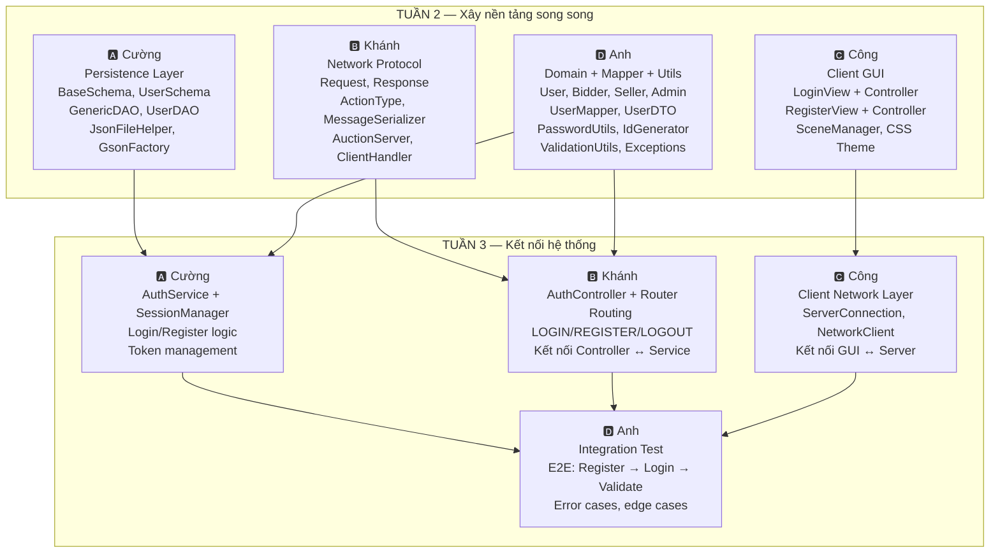

# 🔄 KẾ HOẠCH TUẦN 2–3 (CẢI TIẾN) — Feature-First: Hoàn thiện Auth End-to-End

> **Phiên bản:** 2.0 · **Ngày tạo:** 04/04/2026
>
> **Triết lý thay đổi:** Thay vì build từng tầng riêng lẻ (tuần 2 chỉ làm model, tuần 3 chỉ làm DAO...), chúng ta sẽ **hoàn thiện nguyên 1 tính năng xuyên suốt** từ Database → Domain → Network → GUI. Tính năng đầu tiên: **Authentication (Login / Register / Logout)**.

> [!IMPORTANT]
> Kế hoạch này **thay thế** Tuần 2 và Tuần 3 trong `WEEKLY_PLAN.md` gốc. Các tuần từ 4 trở đi sẽ được điều chỉnh sau dựa trên tiến độ thực tế.

---

## 📊 Tổng quan: Auth cần những gì?

Dựa trên tài liệu kiến trúc (`server_architecture_overhaul.md`) và flow diagrams (`diagrams_flow_auth.md`), để Auth **chạy được MVP**, cần hoàn thành:



---

## 🤝 Contracts — Giao kèo Interface trước khi code

> [!IMPORTANT]
> Trước khi ai bắt tay vào code, **cả 4 người phải đồng ý** các interface/contract sau. Đây là "bản hợp đồng" để 4 người code song song mà không chờ nhau.

### Contract 1: Schema ↔ DAO (Cường sở hữu)

```java
// GenericDAO<T extends BaseSchema>
void save(T entity);
T findById(String id);
List<T> findAll();
void update(T entity);
void delete(String id);

// UserDAO bổ sung:
UserSchema findByUsername(String username);
```

### Contract 2: Domain Model (Anh sở hữu)

```java
// User (abstract, immutable)
String getId();
String getUsername();
UserRole getRole();
abstract boolean hasPermission(String action);

// UserMapper (static methods)
static User toDomain(UserSchema schema);
static UserDTO toDTO(User user);
static UserSchema toNewSchema(String username, String hashedPassword, String salt, String email, UserRole role);
```

### Contract 3: Network Protocol (Khánh sở hữu)

```java
// Request: { action: ActionType, data: Map<String, Object>, token: String }
// Response: { type: "RESPONSE"|"PUSH", status: "OK"|"ERROR", message: String, data: Object }

// Response factory methods:
static Response ok(Object data);
static Response error(String message);
```

### Contract 4: Client ↔ Server (Công + Khánh đồng sở hữu)

```
Client gửi LOGIN:
  → {"action": "LOGIN", "data": {"username": "x", "password": "y"}}
  ← {"type": "RESPONSE", "status": "OK", "data": {"token": "uuid", "user": {id, username, role}}}

Client gửi REGISTER:
  → {"action": "REGISTER", "data": {"username": "x", "password": "y", "email": "z", "role": "BIDDER"}}
  ← {"type": "RESPONSE", "status": "OK", "message": "Đăng ký thành công"}

Client gửi LOGOUT:
  → {"action": "LOGOUT", "token": "uuid"}
  ← {"type": "RESPONSE", "status": "OK", "message": "Đã đăng xuất"}
```

---

## 📅 TUẦN 2: Xây nền tảng song song (4 trục độc lập)

> **Mục tiêu cuối tuần 2:** Mỗi người có 1 khối code **tự chạy được, tự test được** trên branch riêng. Chưa kết nối với nhau.

### 📖 Phần TỰ HỌC (ai cũng phải làm)

| # | Nội dung | Ai cần nhất | Đầu ra kiểm tra |
|---|----------|-------------|-----------------|
| 1 | Gson: serialize/deserialize Java object ↔ JSON | Cường, Anh | Đọc/ghi 1 object từ file JSON |
| 2 | Java Socket cơ bản (ServerSocket + Socket) | Khánh | Viết echo server/client đơn giản |
| 3 | JavaFX FXML + CSS styling | Công | Tạo form login đẹp với dark theme |
| 4 | Password hashing (SHA-256 + salt) | Anh | Hash rồi verify thành công |
| 5 | Abstract class, Enum, Immutable object | Cả nhóm | Giải thích được khi nào dùng cái nào |

---

### 🅰️ Cường — Persistence Layer (Schema + DAO + JSON Infrastructure)

```
Branch: feature/tuan-2-cuong-persistence
```

**Tham chiếu kiến trúc:** Mục 3 (`persistence/`) + Mục 4.1 trong `server_architecture_overhaul.md`

**Deliverables:**

1. **`BaseSchema.java`**
   - `protected` constructor rỗng (cho Gson) + constructor tường minh `(id, createdAt, updatedAt)`
   - Getter/setter, `equals()` theo id, `hashCode()` theo id
   
2. **`UserSchema.java`** (`extends BaseSchema`)
   - Trường: `username`, `hashedPassword`, `passwordSalt`, `email`, `role` (UserRole enum)
   - Constructor rỗng + constructor tường minh 8 tham số

3. **`GsonFactory.java`**
   - Tạo `Gson` instance chuẩn với `LocalDateTime` TypeAdapter
   - `setPrettyPrinting()` để file JSON dễ đọc khi debug

4. **`JsonFileHelper.java`**
   - `<T> List<T> readList(String filePath, Class<T> clazz)` — đọc JSON array thành List
   - `<T> void writeList(String filePath, List<T> list)` — ghi List thành JSON array
   - Xử lý file không tồn tại → trả List rỗng (không throw exception)

5. **`GenericDAO<T extends BaseSchema>` interface** + **`UserDAO` implementation**
   - `save()`, `findById()`, `findAll()`, `update()`, `delete()`
   - `findByUsername(String)` — method riêng của UserDAO
   - Mỗi thao tác ghi = đọc toàn bộ list → sửa → ghi lại toàn bộ (đơn giản, đủ cho MVP)

**Package đích (theo kiến trúc mới):**
```
com.auctionuet.server.persistence/
├── schema/
│   ├── BaseSchema.java
│   └── UserSchema.java
├── dao/
│   ├── GenericDAO.java    (interface)
│   └── UserDAO.java       (implementation)
└── json/
    ├── JsonFileHelper.java
    └── GsonFactory.java
```

**✅ Test đầu ra (bắt buộc viết JUnit):**
```java
@Test void testSaveAndFindById()     → Save UserSchema, findById trả đúng
@Test void testFindByUsername()       → Tìm đúng user theo username
@Test void testFindAll()             → Save 3 user, findAll trả 3
@Test void testUpdate()              → Cập nhật email, đọc lại đúng
@Test void testDelete()              → Xóa user, findById trả null
@Test void testFileNotExist()        → File chưa tạo → findAll trả List rỗng
@Test void testGsonLocalDateTime()   → Serialize/deserialize LocalDateTime chính xác
```

---

### 🅱️ Khánh — Network Protocol + Socket Server Skeleton

```
Branch: feature/tuan-2-khanh-network
```

**Tham chiếu kiến trúc:** Mục 3 (`network/`) + Mục 4.4 trong `server_architecture_overhaul.md`

**Deliverables:**

1. **`ActionType.java`** (enum)
   - Giá trị: `LOGIN`, `REGISTER`, `LOGOUT`, `PING` (chỉ cần 4 action cho tuần này)

2. **`Request.java`**
   - Trường: `action` (ActionType), `data` (Map<String, Object>), `token` (String)

3. **`Response.java`**
   - Trường: `type`, `status`, `event`, `message`, `data`
   - 3 factory methods: `ok()`, `error()`, `push()`

4. **`MessageSerializer.java`**
   - `String serialize(Response res)` → JSON string
   - `Request deserialize(String json)` → Request object
   - Sử dụng `GsonFactory` của Cường (hoặc tự tạo Gson instance tạm nếu Cường chưa merge)

5. **`AuctionServer.java`**
   - `ServerSocket` lắng nghe port 8888
   - Vòng lặp `accept()` → tạo `ClientHandler` trên thread mới

6. **`ClientHandler.java`** (`implements Runnable`)
   - Vòng lặp: đọc JSON → deserialize thành `Request` → (tuần này chỉ xử lý PING) → gửi `Response` 
   - Trường `currentUser` = null (chưa có auth)
   - `synchronized sendMessage(Response)` — thread-safe ghi ra socket

**Package đích:**
```
com.auctionuet.server.network/
├── protocol/
│   ├── ActionType.java
│   ├── Request.java
│   ├── Response.java
│   └── MessageSerializer.java
└── server/
    ├── AuctionServer.java
    └── ClientHandler.java
```

**✅ Test đầu ra:**
```java
@Test void testSerializeResponse()      → Response.ok("hello") → JSON → deserialize lại = ok
@Test void testDeserializeRequest()     → JSON string → Request với đúng action + data
@Test void testSerializeRoundTrip()     → Request → JSON → Request, giữ nguyên dữ liệu
```
**Test thủ công:**
- Chạy `AuctionServer` → "Listening on port 8888..."
- Dùng telnet/netcat gửi `{"action":"PING"}` → nhận `{"type":"RESPONSE","status":"OK","message":"PONG"}`
- 2 terminal cùng kết nối → Server xử lý cả 2

---

### 🅲️ Công — Client GUI (Login + Register screens)

```
Branch: feature/tuan-2-cong-client-gui
```

**Tham chiếu:** Tuần 5 trong WEEKLY_PLAN gốc (kéo lên sớm)

**Deliverables:**

1. **`LoginView.fxml` + `LoginController.java`**
   - Form: username (TextField), password (PasswordField), nút Login, link "Chưa có tài khoản? Đăng ký"
   - Validation trên client: không để trống username/password
   - Label hiển thị lỗi (ẩn mặc định, hiện khi có lỗi, text màu đỏ)
   - Khi bấm Login: **tuần này chỉ print ra console** (chưa kết nối server)

2. **`RegisterView.fxml` + `RegisterController.java`**
   - Form: username, email, password, confirm password, chọn role (ComboBox: Bidder/Seller), nút Register
   - Validation: email hợp lệ, password ≥ 8 ký tự, password == confirm, username ≥ 3 ký tự
   - Link "Đã có tài khoản? Đăng nhập" → quay về Login

3. **`SceneManager.java`** (Singleton)
   - `switchScene(String fxmlPath)` — chuyển scene trên Stage chính
   - Giữ reference tới `Stage` chính

4. **`styles.css`** — Dark theme hiện đại
   - Background tối (#1a1a2e hoặc tương tự)
   - Input fields bo tròn, focus effect
   - Button gradient, hover effect
   - Typography rõ ràng

**Package đích:**
```
com.auctionuet.client/
├── ClientApp.java              (entry point, load LoginView)
├── view/
│   ├── SceneManager.java
│   ├── LoginController.java
│   └── RegisterController.java
└── resources/
    ├── fxml/
    │   ├── LoginView.fxml
    │   └── RegisterView.fxml
    └── css/
        └── styles.css
```

**✅ Test đầu ra (thủ công):**
- Chạy `ClientApp` → Cửa sổ Login đẹp, dark theme
- Để trống username → bấm Login → Hiện "Vui lòng nhập username"
- Click "Đăng ký" → Chuyển sang màn Register, animation smooth
- Nhập password khác confirm → Hiện "Mật khẩu không khớp"
- Click "Đăng nhập" → Quay về Login

---

### 🅳️ Anh — Domain Model + Mapper + Utilities

```
Branch: feature/tuan-2-anh-domain
```

**Tham chiếu kiến trúc:** Mục 3 (`domain/`) + Mục 4.2 + Mục 4.3 trong `server_architecture_overhaul.md`

**Deliverables:**

1. **Enums:** `UserRole.java` { BIDDER, SELLER, ADMIN }

2. **Domain Model (immutable, KHÔNG có password):**
   - `User.java` (abstract): `id`, `username`, `role` — tất cả `private final`, chỉ getter
   - `abstract boolean hasPermission(String action)`
   - `abstract String getDisplayInfo()`
   - `Bidder.java`, `Seller.java`, `Admin.java` — mỗi class override `hasPermission()` với bảng quyền riêng

3. **DTO:**
   - `UserDTO.java` (immutable): `id`, `username`, `role` — dùng gửi qua mạng

4. **Mapper:**
   - `UserMapper.java` (tất cả static methods):
     - `User toDomain(UserSchema schema)` — Factory Method: switch role → tạo đúng subclass
     - `UserDTO toDTO(User user)` — chuyển từ domain sang DTO
     - `UserSchema toNewSchema(...)` — tạo schema mới khi register

5. **Utilities:**
   - `IdGenerator.java`: `static String generate()` → UUID.randomUUID().toString()
   - `PasswordUtils.java`: `generateSalt()`, `hash(password, salt)`, `verify(password, salt, hashedPassword)` — dùng SHA-256
   - `ValidationUtils.java`: `validateEmail()`, `validatePassword()`, `validateUsername()` — throw `IllegalArgumentException` nếu sai

6. **Exceptions:** (refactor từ tuần 1 nếu cần)
   - `AuthenticationException.java`, `UserNotFoundException.java`, `DuplicateUserException.java`

**Package đích:**
```
com.auctionuet.server.domain/
├── model/
│   ├── User.java (abstract)
│   ├── Bidder.java
│   ├── Seller.java
│   └── Admin.java
└── enums/
    └── UserRole.java

com.auctionuet.server.network/
└── dto/
    └── UserDTO.java

com.auctionuet.server.mapper/
└── UserMapper.java

com.auctionuet.server.util/
├── IdGenerator.java
├── PasswordUtils.java
└── ValidationUtils.java

com.auctionuet.server.exception/
├── AuthenticationException.java
├── UserNotFoundException.java
└── DuplicateUserException.java
```

**✅ Test đầu ra (JUnit bắt buộc):**
```java
// Domain
@Test void testBidderPermissions()    → PLACE_BID=true, MANAGE_USERS=false
@Test void testAdminPermissions()     → MANAGE_USERS=true, PLACE_BID=false
@Test void testUserImmutable()        → Không có setter, fields là final

// Mapper
@Test void testToDomainBidder()       → UserSchema(role=BIDDER) → Bidder instance
@Test void testToDomainAdmin()        → UserSchema(role=ADMIN) → Admin instance
@Test void testToDTO()                → User → UserDTO, không có password
@Test void testToNewSchema()          → Tạo schema mới có id + timestamps

// Utils
@Test void testPasswordHashAndVerify() → hash rồi verify → true
@Test void testDifferentSalt()         → cùng password, khác salt → khác hash
@Test void testValidEmail()            → "user@uet.vn" → ok
@Test void testInvalidEmail()          → "not-email" → throw
@Test void testWeakPassword()          → "123" → throw
```

---

### 📋 Meeting cuối Tuần 2 (Tối thứ 7)

**Agenda:**
1. Mỗi người demo code của mình chạy **độc lập** (tests pass)
2. Review code chéo: mỗi người đọc code 2 người khác
3. **Merge tất cả vào `develop`** — giải quyết conflict nếu có
4. Verify: sau merge, `mvn compile` + `mvn test` toàn project phải pass
5. Bàn kế hoạch kết nối Tuần 3

---

## 📅 TUẦN 3: Kết nối hệ thống — Auth chạy End-to-End

> **Mục tiêu cuối tuần 3:** Chạy được **MVP hoàn chỉnh**: Mở Client → Login/Register → Server xác thực → Client chuyển sang Dashboard shell. Toàn bộ qua mạng TCP socket thật.

### 📖 Phần TỰ HỌC (ai cũng phải làm)

| # | Nội dung | Ai cần nhất | Đầu ra kiểm tra |
|---|----------|-------------|-----------------|
| 1 | Singleton Pattern (thread-safe) | Cường | Viết được enum Singleton hoặc double-check locking |
| 2 | Java Thread + Runnable | Khánh, Công | Chạy task song song trên 2 thread |
| 3 | JavaFX Platform.runLater() | Công | Cập nhật UI từ background thread |
| 4 | Integration testing techniques | Anh | Viết test chạy server + client giả |

---

### 🅰️ Cường — AuthService + SessionManager (Server Business Logic)

```
Branch: feature/tuan-3-cuong-auth-service
```

**Tham chiếu:** Luồng Login + Register trong `diagrams_flow_auth.md`

**Deliverables:**

1. **`AuthService.java`** — Trái tim của hệ thống xác thực
   - `LoginResult login(String username, String password)`:
     1. Gọi `UserDAO.findByUsername(username)` → `UserSchema`
     2. Nếu null → throw `UserNotFoundException`
     3. Gọi `PasswordUtils.verify(password, schema.salt, schema.hashedPassword)`
     4. Nếu sai → throw `AuthenticationException`
     5. Gọi `UserMapper.toDomain(schema)` → `User` (không có password!)
     6. Gọi `SessionManager.createSession(user)` → token
     7. Trả `LoginResult(token, user)`
   
   - `void register(String username, String password, String email, UserRole role)`:
     1. Validate input qua `ValidationUtils`
     2. Check trùng: `UserDAO.findByUsername(username)` → nếu != null → throw `DuplicateUserException`
     3. Hash: `PasswordUtils.generateSalt()` + `PasswordUtils.hash(password, salt)`
     4. Tạo schema: `UserMapper.toNewSchema(username, hashedPassword, salt, email, role)`
     5. Lưu: `UserDAO.save(schema)` — WRITE-THROUGH

2. **`SessionManager.java`** (Singleton)
   - `Map<String, User>` — token → User (RAM only)
   - `String createSession(User user)` → generate UUID token, lưu vào map
   - `User validateToken(String token)` → trả User hoặc throw
   - `void removeSession(String token)` → logout
   - `void invalidateSessionByUserId(String userId)` → kick user (admin dùng sau)

3. **`LoginResult.java`** — POJO: `token` + `user`

**Package đích:**
```
com.auctionuet.server.domain/
└── service/
    ├── AuthService.java
    └── SessionManager.java
```

**✅ Test đầu ra (JUnit):**
```java
@Test void testRegisterAndLogin()       → Register user A, login user A → thành công, có token
@Test void testLoginWrongPassword()     → throw AuthenticationException
@Test void testLoginUserNotExist()      → throw UserNotFoundException
@Test void testRegisterDuplicate()      → throw DuplicateUserException  
@Test void testValidateToken()          → Login → lấy token → validateToken → trả đúng User
@Test void testLogout()                 → removeSession → validateToken lại → throw
@Test void testSessionManagerSingleton() → 2 lần getInstance() trả cùng object
```

---

### 🅱️ Khánh — AuthController + RequestRouter (Server Routing)

```
Branch: feature/tuan-3-khanh-controller
```

**Tham chiếu:** Mục 4.4 trong `server_architecture_overhaul.md`

**Deliverables:**

1. **`AuthController.java`**
   - `Response handleLogin(Request req)`:
     1. Lấy username, password từ `req.getData()`
     2. Gọi `AuthService.login(username, password)`
     3. Catch exceptions → `Response.error(message)`
     4. Thành công → `UserMapper.toDTO(user)` → `Response.ok({token, userDTO})`
   
   - `Response handleRegister(Request req)`:
     1. Lấy username, password, email, role từ `req.getData()`
     2. Gọi `AuthService.register(...)`
     3. Thành công → `Response.ok("Đăng ký thành công")`
   
   - `Response handleLogout(Request req)`:
     1. `SessionManager.validateToken(req.getToken())` → User
     2. `SessionManager.removeSession(req.getToken())`
     3. `Response.ok("Đã đăng xuất")`

2. **`RequestRouter.java`**
   - `Response route(Request req)` — switch theo `req.getAction()`:
     - `LOGIN` → `authController.handleLogin(req)`
     - `REGISTER` → `authController.handleRegister(req)`
     - `LOGOUT` → `authController.handleLogout(req)`
     - `PING` → `Response.ok("PONG")`
     - default → `Response.error("Unknown action")`

3. **Cập nhật `ClientHandler.java`** (từ tuần 2):
   - Thay xử lý PING cứng → gọi `RequestRouter.route(request)`
   - Sau `handleLogin` thành công → `this.currentUser = user`

**Package đích:**
```
com.auctionuet.server.network/
├── controller/
│   └── AuthController.java
└── server/
    └── RequestRouter.java
    (ClientHandler.java đã có từ tuần 2, chỉ cập nhật)
```

**✅ Test đầu ra (JUnit):**
```java
@Test void testRouteLogin()         → Request(LOGIN) → gọi đúng handleLogin
@Test void testRouteRegister()      → Request(REGISTER) → gọi đúng handleRegister
@Test void testRoutePing()          → Request(PING) → Response.ok("PONG")
@Test void testRouteUnknown()       → Request(null) → Response.error("Unknown action")
@Test void testLoginResponseFormat() → Response chứa token + UserDTO, không chứa password
```
**Test thủ công (end-to-end qua socket):**
- Chạy Server → telnet gửi REGISTER JSON → nhận OK
- Gửi LOGIN JSON → nhận token + userDTO
- Gửi LOGOUT JSON kèm token → nhận OK

---

### 🅲️ Công — Client Network Layer + Kết nối GUI ↔ Server

```
Branch: feature/tuan-3-cong-client-network
```

**Deliverables:**

1. **`ServerConnection.java`** (Singleton)
   - `connect(String host, int port)` — mở Socket TCP
   - `Response sendRequest(Request req)` — blocking: gửi JSON → đọc response JSON → trả Response object
   - `disconnect()` — đóng socket
   - `boolean isConnected()`

2. **`AuthClient.java`** — Adapter giữa GUI và Network
   - `LoginResult login(String username, String password)`:
     1. Tạo Request(LOGIN, {username, password})
     2. Gọi `ServerConnection.sendRequest(req)` 
     3. Parse response → trả `LoginResult` hoặc throw
   
   - `void register(String username, String password, String email, String role)`:
     1. Tạo Request(REGISTER, {...})
     2. Gọi sendRequest → kiểm tra OK/ERROR

3. **Cập nhật `LoginController.java`** (từ tuần 2):
   - Bấm Login → gọi `AuthClient.login()` **trên background thread**
   - Thành công → `Platform.runLater(() → SceneManager.switchScene("Dashboard"))`
   - Thất bại → `Platform.runLater(() → errorLabel.setText(message))`

4. **Cập nhật `RegisterController.java`** (từ tuần 2):
   - Bấm Register → gọi `AuthClient.register()` trên background thread
   - Thành công → chuyển về Login + hiện "Đăng ký thành công"

5. **`DashboardView.fxml` + `DashboardController.java`** (shell cơ bản)
   - Chỉ cần: Header hiện "Xin chào, {username} ({role})" + nút Logout
   - Bấm Logout → gửi LOGOUT request → quay về Login

**Package đích:**
```
com.auctionuet.client/
├── network/
│   ├── ServerConnection.java
│   └── AuthClient.java
├── view/
│   ├── LoginController.java     (cập nhật)
│   ├── RegisterController.java  (cập nhật)
│   └── DashboardController.java (mới)
└── resources/
    └── fxml/
        └── DashboardView.fxml   (mới)
```

**✅ Test đầu ra (thủ công, demo live):**
- Chạy Server → Chạy Client → Màn Login hiện
- Bấm Login sai → Label đỏ "Sai mật khẩu" (từ server, không phải hardcode)
- Bấm Register → Đăng ký thành công → Quay về Login
- Bấm Login đúng → Chuyển sang Dashboard "Xin chào, cuong (BIDDER)"
- Bấm Logout → Quay về Login
- **Kiểm tra file `data/users.json`** → thấy user vừa đăng ký, password đã hash

---

### 🅳️ Anh — Integration Testing + Error Handling hoàn chỉnh

```
Branch: feature/tuan-3-anh-integration
```

**Deliverables:**

1. **`AuthIntegrationTest.java`** — Test xuyên suốt (không cần GUI)
   - Khởi chạy `AuctionServer` trên thread riêng
   - Tạo mock client bằng raw Socket
   - Gửi JSON request, nhận JSON response, assert kết quả

2. **Test Scenarios:**
   ```java
   @Test void testFullAuthFlow() {
       // 1. Register user "testuser"
       // 2. Login "testuser" → nhận token
       // 3. Gửi request kèm token → OK
       // 4. Logout → OK
       // 5. Gửi request với token cũ → ERROR (invalid token)
   }
   
   @Test void testRegisterDuplicateUsername() {
       // Register "cuong" → OK
       // Register "cuong" lần 2 → ERROR "Username đã tồn tại"
   }
   
   @Test void testLoginWrongPassword() {
       // Register "cuong" password "abc123"
       // Login "cuong" password "wrong" → ERROR "Sai mật khẩu"
   }
   
   @Test void testLoginNonExistentUser() {
       // Login "ghost" → ERROR "User không tồn tại"
   }
   
   @Test void testInvalidRequest() {
       // Gửi JSON rác → Server trả ERROR, KHÔNG crash
   }
   
   @Test void testMultipleClientsLogin() {
       // Client A register + login
       // Client B register + login
       // Cả 2 token đều valid, khác nhau
   }
   
   @Test void testPingNoAuth() {
       // Gửi PING không cần token → OK "PONG"
   }
   ```

3. **`TestHelper.java`** — Utility cho integration testing
   - `startTestServer(int port)` → khởi chạy server trên port tùy chọn
   - `stopTestServer()`
   - `Response sendRawRequest(int port, String json)` → gửi/nhận qua socket
   - `void cleanTestData()` → xóa file JSON test

4. **Tổng hợp lỗi + Bug report:**
   - Chạy toàn bộ test → ghi nhận lỗi → tạo GitHub Issues
   - Nếu có bug → tạo fix PR hoặc báo cho người phụ trách

**✅ Test đầu ra:**
- `mvn test` → **TẤT CẢ** integration tests pass ✅
- Ít nhất **7 test cases** cho auth flow
- Test data được cleanup tự động (không ảnh hưởng test khác)
- Không có test flaky (chạy lại 5 lần đều pass)

---

### 📋 Meeting cuối Tuần 3 (Tối thứ 7)

**Agenda:**
1. **DEMO LIVE:** Mở Server → Mở Client → Register → Login → Dashboard → Logout
2. Anh chạy toàn bộ integration tests trước mặt cả nhóm
3. Review code chéo lần cuối
4. **MERGE vào `develop`** → Tag version `v0.1.0-auth-mvp`
5. Bàn kế hoạch Tuần 4: Bắt đầu feature Auction & Bidding

---

## 📊 Dependency Graph — Ai chờ ai?

```
TUẦN 2: Hoàn toàn SONG SONG — không ai chờ ai
┌──────────┐  ┌──────────┐  ┌──────────┐  ┌──────────┐
│ Cường    │  │ Khánh    │  │ Công     │  │ Anh      │
│ Schema   │  │ Protocol │  │ GUI      │  │ Domain   │
│ DAO      │  │ Socket   │  │ CSS      │  │ Mapper   │
│ JSON I/O │  │ Server   │  │ Scenes   │  │ Utils    │
└──────────┘  └──────────┘  └──────────┘  └──────────┘
     │              │              │              │
     ▼              ▼              ▼              ▼
  MERGE TUẦN 2 (Tối Thứ 7) ──────────────────────
     │              │              │              │
     ▼              ▼              ▼              ▼
TUẦN 3: Phụ thuộc nhẹ — nhưng vẫn song song phần lớn
┌──────────┐  ┌──────────┐  ┌──────────┐  ┌──────────┐
│ Cường    │  │ Khánh    │  │ Công     │  │ Anh      │
│ Auth     │←─│ Controller│  │ Client   │  │ Integ.   │
│ Service  │  │ Router   │  │ Network  │  │ Test     │
│ Session  │  │ CH update│  │ GUI↔Net  │  │ E2E      │
└──────────┘  └──────────┘  └──────────┘  └──────────┘
   (Cường+Anh    (Khánh cần     (Công cần    (Anh cần
   tuần 2 là     Cường tuần 3   Khánh tuần 2  TẤT CẢ
   nền cho       làm xong       Protocol      merge xong
   tuần 3)       AuthService)   format)       mới test)
```

> [!TIP]
> **Anh sẽ bắt đầu integration test muộn nhất** (cần server + client chạy được). Tuy nhiên, Anh có thể viết sẵn test skeleton + TestHelper trong khi chờ, và bắt đầu test ngay khi merge code đầu tuần 3 xong.

---

## ✅ Checklist MVP — Auth hoàn thành khi nào?

| # | Tiêu chí | Người verify |
|---|----------|-------------|
| 1 | Client mở lên → hiện Login screen đẹp (dark theme) | Công |
| 2 | Register → User lưu vào `users.json` (password đã hash) | Cường |
| 3 | Login đúng → nhận token + chuyển Dashboard | Khánh |
| 4 | Login sai → hiện lỗi từ server (không hardcode) | Anh |
| 5 | Logout → token bị xóa, quay về Login | Cường |
| 6 | Login lại với token cũ → bị từ chối | Anh |
| 7 | 2 Client đồng thời register + login → không conflict | Anh |
| 8 | Server crash → Client hiện lỗi kết nối (không treo) | Công |
| 9 | `mvn test` toàn project → ALL PASS | Anh |
| 10 | File JSON readable, password KHÔNG phải plain text | Cường |
