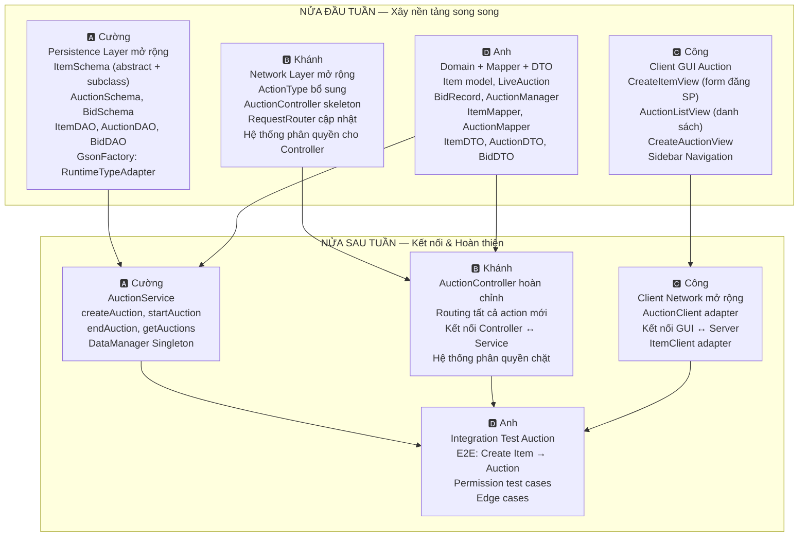

# 🏛️ KẾ HOẠCH TUẦN 4 — Auction Feature: Sản phẩm, Phiên đấu giá & Phân quyền

> **Phiên bản:** 1.0 · **Ngày tạo:** 14/04/2026
>
> **Triết lý:** Tiếp tục chiến lược Feature-First từ tuần 2-3. Tuần 4 hoàn thiện nguyên **Auction Flow** xuyên suốt: Đăng sản phẩm → Tạo phiên đấu giá → Bắt đầu phiên → Xem danh sách → Đóng phiên. Song song triển khai **hệ thống phân quyền** xuyên suốt mọi Controller.

> [!IMPORTANT]
> Kế hoạch này triển khai toàn bộ luồng trong `docs/diagrams_flow_auction.md`. Tuần 5 sẽ tập trung vào Bidding realtime (PLACE_BID, Observer, Push notification).

---

## 📊 Tổng quan: Tuần 4 cần làm những gì?



---

## 🤝 Contracts — Giao kèo Interface tuần 4

> [!IMPORTANT]
> Trước khi code, **cả 4 người phải nắm rõ** các interface/contract mới. Đây là bổ sung cho các contract tuần 2-3.

### Contract 5: ItemSchema — Cây kế thừa (Cường sở hữu)

```java
// ItemSchema (abstract) extends BaseSchema
// Trường: name, description, startingPrice, type (ItemType), sellerId
//         imageUrl, condition, auctionCount

// ElectronicsSchema extends ItemSchema
// Trường bổ sung: brand, warrantyMonths

// ArtSchema extends ItemSchema
// Trường bổ sung: artist, year, medium

// VehicleSchema extends ItemSchema
// Trường bổ sung: make, model, mileage, year

// ItemDAO bổ sung:
List<ItemSchema> findBySellerId(String sellerId);
```

### Contract 6: AuctionSchema (Cường sở hữu)

```java
// AuctionSchema extends BaseSchema
// Trường: itemId, sellerId, startTime, endTime, status (AuctionStatus),
//         highestBid, winnerId, title, description

// AuctionDAO bổ sung:
List<AuctionSchema> findByStatus(AuctionStatus status);
List<AuctionSchema> findBySellerId(String sellerId);
```

### Contract 7: Domain Model — Item + LiveAuction (Anh sở hữu)

```java
// AuctionStatus enum: OPEN, RUNNING, FINISHED, PAID, CANCELED
// ItemType enum: ELECTRONICS, ART, VEHICLE

// Item (domain, phẳng — không kế thừa):
//   id, name, description, startingPrice, type, sellerId, imageUrl, condition

// LiveAuction:
//   id, itemId, sellerId, endTime, status, currentHighestBid, currentWinnerId
//   bidHistory (List<BidRecord>), bidLock (ReentrantLock), observers (List<AuctionObserver>)
//   placeBid(User bidder, double amount) → BidRecord

// BidRecord:
//   bidderId, bidderUsername, amount, timestamp
```

### Contract 8: Mapper — Item + Auction (Anh sở hữu)

```java
// ItemMapper (static):
static Item toDomain(ItemSchema schema);
static ItemDTO toDTO(ItemSchema schema);
static ItemSchema toNewSchema(Map<String, Object> itemData, String sellerId);

// AuctionMapper (static):
static LiveAuction toDomain(AuctionSchema schema);
static AuctionDTO toDTO(AuctionSchema schema, ItemDTO itemDTO);
static AuctionSchema toNewSchema(String itemId, String sellerId,
                                  LocalDateTime startTime, LocalDateTime endTime,
                                  String title, String description);
static AuctionSchema toSchema(LiveAuction liveAuction);
```

### Contract 9: DTO — Item + Auction (Anh sở hữu)

```java
// ItemDTO (immutable):
//   id, name, description, startingPrice, type, sellerUsername, imageUrl, condition

// AuctionDTO (immutable):
//   id, item (ItemDTO), sellerUsername, startTime, endTime, status,
//   currentHighestBid, currentWinnerUsername, title, description

// BidDTO (immutable):
//   auctionId, bidderUsername, amount, timestamp
```

### Contract 10: Phân quyền — Permission System (Khánh + Anh đồng sở hữu)

```java
// Permission matrix (đã có sẵn hasPermission() từ tuần 2-3):
// Bidder: VIEW_AUCTION ✅, PLACE_BID ✅, VIEW_BID_HISTORY ✅
// Seller: CREATE_ITEM ✅, UPDATE_ITEM ✅, DELETE_ITEM ✅,
//         CREATE_AUCTION ✅, START_AUCTION ✅, VIEW_AUCTION ✅
// Admin:  MANAGE_USERS ✅, VIEW_AUCTION ✅, mọi action quản trị ✅

// Controller phải kiểm tra quyền TRƯỚC KHI xử lý logic:
// 1. validateToken(token) → User
// 2. user.hasPermission(ACTION_NAME) → boolean
// 3. Nếu false → Response.error("Bạn không có quyền thực hiện hành động này")
```

### Contract 11: Client ↔ Server — Auction Protocol (Công + Khánh đồng sở hữu)

```
Client gửi CREATE_ITEM:
  → {"action": "CREATE_ITEM", "token": "uuid",
     "data": {"name": "iPhone 15", "description": "...", "startingPrice": 1000000,
              "type": "ELECTRONICS", "imageUrl": "...", "condition": "NEW",
              "brand": "Apple", "warrantyMonths": 12}}
  ← {"type": "RESPONSE", "status": "OK", "data": {ItemDTO}}

Client gửi CREATE_AUCTION:
  → {"action": "CREATE_AUCTION", "token": "uuid",
     "data": {"itemId": "item-uuid", "startTime": "...", "endTime": "...",
              "title": "Đấu giá iPhone 15", "description": "..."}}
  ← {"type": "RESPONSE", "status": "OK", "data": {AuctionDTO}}

Client gửi START_AUCTION:
  → {"action": "START_AUCTION", "token": "uuid", "data": {"auctionId": "auction-uuid"}}
  ← {"type": "RESPONSE", "status": "OK", "message": "Phiên đấu giá đã bắt đầu"}

Client gửi GET_AUCTIONS:
  → {"action": "GET_AUCTIONS", "token": "uuid"}
  ← {"type": "RESPONSE", "status": "OK", "data": [AuctionDTO, AuctionDTO, ...]}

Client gửi GET_AUCTION_DETAIL:
  → {"action": "GET_AUCTION_DETAIL", "token": "uuid", "data": {"auctionId": "uuid"}}
  ← {"type": "RESPONSE", "status": "OK", "data": {AuctionDTO with full item info}}
```

---

## 👥 Phân công chi tiết

| Thành viên | Vai trò tuần 4 | Branch | Tài liệu chi tiết |
|------------|---------------|--------|-------------------|
| 🅰️ **Cường** | Persistence mở rộng + AuctionService | `feature/tuan-4-cuong-auction-persistence` | [TASK_CUONG_WEEK4.md](./TASK_CUONG_WEEK4.md) |
| 🅱️ **Khánh** | Network mở rộng + Phân quyền + AuctionController | `feature/tuan-4-khanh-auction-network` | [TASK_KHANH_WEEK4.md](./TASK_KHANH_WEEK4.md) |
| 🅲️ **Công** | Client GUI Auction + Client Network | `feature/tuan-4-cong-auction-gui` | [TASK_CONG_WEEK4.md](./TASK_CONG_WEEK4.md) |
| 🅳️ **Anh** | Domain Model + Mapper + DTO + Integration Test | `feature/tuan-4-anh-auction-domain` | [TASK_ANH_WEEK4.md](./TASK_ANH_WEEK4.md) |

---

## 📅 Timeline tuần 4

### Nửa đầu tuần (Thứ 2 → Thứ 4)

> **Mục tiêu:** Mỗi người hoàn thành phần nền tảng riêng, tự test độc lập.

| Ngày | Cường | Khánh | Công | Anh |
|------|-------|-------|------|-----|
| T2 | ItemSchema + subclasses | ActionType mở rộng | CreateItemView design | AuctionStatus, ItemType enums |
| T3 | AuctionSchema + BidSchema | Permission system trong Controller | AuctionListView | Item, LiveAuction, BidRecord model |
| T4 | ItemDAO, AuctionDAO, BidDAO | AuctionController skeleton + Router | CreateAuctionView + Navigation | ItemMapper, AuctionMapper, BidMapper, DTO |

**📋 Checkpoint giữa tuần (Tối thứ 4):**
- Mỗi người push code lên branch riêng
- Sync call 30 phút: báo tiến độ, blockers
- **Merge tất cả vào `develop`** → giải quyết conflict

### Nửa sau tuần (Thứ 5 → Thứ 7)

> **Mục tiêu:** Kết nối các tầng, chạy được E2E.

| Ngày | Cường | Khánh | Công | Anh |
|------|-------|-------|------|-----|
| T5 | AuctionService logic | AuctionController hoàn chỉnh | ItemClient + AuctionClient | Viết test skeleton |
| T6 | DataManager + GsonFactory update | Kết nối Controller ↔ Service | Kết nối GUI ↔ Server | Chạy integration tests |
| T7 | Bug fix + hỗ trợ | Bug fix + hỗ trợ | Polish UI | Fix bugs từ test |

**📋 Meeting cuối tuần (Tối thứ 7):**
1. **DEMO LIVE:** Seller đăng sản phẩm → Tạo auction → Start auction → Bidder xem danh sách
2. Anh chạy integration tests trước mặt cả nhóm
3. Review code chéo
4. **MERGE vào `develop`** → Tag `v0.2.0-auction-mvp`
5. Bàn kế hoạch Tuần 5: Bidding realtime + Observer pattern

---

## 📊 Dependency Graph — Ai chờ ai?

```
NỬA ĐẦU TUẦN: Hoàn toàn SONG SONG — không ai chờ ai
┌──────────────┐  ┌──────────────┐  ┌──────────────┐  ┌──────────────┐
│ Cường        │  │ Khánh        │  │ Công         │  │ Anh          │
│ ItemSchema   │  │ ActionType   │  │ CreateItem   │  │ Enums        │
│ AuctionSchema│  │ Permission   │  │ AuctionList  │  │ Item model   │
│ BidSchema    │  │ Controller   │  │ CreateAuction│  │ LiveAuction  │
│ DAO classes  │  │ skeleton     │  │ Navigation   │  │ Mapper + DTO │
└──────────────┘  └──────────────┘  └──────────────┘  └──────────────┘
       │                 │                 │                 │
       ▼                 ▼                 ▼                 ▼
    MERGE GIỮA TUẦN (Tối Thứ 4) ─────────────────────────
       │                 │                 │                 │
       ▼                 ▼                 ▼                 ▼
NỬA SAU TUẦN: Phụ thuộc nhẹ — kết nối hệ thống
┌──────────────┐  ┌──────────────┐  ┌──────────────┐  ┌──────────────┐
│ Cường        │  │ Khánh        │  │ Công         │  │ Anh          │
│ AuctionServ  │←─│ Controller   │  │ Client Net   │  │ Integration  │
│ DataManager  │  │ full routing │  │ GUI↔Server   │  │ Test E2E     │
│ GsonFactory  │  │ permission   │  │ polish       │  │ Permission   │
└──────────────┘  └──────────────┘  └──────────────┘  └──────────────┘
  (Anh nửa đầu    (Khánh cần        (Công cần        (Anh cần
   là nền cho      Cường nửa sau     Protocol từ      TẤT CẢ merge
   Cường nửa sau)  AuctionService)   Khánh)           xong mới test)
```

> [!TIP]
> **Anh tiếp tục bắt đầu integration test muộn nhất** (cần cả server + client). Nhưng nửa đầu tuần Anh tập trung viết Domain Model + Mapper + DTO — đây là phần nền tảng mà Cường (AuctionService) và Khánh (Controller) đều cần.

---

## ✅ Checklist MVP — Auction Feature hoàn thành khi nào?

| # | Tiêu chí | Người verify |
|---|----------|-------------|
| 1 | Seller đăng nhập → tạo sản phẩm mới với ảnh, tên, loại, giá → lưu vào `items.json` | Cường |
| 2 | Seller tạo phiên đấu giá cho sản phẩm → lưu vào `auctions.json` (status = OPEN) | Cường |
| 3 | Seller bấm Start Auction → status = RUNNING, LiveAuction nạp vào RAM | Anh |
| 4 | Bidder xem danh sách phiên đấu giá khả dụng (GET_AUCTIONS) | Khánh |
| 5 | Bidder KHÔNG thể tạo sản phẩm/phiên đấu giá → bị từ chối phân quyền | Khánh |
| 6 | Admin KHÔNG thể tạo sản phẩm → bị từ chối phân quyền | Anh |
| 7 | Client hiển thị form đăng sản phẩm với đầy đủ trường input | Công |
| 8 | Client hiển thị danh sách auction dạng card/grid đẹp | Công |
| 9 | Phiên đấu giá tự kết thúc khi hết endTime (countdown timer) | Anh |
| 10 | `mvn test` toàn project → ALL PASS | Anh |
| 11 | File JSON mới (`items.json`, `auctions.json`) readable, đúng format | Cường |
| 12 | Seller chỉ quản lý được sản phẩm CỦA MÌNH (ownership check) | Khánh |

---

## 📖 Phần TỰ HỌC (ai cũng phải làm)

| # | Nội dung | Ai cần nhất | Đầu ra kiểm tra |
|---|----------|-------------|-----------------|
| 1 | Gson RuntimeTypeAdapterFactory (serialize subclass) | Cường | Serialize/deserialize ElectronicsSchema ↔ JSON đúng |
| 2 | Java ReentrantLock cơ bản | Anh | Viết demo 2 thread truy cập shared resource an toàn |
| 3 | JavaFX ListView/GridView + custom cell | Công | Hiển thị danh sách card sản phẩm đẹp |
| 4 | ScheduledExecutorService (countdown timer) | Anh | Tạo timer đếm ngược 30 giây rồi trigger callback |
| 5 | Java abstract class + factory pattern | Cường, Anh | Giải thích và demo tạo đúng subclass từ enum type |
