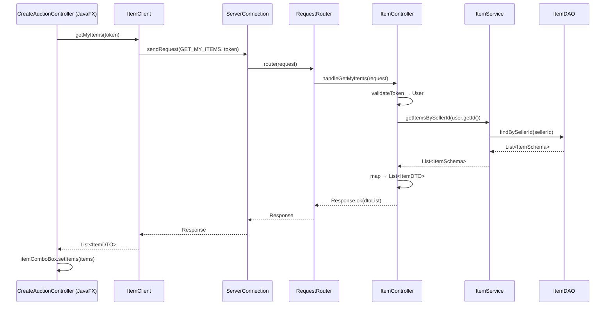

# Refactoring: Tách ItemService từ AuctionService + Triển khai GET_MY_ITEMS

## Tổng quan thay đổi

Tách logic **Item Management** ra khỏi `AuctionService` thành `ItemService` riêng biệt, triển khai luồng `GET_MY_ITEMS` end-to-end, và kết nối frontend để hiển thị item thật thay vì mock data.

## Các file đã thay đổi

### 🆕 File mới

| File | Mô tả |
|------|--------|
| [ItemService.java](file:///d:/Project/AuctionUET/auction-server/src/main/java/com/auctionuet/server/domain/service/ItemService.java) | Service chuyên xử lý item: `createItem`, `getItemsBySellerId`, `getItemById`, `updateItem` |
| [ItemController.java](file:///d:/Project/AuctionUET/auction-server/src/main/java/com/auctionuet/server/network/controller/ItemController.java) | Controller xử lý `CREATE_ITEM` và `GET_MY_ITEMS` requests |

### ✏️ File đã sửa

| File | Thay đổi |
|------|----------|
| [AuctionService.java](file:///d:/Project/AuctionUET/auction-server/src/main/java/com/auctionuet/server/domain/service/AuctionService.java) | Xóa `createItem()`, thay `ItemDAO` → `ItemService` |
| [AuctionController.java](file:///d:/Project/AuctionUET/auction-server/src/main/java/com/auctionuet/server/network/controller/AuctionController.java) | Xóa `handleCreateItem()`, thay `ItemDAO` → `ItemService` |
| [RequestRouter.java](file:///d:/Project/AuctionUET/auction-server/src/main/java/com/auctionuet/server/network/server/RequestRouter.java) | Thêm `ItemController`, route `CREATE_ITEM` + `GET_MY_ITEMS` |
| [AuctionServer.java](file:///d:/Project/AuctionUET/auction-server/src/main/java/com/auctionuet/server/network/server/AuctionServer.java) | Wire `ItemService` → `ItemController` + `AuctionService` |
| [AuctionServiceTest.java](file:///d:/Project/AuctionUET/auction-server/src/test/java/com/auctionuet/server/domain/service/AuctionServiceTest.java) | Dùng `ItemService`, thêm test `testGetItemsBySeller` |
| [CreateAuctionController.java](file:///d:/Project/AuctionUET/auction-client/src/main/java/com/auctionuet/client/view/CreateAuctionController.java) | Gọi `ItemClient.getMyItems()` thay vì mock "iPhone 15" |

## Luồng GET_MY_ITEMS (End-to-End)

## Kết quả

- ✅ Server compile thành công
- ✅ Client compile thành công  
- ✅ Tất cả tests pass (bao gồm test mới `testGetItemsBySeller`)
- ✅ Dropdown ComboBox giờ hiển thị item thật từ server
