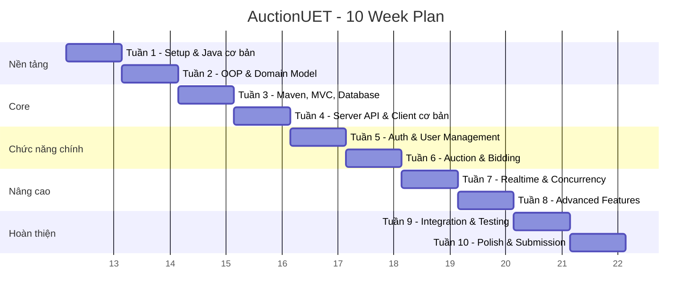

.# 🏗️ KẾ HOẠCH 10 TUẦN — HỆ THỐNG ĐẤU GIÁ TRỰC TUYẾN (AuctionUET)

## 👥 Thành viên nhóm

| Ký hiệu | Họ tên | Vai trò chính (xoay vòng) |
|----------|--------|---------------------------|
| **Cường** | Tạ Hữu Cường | Server Core & Database |
| **Khánh** | Đào Đình Khánh | Networking & Protocol |
| **Công** | Nguyễn Cao Công | Client GUI (JavaFX) |
| **Anh** | Ngô Duy Anh | Business Logic & Testing |

> [!IMPORTANT]
> **Vai trò chính ≠ Chỉ làm phần đó.** Mỗi người có trách nhiệm **hiểu toàn bộ hệ thống**. Vai trò chính chỉ xác định ai là người **chịu trách nhiệm code đầu tiên** cho phần đó. Các tuần sau, mọi người sẽ review chéo và làm task ở phần khác để đảm bảo hiểu hết.

---

## 📅 QUY TRÌNH LÀM VIỆC HẰNG TUẦN

### Lịch tuần cố định (áp dụng mỗi tuần)

Tối thứ 7 hằng tuần, họp để hiểu code của nhau và merge code.

### Quy tắc Git

```
Branching:  main ← develop ← feature/tuan-X-ten-nguoi-mo-ta
PR format:  [Tuần X] Tên người - Mô tả ngắn
Commit:     feat: thêm class User / fix: sửa lỗi bid validation
```

**Mỗi PR cần được pass CI/CD**

### Quy tắc Review chéo (BẮT BUỘC)

Mỗi tuần, mỗi người phải review **code của ít nhất 2 người khác** và trả lời được:
1. Code này làm gì?
2. Interface/class nào được dùng? Tại sao?
3. Có edge case nào chưa xử lý không?

---

## 🗺️ TỔNG QUAN 10 TUẦN



---

## 📚 TUẦN 1: Thiết lập môi trường & Học Git + Maven + JavaFX cơ bản

### 🎯 Mục tiêu
- Cài đặt toàn bộ công cụ cần thiết
- Hiểu cách dùng Git (branch, commit, PR, merge)
- Hiểu Maven project structure
- Chạy được ứng dụng JavaFX "Hello World"
- Tạo project skeleton trên GitHub

### 📖 Phần TỰ HỌC (ai cũng phải làm)

| # | Nội dung | Tài liệu | Đầu ra kiểm tra |
|---|----------|-----------|-----------------|
| 1 | Cài JDK 21, IntelliJ IDEA, Scene Builder | [Adoptium JDK](https://adoptium.net), [IntelliJ](https://jetbrains.com/idea) | Chạy `java -version` → JDK 21 |
| 2 | Học Git cơ bản | [Git tutorial](https://learngitbranching.js.org) | Tạo branch, commit, push, tạo PR thành công |
| 3 | Học Maven cơ bản | [Maven in 5 min](https://maven.apache.org/guides/getting-started/maven-in-five-minutes.html) | Hiểu `pom.xml`, chạy `mvn compile`, `mvn test` |
| 4 | JavaFX Hello World | [OpenJFX Getting Started](https://openjfx.io/openjfx-docs/) | Hiểu FXML + Controller, chạy cửa sổ Hello World |

### 🔨 Nhiệm vụ cá nhân

#### Cường — Khởi tạo Maven Project
```
Branch: feature/tuan-1-cuong-maven-setup
```
**Task:**
1. Tạo Maven multi-module project: `auction-server` và `auction-client`
2. Cấu hình `pom.xml` cha với các dependencies chung
3. Cấu hình `auction-client/pom.xml` với JavaFX dependencies
4. Cấu hình `auction-server/pom.xml` cơ bản
5. Thêm [.gitignore](file:///d:/Project/AuctionUET/.gitignore) cho Maven (target/, .idea/, *.iml)

**✅ Test đầu ra:**
- `mvn compile` chạy thành công ở cả 2 module
- `mvn clean package` không lỗi
- Cấu trúc thư mục đúng chuẩn Maven

```
AuctionUET/
├── pom.xml                    (parent POM)
├── auction-server/
│   ├── pom.xml
│   └── src/main/java/com/auctionuet/server/
│       └── ServerApp.java     (main class, in ra "Server started")
├── auction-client/
│   ├── pom.xml
│   └── src/main/java/com/auctionuet/client/
│       └── ClientApp.java     (main class, mở cửa sổ JavaFX trống)
```

---

#### Khánh — Thiết lập Git Workflow & CI/CD
```
Branch: feature/tuan-1-khanh-git-cicd
```
**Task:**
1. Tạo file `.github/workflows/ci.yml` chạy `mvn test` khi push/PR
2. Tạo `CONTRIBUTING.md` mô tả quy trình PR
3. Tạo branch protection rule cho `main` (require 2 reviews)
4. Tạo PR template `.github/pull_request_template.md`

**✅ Test đầu ra:**
- Push lên GitHub → GitHub Actions chạy → ✅ Pass
- PR template hiện khi tạo PR mới
- Không thể merge trực tiếp vào `main` mà không có review

---

#### Công — JavaFX Hello World + Scene Builder
```
Branch: feature/tuan-1-cong-javafx-hello
```
**Task:**
1. Tạo `MainView.fxml` bằng Scene Builder với: Label "AuctionUET", Button "Start"
2. Tạo `MainController.java` xử lý sự kiện click button
3. Tạo `ClientApp.java` load FXML và hiển thị Stage
4. Viết comment giải thích rõ từng dòng code

**✅ Test đầu ra:**
- Chạy `ClientApp` → Cửa sổ JavaFX hiện ra
- Click button "Start" → Label đổi thành "Welcome to AuctionUET!"
- FXML file mở được trong Scene Builder

---

#### Anh — JUnit Test Setup + Coding Convention
```
Branch: feature/tuan-1-anh-test-convention
```
**Task:**
1. Thêm JUnit 5 dependency vào `pom.xml`
2. Tạo class `Calculator.java` (cộng, trừ, nhân, chia) để luyện viết test
3. Viết `CalculatorTest.java` với các test case (bao gồm chia cho 0)
4. Tạo file `STYLE_GUIDE.md` tóm tắt Google Java Style Guide

**✅ Test đầu ra:**
- `mvn test` → Tất cả test pass ✅
- Test chia cho 0 → Expect ArithmeticException
- Style guide có ít nhất: naming convention, indentation, Javadoc rules

---

## 📚 TUẦN 2: OOP Design — Domain Model & Class Hierarchy

### 🎯 Mục tiêu
- Thiết kế class diagram cho toàn bộ hệ thống
- Implement các entity class chính
- Áp dụng 4 trụ OOP: Encapsulation, Inheritance, Polymorphism, Abstraction
- Áp dụng Design Pattern: Factory Method

### 📖 Phần TỰ HỌC (ai cũng phải làm)

| # | Nội dung | Đầu ra kiểm tra |
|---|----------|-----------------|
| 1 | Abstract class vs Interface | Giải thích được khi nào dùng cái nào, cho ví dụ |
| 2 | Design Pattern: Factory Method | Vẽ được diagram, viết được ví dụ nhỏ |
| 3 | Java Enum | Viết được enum cho AuctionStatus, UserRole |
| 4 | Java Generics cơ bản | Hiểu `List<T>`, viết được generic method |

### 🔨 Nhiệm vụ cá nhân

#### Cường — Entity Base & User Hierarchy
```
Branch: feature/tuan-2-cuong-user-model
```
**Task:**
1. Tạo `Entity.java` (abstract class): `id` (UUID), `createdAt`, `updatedAt`
2. Tạo `User.java` (abstract, extends Entity): `username`, `password`, `email`, `role`
3. Tạo `Bidder.java`, `Seller.java`, `Admin.java` (extends User)
4. Tạo enum `UserRole` { BIDDER, SELLER, ADMIN }
5. Mỗi class override `toString()` và có method `getInfo(): String`

**✅ Test đầu ra:**
```java
// UserTest.java phải pass:
@Test void testBidderCreation() → Bidder có role = BIDDER
@Test void testSellerCreation() → Seller có role = SELLER  
@Test void testPolymorphism() → List<User> chứa cả 3 loại, gọi getInfo() mỗi loại ra khác nhau
@Test void testEncapsulation() → private fields, chỉ truy cập qua getter/setter
```

---

#### Khánh — Item Hierarchy & Factory Pattern
```
Branch: feature/tuan-2-khanh-item-factory
```
**Task:**
1. Tạo `Item.java` (abstract, extends Entity): `name`, `description`, `startingPrice`, `imageUrl`
2. Tạo `Electronics.java` (extends Item): thêm `brand`, `warranty`
3. Tạo `Art.java` (extends Item): thêm `artist`, `year`
4. Tạo `Vehicle.java` (extends Item): thêm `make`, `model`, `mileage`
5. Tạo `ItemFactory.java` (Factory Pattern): `createItem(ItemType type)`
6. Tạo enum `ItemType` { ELECTRONICS, ART, VEHICLE }

**✅ Test đầu ra:**
```java
// ItemFactoryTest.java phải pass:
@Test void testCreateElectronics() → Factory trả về Electronics
@Test void testCreateArt() → Factory trả về Art
@Test void testCreateVehicle() → Factory trả về Vehicle
@Test void testPolymorphism() → List<Item> chứa 3 loại, mỗi loại printInfo() khác nhau
@Test void testInvalidType() → Throw IllegalArgumentException
```

---

#### Công — Auction & BidTransaction Model
```
Branch: feature/tuan-2-cong-auction-model
```
**Task:**
1. Tạo `Auction.java` (extends Entity): `item`, `seller`, `startTime`, `endTime`, `currentHighestBid`, `status`
2. Tạo enum `AuctionStatus` { OPEN, RUNNING, FINISHED, PAID, CANCELED }
3. Tạo `BidTransaction.java` (extends Entity): `auction`, `bidder`, `amount`, `timestamp`
4. Auction có method: `placeBid(Bidder, double)` → validate & cập nhật
5. Validation: bid > currentHighestBid, auction phải RUNNING

**✅ Test đầu ra:**
```java
// AuctionTest.java phải pass:
@Test void testPlaceBidSuccess() → currentHighestBid cập nhật
@Test void testPlaceBidTooLow() → Throw InvalidBidException
@Test void testPlaceBidWhenClosed() → Throw AuctionClosedException
@Test void testAuctionStatusTransition() → OPEN → RUNNING → FINISHED
@Test void testBidHistory() → List<BidTransaction> lưu đúng thứ tự
```

---

#### Anh — Custom Exceptions & Validation
```
Branch: feature/tuan-2-anh-exceptions
```
**Task:**
1. Tạo `AuctionException.java` (base exception)
2. Tạo `InvalidBidException.java` extends AuctionException
3. Tạo `AuctionClosedException.java` extends AuctionException
4. Tạo `UserNotFoundException.java` extends AuctionException
5. Tạo `DuplicateUserException.java` extends AuctionException
6. Tạo `ValidationUtils.java`: validate email, password strength, username format
7. Viết comprehensive JUnit tests cho tất cả

**✅ Test đầu ra:**
```java
// ValidationUtilsTest.java phải pass:
@Test void testValidEmail() → "user@uet.vn" → true
@Test void testInvalidEmail() → "not-email" → false
@Test void testStrongPassword() → "Abc@1234" → true
@Test void testWeakPassword() → "123" → false
@Test void testValidUsername() → "cuong_ta" → true
@Test void testUsernameEmptyOrNull() → Throw IllegalArgumentException
```

---

## 📚 TUẦN 3: Maven Build, MVC Pattern & Database (JSON File)

### 🎯 Mục tiêu
- Hiểu MVC Pattern sâu hơn
- Xây dựng tầng DAO (Data Access Object) dùng JSON file
- Setup Gson/Jackson cho JSON serialization
- Tạo Server skeleton structure

### 📖 Phần TỰ HỌC (ai cũng phải làm)

| # | Nội dung | Đầu ra kiểm tra |
|---|----------|-----------------|
| 1 | MVC Pattern | Vẽ được diagram MVC, giải thích Model-View-Controller |
| 2 | JSON + Gson library | Đọc/ghi object Java thành JSON file |
| 3 | DAO Pattern | Giải thích DAO, viết được interface + implementation |
| 4 | Java IO (File read/write) | Đọc/ghi file text, hiểu try-with-resources |

### 🔨 Nhiệm vụ cá nhân

#### Cường — DAO Interface & UserDAO
```
Branch: feature/tuan-3-cuong-userdao
```
**Task:**
1. Tạo `GenericDAO<T>` interface: `save()`, `findById()`, `findAll()`, `update()`, `delete()`
2. Tạo `UserDAO.java` implements GenericDAO\<User>
3. UserDAO lưu/đọc User từ file `data/users.json` dùng Gson
4. Thêm method đặc biệt: `findByUsername(String)`, `findByEmail(String)`
5. Thêm Gson dependency vào `pom.xml`

**✅ Test đầu ra:**
```java
// UserDAOTest.java phải pass:
@Test void testSaveUser() → Ghi ra file JSON, đọc lại đúng
@Test void testFindById() → Tìm được user đã save
@Test void testFindByUsername() → Tìm đúng user
@Test void testUpdateUser() → Cập nhật email, đọc lại đúng
@Test void testDeleteUser() → Xóa thành công, findById trả null
@Test void testFindAll() → Save 3 users, findAll trả 3
```

---

#### Khánh — ItemDAO & AuctionDAO
```
Branch: feature/tuan-3-khanh-itemdao
```
**Task:**
1. Tạo `ItemDAO.java` implements GenericDAO\<Item> → lưu vào `data/items.json`
2. Tạo `AuctionDAO.java` implements GenericDAO\<Auction> → lưu vào `data/auctions.json`
3. Xử lý Gson polymorphism: deserialize đúng subclass (Electronics, Art, Vehicle)
4. Tạo `RuntimeTypeAdapterFactory` hoặc custom TypeAdapter cho Item hierarchy

**✅ Test đầu ra:**
```java
// ItemDAOTest.java phải pass:
@Test void testSaveElectronics() → Save Electronics, đọc lại đúng type
@Test void testSaveArt() → Save Art, đọc lại đúng type  
@Test void testPolymorphicDeserialize() → Save 3 loại, đọc lại đúng mỗi loại
// AuctionDAOTest.java phải pass:
@Test void testSaveAuction() → Save Auction kèm Item, đọc lại đúng
@Test void testFindRunningAuctions() → Chỉ trả auctions có status RUNNING
```

---

#### Công — Server MVC Structure
```
Branch: feature/tuan-3-cong-server-mvc
```
**Task:**
1. Tạo package structure cho server:
```
server/
├── controller/    (xử lý request)
├── model/         (domain objects - đã có từ tuần 2)
├── dao/           (data access - đã có từ tuần 2)
├── service/       (business logic)
└── ServerApp.java
```
2. Tạo `UserService.java`: `register()`, `login()`, `getUserById()`
3. Tạo `AuctionService.java`: `createAuction()`, `getActiveAuctions()`, `getAuctionById()`
4. Service gọi DAO, thêm business logic validation

**✅ Test đầu ra:**
```java
// UserServiceTest.java phải pass:
@Test void testRegisterSuccess() → User được save qua DAO
@Test void testRegisterDuplicateUsername() → Throw DuplicateUserException
@Test void testLoginSuccess() → Trả về User object
@Test void testLoginWrongPassword() → Throw AuthenticationException
```

---

#### Anh — Singleton Pattern & Data Manager
```
Branch: feature/tuan-3-anh-singleton
```
**Task:**
1. Tạo `DataManager.java` (Singleton): quản lý tất cả DAO instances
2. Tạo `AuctionManager.java` (Singleton): quản lý phiên đấu giá đang chạy
3. AuctionManager có: `startAuction()`, `endAuction()`, `getRunningAuctions()`
4. Viết test đảm bảo Singleton hoạt động đúng
5. Tạo `BidService.java`: `placeBid()` với validation đầy đủ

**✅ Test đầu ra:**
```java
// SingletonTest.java phải pass:
@Test void testDataManagerSingleton() → 2 lần getInstance() trả cùng object
@Test void testAuctionManagerSingleton() → Tương tự
// BidServiceTest.java phải pass:
@Test void testPlaceBidSuccess() → Bid được save, auction cập nhật
@Test void testPlaceBidTooLow() → Throw InvalidBidException  
@Test void testPlaceBidAuctionClosed() → Throw AuctionClosedException
```

---

## 📚 TUẦN 4: Networking — Socket Server & Client Communication

### 🎯 Mục tiêu
- Hiểu Java Socket programming
- Xây dựng Server có thể nhận kết nối từ nhiều Client
- Thiết kế communication protocol (JSON messages)
- Client gửi request, Server xử lý và trả response

### 📖 Phần TỰ HỌC (ai cũng phải làm)

| # | Nội dung | Đầu ra kiểm tra |
|---|----------|-----------------|
| 1 | Java Socket (ServerSocket, Socket) | Viết echo server/client đơn giản |
| 2 | Java Thread basics | Tạo thread, hiểu Runnable, start/join |
| 3 | ObjectInputStream/ObjectOutputStream | Gửi/nhận object qua stream |
| 4 | JSON over Socket | Gửi JSON string qua socket, parse ở đầu nhận |

### 🔨 Nhiệm vụ cá nhân

#### Cường — Socket Server Multi-threaded
```
Branch: feature/tuan-4-cuong-socket-server
```
**Task:**
1. Tạo `AuctionServer.java`: ServerSocket lắng nghe port 8888
2. Mỗi client kết nối → tạo `ClientHandler.java` (implements Runnable) xử lý trên thread riêng
3. ClientHandler đọc JSON request, gọi đúng Service, trả JSON response
4. Quản lý danh sách connected clients

**✅ Test đầu ra:**
- Chạy Server → "Server listening on port 8888"
- 3 Client kết nối cùng lúc → Server in ra "Client 1 connected", "Client 2 connected", "Client 3 connected"
- Client gửi `{"action": "PING"}` → Server trả `{"status": "OK", "message": "PONG"}`

---

#### Khánh — Communication Protocol Design
```
Branch: feature/tuan-4-khanh-protocol
```
**Task:**
1. Tạo `Request.java`: `action` (enum), `data` (Map), `token` (String)
2. Tạo `Response.java`: `status` (OK/ERROR), `message`, `data`
3. Tạo enum `ActionType`: LOGIN, REGISTER, CREATE_AUCTION, PLACE_BID, GET_AUCTIONS, ...
4. Tạo `MessageSerializer.java`: serialize/deserialize Request/Response to JSON
5. Tạo `RequestRouter.java`: map ActionType → đúng Controller method

**✅ Test đầu ra:**
```java
// MessageSerializerTest.java phải pass:
@Test void testSerializeRequest() → Request → JSON string → Deserialize lại = Request gốc
@Test void testSerializeResponse() → Tương tự
// RequestRouterTest.java phải pass:
@Test void testRouteLogin() → ActionType.LOGIN → gọi UserController.login()
@Test void testRouteCreateAuction() → ActionType.CREATE_AUCTION → gọi AuctionController.create()
```

---

#### Công — Client Network Layer
```
Branch: feature/tuan-4-cong-client-network
```
**Task:**
1. Tạo `NetworkClient.java`: kết nối Server, gửi Request, nhận Response
2. Tạo `ServerConnection.java` (Singleton): quản lý connection tới server
3. Method: `sendRequest(Request): Response` — blocking call
4. Xử lý connection lost → auto reconnect hoặc thông báo lỗi

**✅ Test đầu ra:**
- Client chạy → kết nối Server thành công
- `sendRequest(PING)` → nhận Response(OK, "PONG")
- Kill Server → Client hiện "Connection lost"
- Khởi động lại Server → Client reconnect thành công

---

#### Anh — Controller Layer (Server-side)
```
Branch: feature/tuan-4-anh-controllers
```
**Task:**
1. Tạo `UserController.java`: `login(Request)`, `register(Request)` → Response
2. Tạo `AuctionController.java`: `create(Request)`, `getAll(Request)`, `getById(Request)` → Response
3. Tạo `BidController.java`: `placeBid(Request)` → Response
4. Mỗi controller gọi Service tương ứng, catch exception → trả error response

**✅ Test đầu ra:**
```java
// UserControllerTest.java phải pass:
@Test void testLoginSuccess() → Response status=OK, data chứa user info
@Test void testLoginFailed() → Response status=ERROR, message="Invalid credentials"
@Test void testRegisterSuccess() → Response status=OK
@Test void testRegisterDuplicate() → Response status=ERROR
```

---

## 📚 TUẦN 5: Authentication & Full User Management GUI

### 🎯 Mục tiêu
- Implement đầy đủ đăng ký / đăng nhập qua mạng
- Session management (token đơn giản)
- Xây dựng GUI Login / Register bằng JavaFX
- Navigation giữa các màn hình

### 📖 Phần TỰ HỌC (ai cũng phải làm)

| # | Nội dung | Đầu ra kiểm tra |
|---|----------|-----------------|
| 1 | JavaFX Scene navigation | Chuyển giữa 2 FXML scene |
| 2 | JavaFX CSS styling | Style button, text field, layout |
| 3 | Password hashing (SHA-256) | Hash password trước khi lưu |
| 4 | Token-based auth cơ bản | Hiểu concept, tạo simple token = UUID |

### 🔨 Nhiệm vụ cá nhân

#### Cường — Authentication Service + Token
```
Branch: feature/tuan-5-cuong-auth
```
**Task:**
1. Tạo `AuthService.java`: `login()` → trả token (UUID), `register()` → hash password
2. Tạo `SessionManager.java` (Singleton): `Map<String, User>` (token → user)
3. Mỗi request (trừ login/register) phải có token → validate trước khi xử lý
4. Token hết hạn sau 30 phút
5. Tạo `PasswordUtils.java`: hash SHA-256 + salt

**✅ Test đầu ra:**
```java
@Test void testLoginGetToken() → Login thành công, nhận token UUID
@Test void testValidateToken() → Token hợp lệ → trả User
@Test void testExpiredToken() → Đợi/mock timeout → Throw SessionExpiredException
@Test void testPasswordHash() → Hash cùng password+salt → cùng kết quả
@Test void testPasswordHashDifferentSalt() → Khác salt → khác hash
```

---

#### Khánh — Login & Register GUI (Client)
```
Branch: feature/tuan-5-khanh-login-gui
```
**Task:**
1. Tạo `LoginView.fxml` + `LoginController.java`: username, password, login button, link tới register
2. Tạo `RegisterView.fxml` + `RegisterController.java`: username, email, password, confirm password
3. CSS styling đẹp (dark theme hoặc modern design)
4. Validation trên client trước khi gửi request
5. Hiển thị error message khi login/register thất bại

**✅ Test đầu ra:**
- Mở app → Hiện Login screen
- Nhập sai password → Hiện "Invalid credentials" (label đỏ)
- Click "Register" → Chuyển sang Register screen
- Đăng ký thành công → Chuyển về Login screen
- Đăng nhập thành công → Chuyển sang Main Dashboard

---

#### Công — Main Dashboard & Navigation
```
Branch: feature/tuan-5-cong-dashboard
```
**Task:**
1. Tạo `DashboardView.fxml` + `DashboardController.java`
2. Sidebar navigation: Auctions, My Items (Seller), Admin Panel (Admin)
3. Tạo `SceneManager.java` (Singleton): chuyển scene, giữ stage reference
4. Header hiển thị: username, role, logout button
5. Role-based UI: Bidder thấy khác Seller thấy khác Admin

**✅ Test đầu ra:**
- Login as Bidder → Sidebar có: Browse Auctions, My Bids
- Login as Seller → Sidebar có: Browse Auctions, My Items, Create Auction
- Login as Admin → Sidebar có: All Auctions, Manage Users
- Click Logout → Quay về Login screen

---

#### Anh — Admin Panel + User CRUD GUI
```
Branch: feature/tuan-5-anh-admin
```
**Task:**
1. Tạo `AdminPanelView.fxml` + `AdminController.java`
2. Bảng danh sách User (TableView): username, email, role, actions
3. Chức năng: xem, xóa user, đổi role
4. Confirmation dialog trước khi xóa
5. Tạo `AdminService.java` server-side: getAllUsers(), deleteUser(), updateRole()

**✅ Test đầu ra:**
- Admin vào panel → Thấy bảng danh sách tất cả users
- Click xóa → Dialog "Bạn có chắc?" → Yes → User biến mất khỏi bảng
- Sort by role, search by username hoạt động
- Non-admin truy cập → Hiện "Access Denied"

---

## 📚 TUẦN 6: Auction Core — Tạo/Quản lý Auction & Bidding

### 🎯 Mục tiêu
- Seller tạo phiên đấu giá với sản phẩm
- Bidder browse và tham gia đấu giá
- Logic đấu giá đầy đủ: đặt bid, validate, cập nhật giá cao nhất
- Tự động kết thúc phiên khi hết thời gian

### 📖 Phần TỰ HỌC (ai cũng phải làm)

| # | Nội dung | Đầu ra kiểm tra |
|---|----------|-----------------|
| 1 | Java Timer / ScheduledExecutorService | Chạy task sau N giây |
| 2 | JavaFX TableView & ListView | Hiển thị list data |
| 3 | JavaFX Dialog / Alert | Hiện dialog xác nhận, thông báo |
| 4 | Java LocalDateTime & Duration | Tính thời gian còn lại |

### 🔨 Nhiệm vụ cá nhân

#### Cường — Auction Lifecycle Management (Server)
```
Branch: feature/tuan-6-cuong-auction-lifecycle
```
**Task:**
1. Cập nhật `AuctionManager`: quản lý lifecycle OPEN → RUNNING → FINISHED
2. Dùng `ScheduledExecutorService` tự động chuyển status khi hết thời gian
3. Khi FINISHED → xác định winner (bidder có bid cao nhất)
4. Tạo `AuctionResult.java`: winner, finalPrice, allBids
5. Notify all participants khi auction kết thúc

**✅ Test đầu ra:**
```java
@Test void testAutoFinishAuction() → Tạo auction 5s, đợi 6s → status = FINISHED
@Test void testDetermineWinner() → 3 bid, winner = bid cao nhất
@Test void testNoWinner() → Auction không có bid → status = CANCELED
@Test void testStatusTransitions() → OPEN → RUNNING → FINISHED, không skip
```

---

#### Khánh — Create Auction GUI (Seller)
```
Branch: feature/tuan-6-khanh-create-auction
```
**Task:**
1. Tạo `CreateAuctionView.fxml` + `CreateAuctionController.java`
2. Form: Tên sản phẩm, mô tả, giá khởi điểm, loại (Electronics/Art/Vehicle)
3. Trường bổ sung thay đổi theo loại sản phẩm (dynamic form)
4. Chọn thời gian bắt đầu/kết thúc (DateTimePicker)
5. Validation đầy đủ trước khi submit

**✅ Test đầu ra:**
- Seller click "Create Auction" → Form hiện ra
- Chọn loại "Electronics" → Hiện thêm field Brand, Warranty
- Chọn loại "Art" → Hiện thêm field Artist, Year
- Giá < 0 → Hiện lỗi "Price must be positive"
- Submit thành công → Hiện "Auction created!" + quay về danh sách

---

#### Công — Auction List & Detail GUI (Bidder)
```
Branch: feature/tuan-6-cong-auction-list
```
**Task:**
1. Tạo `AuctionListView.fxml` + `AuctionListController.java`
2. ListView/GridView hiển thị các auction đang RUNNING
3. Mỗi card hiển thị: tên, giá hiện tại, thời gian còn lại (countdown)
4. Click vào → Chuyển sang `AuctionDetailView.fxml`
5. Detail view: thông tin sản phẩm, giá hiện tại, input bid, bid history table

**✅ Test đầu ra:**
- Trang Auctions hiện danh sách các phiên đang chạy
- Countdown timer đếm ngược realtime
- Click vào phiên → Thấy chi tiết sản phẩm + form đặt bid
- Bid history table cập nhật mỗi khi có bid mới

---

#### Anh — Bid Logic & BidController hoàn chỉnh
```
Branch: feature/tuan-6-anh-bid-logic
```
**Task:**
1. Hoàn thiện `BidService.placeBid()`:
   - Validate: auction RUNNING, bid > currentHighest, bidder != seller
   - Save BidTransaction
   - Cập nhật Auction.currentHighestBid
2. Tạo `BidValidator.java` (Strategy Pattern): cho phép thay đổi bid rules
3. Implement validation rules: MinIncrementValidator, BidTimingValidator
4. Endpoint: PLACE_BID, GET_BID_HISTORY

**✅ Test đầu ra:**
```java
@Test void testBidHigherThanCurrent() → Success
@Test void testBidEqualToCurrent() → Fail
@Test void testBidLowerThanCurrent() → Fail
@Test void testBidOnOwnAuction() → Fail (seller không thể bid)
@Test void testBidOnClosedAuction() → Fail
@Test void testMinIncrement() → Bid phải >= current + minIncrement
@Test void testBidHistory() → Trả đúng thứ tự thời gian
```

---

## 📚 TUẦN 7: Realtime Update & Concurrency

### 🎯 Mục tiêu
- Realtime push từ Server → tất cả Client (Observer Pattern)
- Xử lý concurrent bids: thread-safe, không lost update
- Không dùng polling — dùng event-based notification

### 📖 Phần TỰ HỌC (ai cũng phải làm)

| # | Nội dung | Đầu ra kiểm tra |
|---|----------|-----------------|
| 1 | Observer Pattern | Implement Observer/Subject cho ví dụ đơn giản |
| 2 | Java synchronized, Lock, Atomic | Viết counter thread-safe |
| 3 | Java ConcurrentHashMap | So sánh HashMap vs ConcurrentHashMap |
| 4 | Thread race condition | Demo race condition → fix bằng synchronized |

### 🔨 Nhiệm vụ cá nhân

#### Cường — Observer Pattern cho Realtime Notification
```
Branch: feature/tuan-7-cuong-observer
```
**Task:**
1. Tạo `AuctionObserver.java` (interface): `onBidPlaced()`, `onAuctionEnded()`
2. Tạo `AuctionSubject.java`: `addObserver()`, `removeObserver()`, `notifyAll()`
3. Khi bid mới → Server push `BID_UPDATE` message tới tất cả clients đang xem auction đó
4. Khi auction kết thúc → push `AUCTION_ENDED` message
5. Server quản lý `Map<AuctionId, List<ClientHandler>>` — ai đang xem auction nào

**✅ Test đầu ra:**
- Client A và Client B cùng xem Auction X
- Client A đặt bid → Client B **tự động** thấy giá mới (KHÔNG cần refresh)
- Client C xem Auction Y → KHÔNG nhận update của Auction X
- Auction X kết thúc → Cả A và B nhận thông báo "Auction ended. Winner: ..."

---

#### Khánh — Concurrent Bid Handler (Thread-Safe)
```
Branch: feature/tuan-7-khanh-concurrent
```
**Task:**
1. Sử dụng `ReentrantLock` per Auction để synchronize bid
2. Bảo đảm: không lost update, không 2 người cùng thắng, không rollback sai
3. Tạo `ConcurrentBidProcessor.java`: queue bid, xử lý tuần tự per auction
4. Stress test: 10 threads cùng bid 1 auction → kết quả đúng

**✅ Test đầu ra:**
```java
@Test void testConcurrentBids() {
    // 10 threads cùng bid, mỗi thread bid 1 lần
    // → Chỉ 1 winner, currentHighestBid = max of all bids
    // → Không có lost update
    // → Bid history chứa tất cả bids hợp lệ, đúng thứ tự
}
@Test void testConcurrentBidsDifferentAuctions() {
    // Bid trên Auction A không block Auction B
}
@Test void testNoConcurrentModificationException() {
    // Observer notifyAll trong khi add/remove observer → không crash
}
```

---

#### Công — Client Realtime Listener
```
Branch: feature/tuan-7-cong-client-realtime
```
**Task:**
1. Tạo `NotificationListener.java` (background thread): lắng nghe push messages từ Server
2. Khi nhận `BID_UPDATE` → cập nhật JavaFX UI trên `Platform.runLater()`
3. Tạo `NotificationBar.java` (JavaFX component): hiện toast notification
4. Subscribe/Unsubscribe khi mở/đóng auction detail view

**✅ Test đầu ra:**
- Mở AuctionDetail → Client gửi SUBSCRIBE request
- Đóng AuctionDetail → Client gửi UNSUBSCRIBE request
- Nhận BID_UPDATE → Giá trên UI tự động cập nhật (không flicker, không crash)
- Nhận AUCTION_ENDED → Dialog thông báo + chuyển về danh sách
- Toast notification hiện ở góc trên phải, tự ẩn sau 3 giây

---

#### Anh — Integration Test: End-to-End Bidding
```
Branch: feature/tuan-7-anh-integration-test
```
**Task:**
1. Viết integration test chạy Server + 2 mock Clients
2. Scenario: Client1 tạo Auction → Client2 bid → Client1 nhận notification
3. Scenario: 2 Clients bid đồng thời → kết quả chính xác
4. Viết test cho edge cases: bid khi vừa hết giờ, nhiều bid liên tục
5. Tạo `TestHelper.java`: utility methods cho integration testing

**✅ Test đầu ra:**
```java
@Test void testEndToEndBidding() → Full flow: create → bid → update → finish → winner
@Test void testMultiClientBidding() → 2 clients, bid xen kẽ, kết quả đúng
@Test void testBidAtExactEndTime() → Bid tại ranh giới thời gian → handle gracefully
@Test void testServerRestart() → Server restart, client reconnect, data intact
```

---

## 📚 TUẦN 8: Tính năng nâng cao — Auto-Bidding, Anti-Sniping, Price Chart

### 🎯 Mục tiêu
- Implement Auto-Bidding (PriorityQueue)
- Implement Anti-Sniping Algorithm
- Implement Bid History Price Curve (LineChart JavaFX)

### 📖 Phần TỰ HỌC (ai cũng phải làm)

| # | Nội dung | Đầu ra kiểm tra |
|---|----------|-----------------|
| 1 | Java PriorityQueue | Hiểu min-heap, custom Comparator |
| 2 | JavaFX LineChart | Vẽ chart đơn giản với data tĩnh |
| 3 | Thuật toán Anti-Sniping | Giải thích logic gia hạn thời gian |
| 4 | Strategy + Command Pattern | Biết khi nào dùng, viết ví dụ nhỏ |

### 🔨 Nhiệm vụ cá nhân

#### Cường — Auto-Bidding Engine
```
Branch: feature/tuan-8-cuong-autobid
```
**Task:**
1. Tạo `AutoBid.java`: `bidder`, `maxBid`, `increment`, `registeredAt`
2. Tạo `AutoBidEngine.java`: xử lý auto-bid khi có bid mới
3. Logic:
   - Khi có bid mới → check tất cả auto-bids cho auction đó
   - Auto-bid nào còn dư tiền → đặt bid = currentHighest + increment
   - Nếu nhiều auto-bid cùng trigger → ưu tiên theo `registeredAt`
   - Không vượt `maxBid`
4. Gửi notification cho user khi auto-bid kích hoạt

**✅ Test đầu ra:**
```java
@Test void testAutoBidTriggered() → Có bid mới → auto-bid đặt giá tự động
@Test void testAutoBidMaxReached() → currentPrice > maxBid → auto-bid dừng
@Test void testMultipleAutoBids() → 2 auto-bids, correct priority by time
@Test void testAutoBidAndManualBid() → Manual bid xen giữa auto-bid → xử lý đúng
@Test void testAutoBidNotification() → User nhận thông báo khi auto-bid hoạt động
```

---

#### Khánh — Anti-Sniping Algorithm
```
Branch: feature/tuan-8-khanh-antisniping
```
**Task:**
1. Tạo `AntiSnipingPolicy.java`: `extensionThreshold` (X giây cuối), `extensionDuration` (Y giây)
2. Cập nhật `AuctionManager`: khi bid trong X giây cuối → gia hạn Y giây
3. Giới hạn max extensions (ví dụ: tối đa 5 lần gia hạn)
4. Notify tất cả participants khi thời gian được gia hạn
5. Config có thể tuỳ chỉnh per auction

**✅ Test đầu ra:**
```java
@Test void testAntiSniping() → Bid lúc 19:59:50, end 20:00:00 → gia hạn đến 20:01:00
@Test void testNoExtension() → Bid lúc 19:50:00, end 20:00:00 → KHÔNG gia hạn
@Test void testMaxExtensions() → Gia hạn 5 lần → lần thứ 6 không gia hạn nữa
@Test void testExtensionNotification() → Client nhận "Auction extended by 60s"
```

---

#### Công — Bid History Visualization (LineChart)
```
Branch: feature/tuan-8-cong-pricechart
```
**Task:**
1. Tạo `PriceChartView.fxml` + `PriceChartController.java`
2. JavaFX `LineChart`: trục X = timestamp, trục Y = bid price
3. Realtime update: mỗi bid mới → thêm data point vào chart
4. Embed chart vào AuctionDetailView
5. Tooltip hiện chi tiết khi hover lên data point

**✅ Test đầu ra:**
- Mở Auction Detail → Thấy line chart phía dưới
- Đặt bid → Chart thêm point mới, line kéo dài
- Hover lên point → Tooltip: "Bidder: cuong, Price: 500k, Time: 20:15:32"
- Chart auto-scroll nếu quá nhiều data points

---

#### Anh — Strategy Pattern cho Bid Rules + Advanced Validation
```
Branch: feature/tuan-8-anh-strategy
```
**Task:**
1. Tạo `BidStrategy.java` (interface): `validate(Bid)`, `calculateMinBid(Auction)`
2. Implement `StandardBidStrategy.java`: bid > current
3. Implement `IncrementalBidStrategy.java`: bid >= current + fixedIncrement
4. Implement `PercentageBidStrategy.java`: bid >= current * 1.05 (5% tối thiểu)
5. Auction có thể chọn strategy khi tạo

**✅ Test đầu ra:**
```java
@Test void testStandardStrategy() → Bid 101 khi current 100 → OK
@Test void testIncrementalStrategy() → Increment = 10, bid 105 khi current 100 → Fail (< 110)
@Test void testPercentageStrategy() → Current 100, bid 104 → Fail (< 105)
@Test void testStrategySwitch() → Auction đổi strategy → validate theo strategy mới
```

---

## 📚 TUẦN 9: Integration Testing, Bug Fixing & Code Quality

### 🎯 Mục tiêu
- Full integration testing end-to-end
- Fix tất cả bugs tìm được
- Code refactoring & cleanup
- Chuẩn bị cho submission

### 📖 Phần TỰ HỌC (ai cũng phải làm)

| # | Nội dung | Đầu ra kiểm tra |
|---|----------|-----------------|
| 1 | Code Review best practices | Biết cách review code hiệu quả |
| 2 | Refactoring techniques | Extract method, rename, move class |
| 3 | Java Logging (java.util.logging) | Thay System.out.println bằng Logger |
| 4 | Javadoc | Viết Javadoc cho tất cả public methods |

### 🔨 Nhiệm vụ cá nhân

#### Cường — Server Stress Testing & Optimization
```
Branch: feature/tuan-9-cuong-stress-test
```
**Task:**
1. Viết stress test: 20 concurrent clients, mỗi client bid 50 lần
2. Đo performance: response time, throughput
3. Fix memory leaks: đảm bảo client disconnect → cleanup resources
4. Thêm logging toàn bộ server operations
5. Fix tất cả bugs tìm được

**✅ Test đầu ra:**
- 20 clients × 50 bids = 1000 bids → server không crash
- Tất cả bids được xử lý đúng thứ tự
- Response time < 100ms per bid
- Không memory leak sau 1000 operations

---

#### Khánh — Network Error Handling & Reconnection
```
Branch: feature/tuan-9-khanh-error-handling
```
**Task:**
1. Xử lý tất cả network error cases: timeout, connection reset, malformed data
2. Implement retry logic: max 3 retries, exponential backoff
3. Graceful disconnect: server notify clients trước khi shutdown
4. Test: pull network cable (simulate) → client handle gracefully
5. Thêm Javadoc cho toàn bộ networking code

**✅ Test đầu ra:**
- Server shutdown → Client hiện "Server is shutting down..."
- Client mất kết nối → Auto retry 3 lần → Hiện "Cannot connect to server"
- Gửi request malformed → Server trả error response, KHÔNG crash
- Timeout 10s → Client hiện "Request timeout"

---

#### Công — UI Polish & UX Improvements
```
Branch: feature/tuan-9-cong-ui-polish
```
**Task:**
1. Thống nhất CSS theme toàn bộ app
2. Loading indicators khi gửi request
3. Responsive layout (resize cửa sổ)
4. Animations: fade-in khi chuyển scene, highlight khi giá thay đổi
5. Error states đẹp (không chỉ là alert dialog)

**✅ Test đầu ra:**
- App nhìn professional, thống nhất
- Resize cửa sổ → Layout không bị vỡ
- Loading spinner hiện khi chờ server response
- Giá thay đổi → highlight xanh lá nhấp nháy 1 giây

---

#### Anh — Unit Test Coverage & CI/CD Complete
```
Branch: feature/tuan-9-anh-test-coverage
```
**Task:**
1. Đảm bảo ≥ 70% test coverage cho business logic
2. Thêm tests cho tất cả edge cases chưa cover
3. Cập nhật CI/CD: chạy toàn bộ test suite
4. Tạo test report (Maven Surefire Report)
5. Viết Javadoc cho toàn bộ test classes

**✅ Test đầu ra:**
- `mvn test` → Tất cả tests pass ✅ (≥ 50 test cases)
- `mvn surefire-report:report` → Tạo HTML report
- GitHub Actions pass toàn bộ
- Mỗi Service class có ≥ 5 test cases

---

## 📚 TUẦN 10: Final Integration, Documentation & Submission

### 🎯 Mục tiêu
- Full system test end-to-end
- Viết tài liệu đầy đủ
- Chuẩn bị demo
- Submit

### 🔨 Nhiệm vụ cá nhân

#### Cường — Final Server Integration + README
```
Branch: feature/tuan-10-cuong-final
```
**Task:**
1. Final integration test: full workflow từ register → login → create → bid → finish
2. Viết README.md đầy đủ: mô tả project, cách cài đặt, cách chạy
3. Tạo file `ARCHITECTURE.md`: mô tả kiến trúc hệ thống + class diagram
4. Cleanup: xóa code thừa, commented code, unused imports

---

#### Khánh — Sequence Diagrams & Design Pattern Documentation
```
Branch: feature/tuan-10-khanh-docs
```
**Task:**
1. Vẽ sequence diagram cho: Login, Place Bid, Auto-Bid, Realtime Update
2. Tạo `DESIGN_PATTERNS.md`: mô tả mỗi pattern đã dùng + code example
3. Tạo `API_PROTOCOL.md`: mô tả tất cả request/response format
4. Verify tất cả Design Patterns áp dụng đúng

---

#### Công — Demo Preparation & UI Screenshots
```
Branch: feature/tuan-10-cong-demo
```
**Task:**
1. Tạo script demo: từng bước chạy demo cho giảng viên xem
2. Chụp screenshots tất cả màn hình → thêm vào docs
3. Fix last-minute UI bugs
4. Đảm bảo app chạy được trên máy khác (không hardcode path)

---

#### Anh — Final Testing & Submission Checklist
```
Branch: feature/tuan-10-anh-final-test
```
**Task:**
1. Chạy full test suite → tất cả pass
2. Tạo checklist barem chấm điểm → tick từng mục
3. Verify: mỗi người giải thích được code của mình VÀ code người khác
4. Tạo `CONTRIBUTION.md`: mô tả đóng góp từng thành viên

---

## 📊 BAREM CHẤM ĐIỂM — CHECKLIST VERIFICATIONS

| Tiêu chí | Điểm | Tuần hoàn thành | Người chịu trách nhiệm chính |
|----------|------|------------------|-------------------------------|
| Thiết kế lớp & cây kế thừa | 0.5 | Tuần 2 | Cường + Khánh |
| OOP principles | 1.0 | Tuần 2 | Cả nhóm |
| Design Patterns (Singleton, Factory, Observer, Strategy) | 1.0 | Tuần 3, 7, 8 | Anh + Cường |
| Quản lý người dùng & sản phẩm | 1.0 | Tuần 5-6 | Khánh + Công |
| Chức năng đấu giá | 1.0 | Tuần 6 | Anh + Công |
| Xử lý lỗi & ngoại lệ | 1.0 | Tuần 2, 9 | Anh + Khánh |
| Concurrent bidding | 1.0 | Tuần 7 | Khánh |
| Realtime update (Observer/Socket) | 0.5 | Tuần 7 | Cường + Công |
| Client-Server architecture | 0.5 | Tuần 4 | Cường + Khánh |
| MVC (JavaFX + FXML, Controller-Model-DAO) | 0.5 | Tuần 3, 5 | Công + Cường |
| Maven, coding convention, clean code | 0.5 | Tuần 1, 9 | Cường + Anh |
| Unit Test (JUnit) | 0.5 | Mỗi tuần | Anh |
| CI/CD (GitHub Actions) | 0.5 | Tuần 1, 9 | Khánh + Anh |
| **Tổng bắt buộc** | **9.0** | | |
| Auto-Bidding | 0.5 | Tuần 8 | Cường |
| Anti-Sniping | 0.5 | Tuần 8 | Khánh |
| Price Chart Visualization | 0.5 | Tuần 8 | Công |
| **Tổng nâng cao (tối đa 1.5)** | **1.5** | | |
| **TỔNG** | **10.5** | | |

---

## 🔑 MẸO QUAN TRỌNG

> [!TIP]
> **Mỗi tuần PHẢI có merge vào develop/main.** Không để code chết trên branch riêng.

> [!WARNING]
> **Rule quan trọng nhất:** Mỗi thành viên phải giải thích được BẤT KỲ phần code nào trong project. Dùng code review meeting Chủ nhật để đảm bảo điều này.

> [!CAUTION]
> **Không copy-paste code từ AI mà không hiểu.** Giảng viên sẽ hỏi giải thích. Nếu không giải thích được → 0 điểm TOÀN NHÓM.

### Công cụ giao tiếp nhóm đề xuất
- **Discord/Zalo Group**: chat hàng ngày
- **GitHub Issues**: track bugs & tasks
- **GitHub Projects (Kanban board)**: quản lý tiến độ trực quan

### Khi gặp khó khăn
1. Google search trước (15 phút)
2. Hỏi nhóm trên Discord
3. Dùng AI để giải thích concept (nhưng phải hiểu trước khi dùng code)
4. Nếu vẫn stuck → mang lên meeting Thứ 5 để thảo luận
